# 失效的访问控制（Broken Access Control）实验报告

> 本报告涵盖 WebGoat 2025.3 中 (A1) Broken Access Control 模块的多个实验，系统梳理 IDOR 越权、垂直越权、会话劫持、Cookie 伪造等漏洞的利用手法与防御措施。

---

## 目录

1. [实验环境搭建](#1-实验环境搭建)
2. [IDOR 越权（水平越权）](#2-idor-越权水平越权)
   - 2.1 信息收集与用户 ID 发现
   - 2.2 Intruder 爆破用户数据
   - 2.3 PUT 请求篡改他人权限
3. [垂直越权（Missing Function Level Access Control）](#3-垂直越权missing-function-level-access-control)
   - 3.1 隐藏菜单发现
   - 3.2 Content-Type 请求头篡改
   - 3.3 POST 接口创建管理员
4. [会话劫持（Hijack a Session）](#4-会话劫持hijack-a-session)
   - 4.1 Cookie 规律分析
   - 4.2 Intruder 爆破 Session ID
5. [Cookie 伪造（Spoofing an Authentication Cookie）](#5-cookie-伪造spoofing-an-authentication-cookie)
6. [核心知识点总结](#6-核心知识点总结)

---

## 1. 实验环境搭建

### 1.1 启动 WebGoat

```bash
java -jar webgoat-2025.3.jar --webgoat.port=8888 --webwolf.port=9999
```

| 参数 | 说明 |
|------|------|
| `java -jar` | 用 Java 运行 JAR 包 |
| `webgoat-2025.3.jar` | WebGoat 程序本体 |
| `--webgoat.port=8888` | WebGoat 主应用监听 8888 端口 |
| `--webwolf.port=9999` | WebWolf 辅助应用监听 9999 端口 |

**访问地址：**
- WebGoat：`http://localhost:8888/WebGoat`
- WebWolf：`http://localhost:9999/WebWolf`

注册账号 `testuser` / `pass123`，登录后进入 **(A1) Broken Access Control** 模块。

---

## 2. IDOR 越权（水平越权）

> **IDOR（Insecure Direct Object References）**：攻击者通过篡改对象标识（如用户 ID、订单号）访问或操作其他用户无权访问的资源。属于**水平越权**（同级用户间越界访问）。

### 2.1 信息收集与用户 ID 发现

**步骤一：以 tom 身份登录**

在实验第二页输入账号 `tom`、密码 `cat`，完成登录认证。

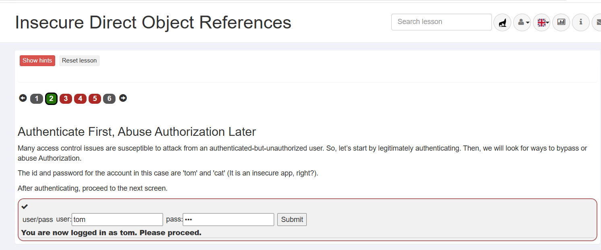

**步骤二：查看 Profile 并分析响应**

点击 **View Profile**，F12 打开开发者工具 → Network 面板，查看 Response。

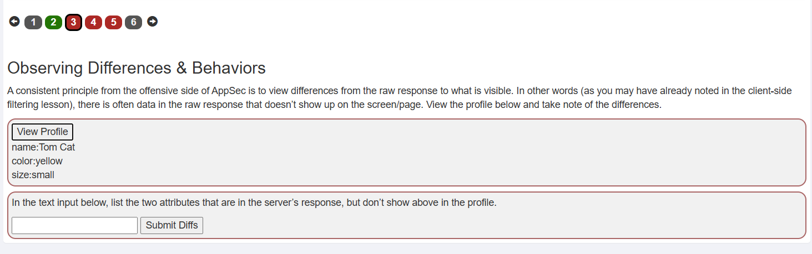

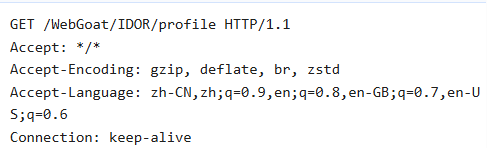

发现返回数据中的隐藏字段：
```json
{
  "role": 3,
  "userId": "2342384"
}
```

其中 `role` 代表权限等级，`userId` 直接暴露用户 ID。

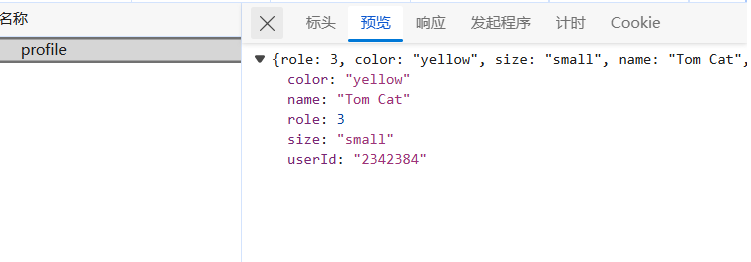

**步骤三：构造 RESTful 路径访问自己资料**

```
GET /WebGoat/IDOR/profile/2342384
```

在关卡中输入

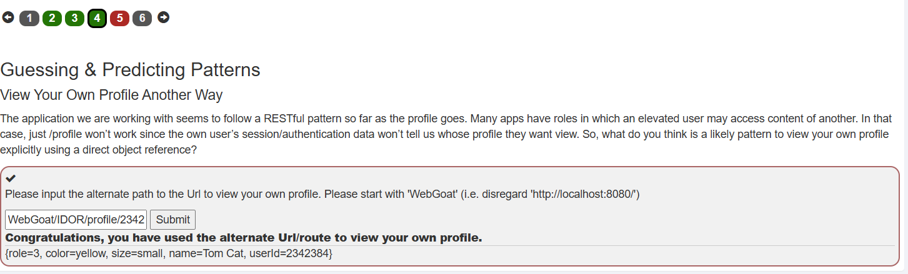

---

### 2.2 Intruder 爆破用户数据

**步骤一：Burp 拦截并发送到 Intruder**

点击 **View Profile**，Burp 拦截请求，复制到 Repeater 后发送到 Intruder。

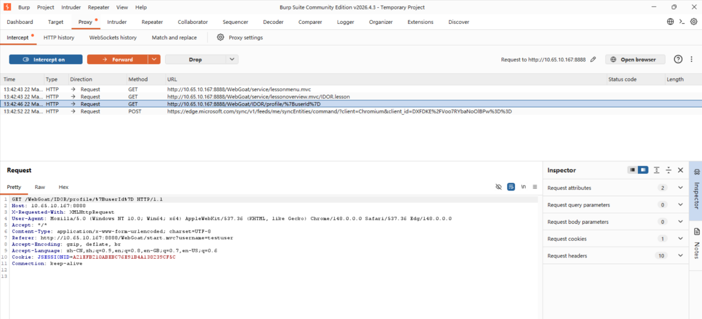

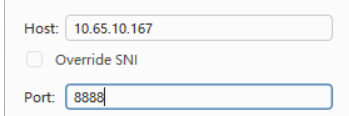

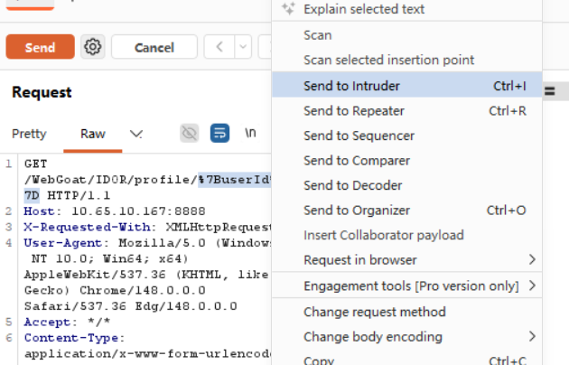

**步骤二：配置爆破参数**

- Payload 类型：**Numbers**
- 范围：`2342380` 至 `2342390`

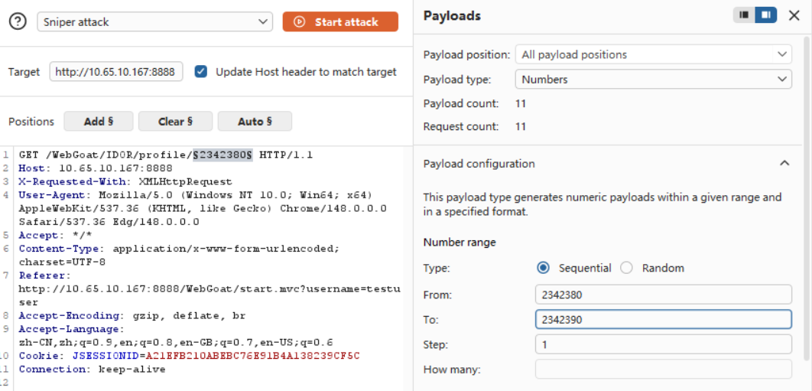

**步骤三：分析爆破结果**

观察响应长度差异，成功获取 **Buffalo Bill** 的完整信息：

```json
{
  "role": 3,
  "color": "brown",
  "size": "large",
  "name": "Buffalo Bill",
  "userId": "2342388"
}
```

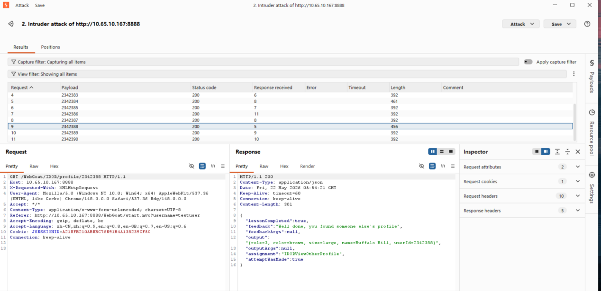

---

### 2.3 PUT 请求篡改他人权限

**步骤一：构造 PUT 请求**

将 GET 请求改为 **PUT**，`profile/` 参数设为 `2342388`，添加：
- `Content-Type: application/json`
- 请求体包含要修改的字段

```http
PUT /WebGoat/IDOR/profile/2342388 HTTP/1.1
Content-Type: application/json

{
  "role": "1",
  "color": "red",
  "size": "large",
  "name": "Buffalo Bill",
  "userId": "2342388"
}
```

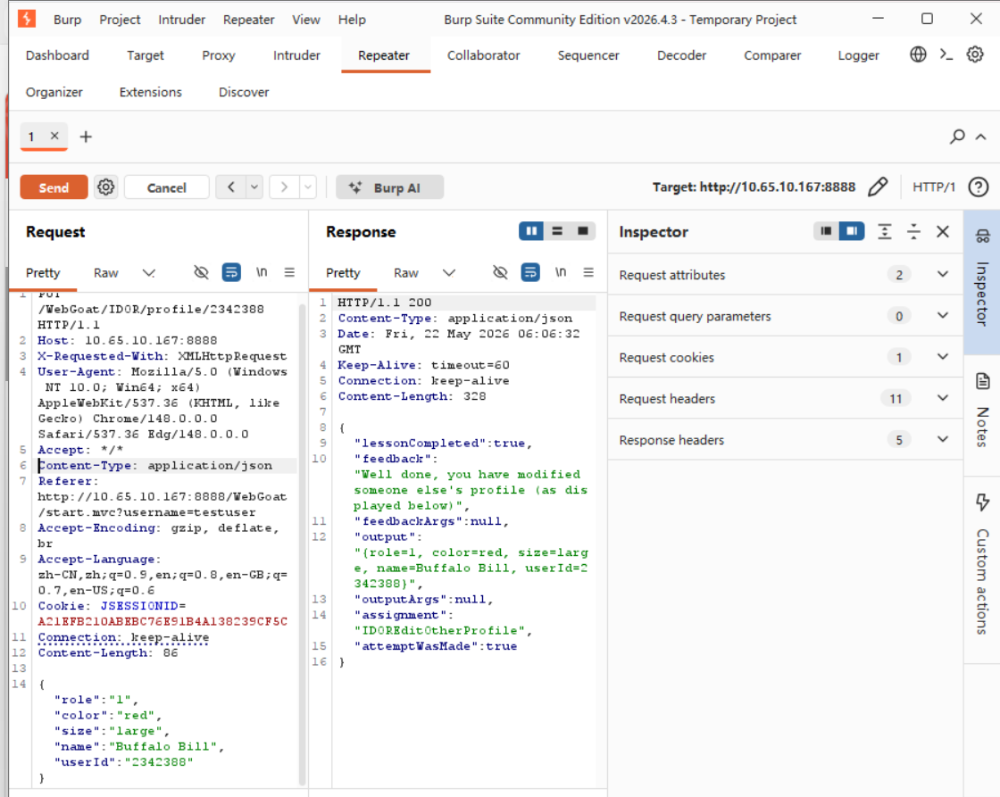

**成功修改了他人的 `role` 值**，完成 IDOR 越权实验。

### 2.4 防御措施

1. **服务端身份校验**：每次操作前验证"当前用户是否有权访问该资源"
2. **使用间接引用**：用 UUID 替代自增 ID
3. **查询时限定范围**：SQL 查询中强制带上当前用户条件
4. **敏感字段过滤**：API 返回时屏蔽 `role`、`userId` 等敏感字段

---

## 3. 垂直越权（Missing Function Level Access Control）

> **垂直越权**：低权限用户访问高权限功能（如普通用户访问管理员面板）。

### 3.1 隐藏菜单发现

**安全误区**：开发者用 CSS 隐藏按钮 / JavaScript 移除菜单，认为用户"看不到 = 访问不了"。

**步骤：F12 → Elements 查看页面源码**

找到被隐藏的管理员菜单：

```html
<li class="hidden-menu-item dropdown">
  <a href="#" class="dropdown-toggle">
    <font>Admin</font>
  </a>
  <ul class="dropdown-menu">
    <li><a href="access-control/users-admin-fix">Users</a></li>
    <li><a href="access-control/config">Config</a></li>
  </ul>
</li>
```

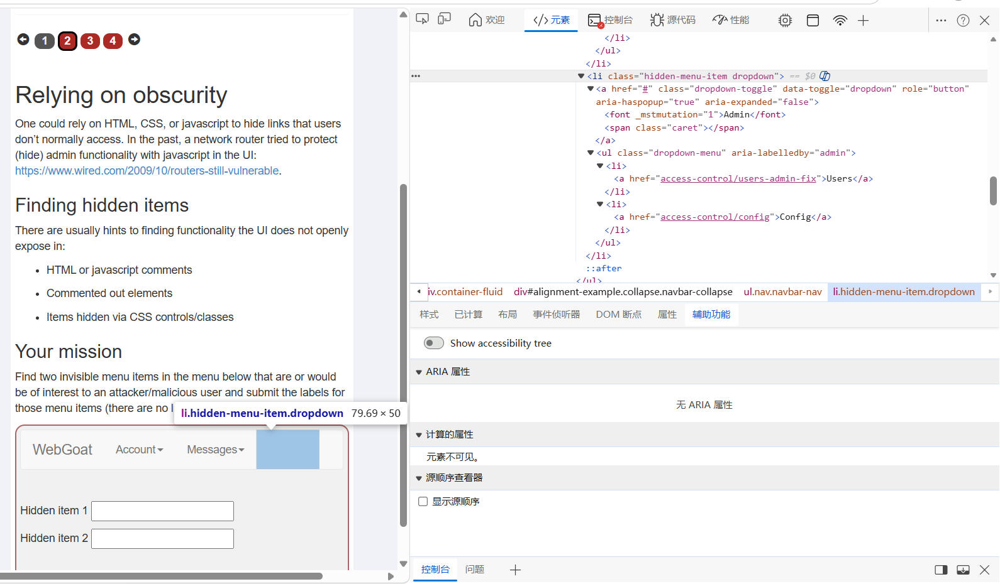

发现两个敏感路径：
- `access-control/users-admin-fix` → Users（用户管理）
- `access-control/config` → Config（系统配置）

填入 **Hidden item 1** 和 **Hidden item 2** 过关。

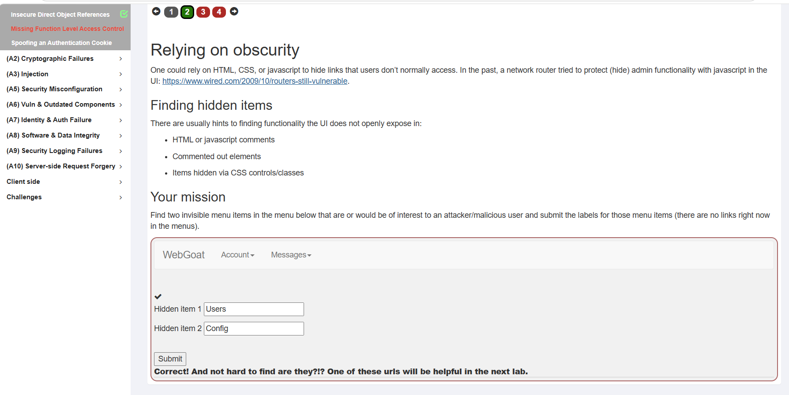

---

### 3.2 Content-Type 请求头篡改

**核心原理**：服务器根据 `Content-Type` 决定返回格式：
- `Accept: text/html` → HTML 页面（普通用户视图）
- `Accept: application/json` → JSON 数据（API 视图，可能包含额外字段）

**步骤一：尝试访问 /users**

```
GET /WebGoat/access-control/users
```

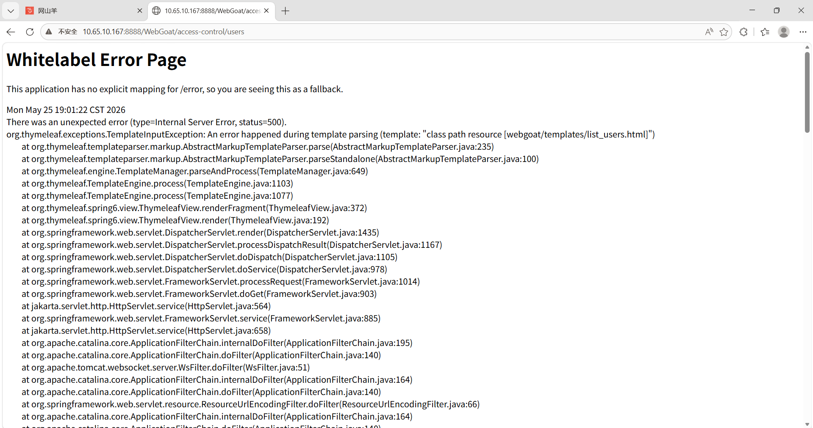

无有效信息返回。

**步骤二：拦截请求，增加 Content-Type**

```http
GET /WebGoat/access-control/users HTTP/1.1
Host: 10.65.10.167:8888
Content-Type: application/json
```

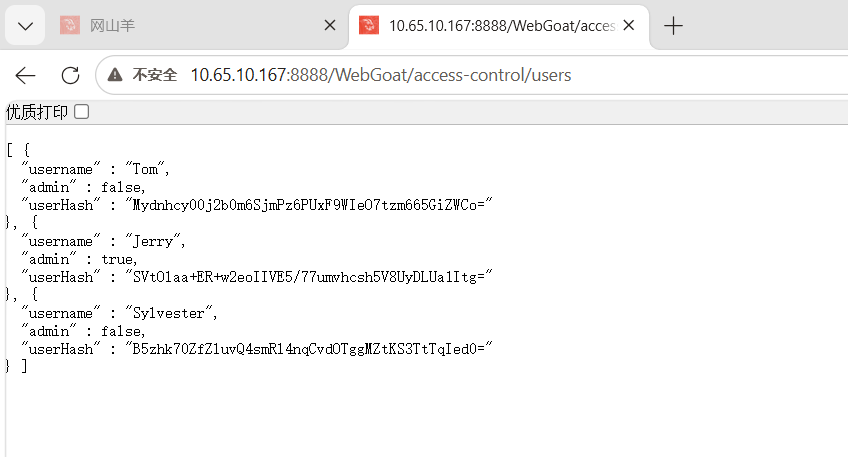

成功获取 Jerry 的用户 Hash,在关卡中输入：

```json
{
  "userHash": "SVtOlaa+ER+w2eoIIVE5/77umvhcsh5V8UyDLUa1Itg="
}
```

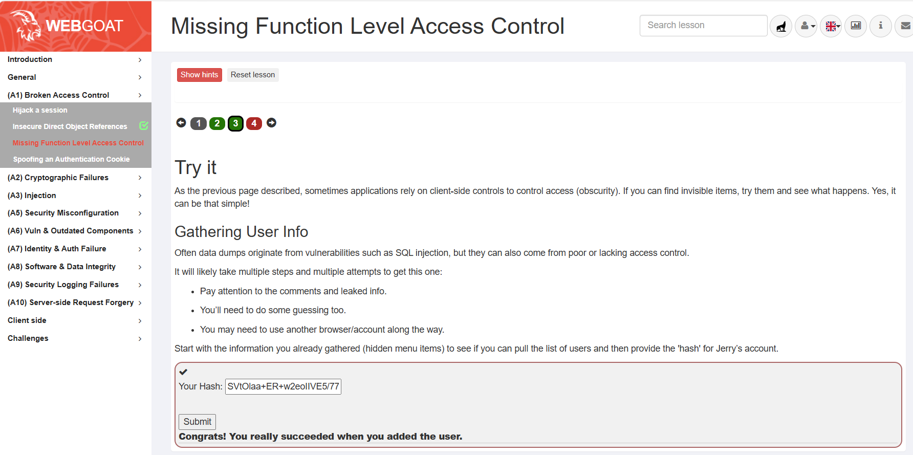

### 💡 渗透测试实战思维：路径推测

`/users-admin-fix` → 返回 HTML 页面（管理员界面，需权限）
`/users` → 返回 JSON 数据（API 接口，可能被绕过）

**`/users` 怎么来的？有根据的推测：**

常见路径测试：
```
/user、/user/list、/api/users、/api/v1/users、/admin/users、/manage/users
```

**信息收集流程：**
1. 正常浏览应用，记录所有可见路径
2. 查看页面源码、JS 文件、注释
3. 分析路径命名规律（如 `/users-admin-fix` → `/users`）
4. 用工具枚举常见路径和变体
5. 结合框架特征推测隐藏端点
6. 对每个发现的端点测试不同请求头组合

> **渗透测试核心原则**：观察 → 推理 → 验证 → 不放弃任何可能性

---

### 3.3 POST 接口创建管理员

**背景**：开发者"修复"漏洞后，`/users` 不再允许 GET 访问。

**思路**：尝试 POST `/users` 创建管理员账号。

**步骤一：构造 POST 请求**

```http
POST /WebGoat/access-control/users HTTP/1.1
Content-Type: application/json

{
  "username": "testuser",
  "password": "",
  "admin": "true"
}
```

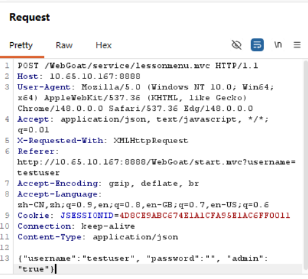

**步骤二：成功提权**

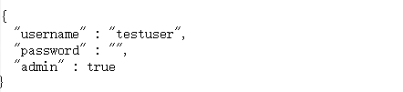

**步骤三：以管理员身份访问受保护接口**

```
GET /WebGoat/access-control/users-admin-fix
```

成功访问，再次获取 Jerry 的 Hash，输入过关。

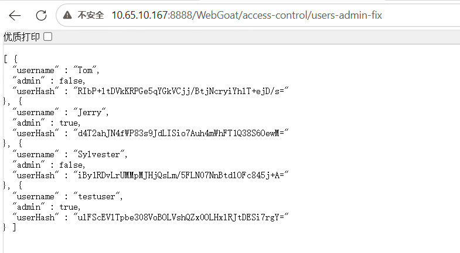

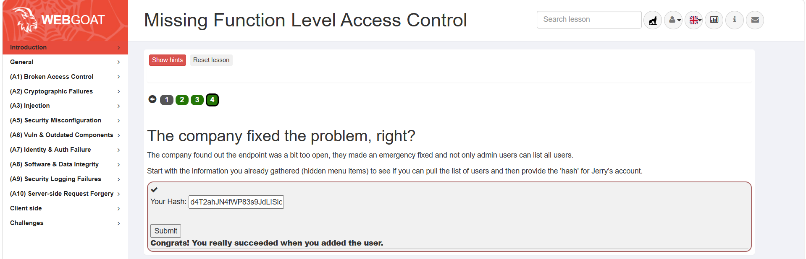

---

### 3.4 REST 核心概念

| 传统方式 | RESTful 方式 |
|----------|--------------|
| `/getUser?id=123` | `GET /users/123` |
| `/createUser?name=Tom` | `POST /users` |
| `/updateUser?id=123&role=admin` | `PUT /users/123` |
| `/deleteUser?id=123` | `DELETE /users/123` |

**HTTP 动词对应操作：**

| 方法 | 作用 | 对应操作 |
|------|------|----------|
| GET | 查询资源 | 读（查） |
| POST | 新建资源 | 增 |
| PUT | 全量更新 | 改（完整替换） |
| PATCH | 局部更新 | 改（部分字段） |
| DELETE | 删除资源 | 删 |

**RESTful API 设计规范：**
- URL 只表示「资源」，不用动词：✅ `/users` ❌ `/getUser`
- 统一用复数：`/users` 而非 `/user`
- 通过 HTTP 方法区分动作
- 层级资源用嵌套 URL：`GET /users/1001/articles`
- 使用 HTTP 状态码：200/201/404/401/403/500

---

### 3.5 垂直越权防御措施

| 序号 | 措施 | 说明 |
|------|------|------|
| 1 | 默认拒绝 | 所有功能端点默认需要认证，敏感操作额外授权 |
| 2 | 服务端强制鉴权 | 每个控制器方法都必须检查用户角色/权限 |
| 3 | RBAC | 使用注解：`@PreAuthorize("hasRole('ADMIN')")` |
| 4 | 统一鉴权过滤器 | 在网关层集中处理权限校验，避免遗漏 |
| 5 | 日志审计 | 记录敏感操作的访问者、时间、结果 |
| 6 | 定期扫描端点 | 检查是否存在未授权暴露的接口 |

---

## 4. 会话劫持（Hijack a Session）

> **核心原理**：开发者自己实现 Session ID 生成，缺乏足够的复杂度和随机性，导致可被猜测/暴力破解。

### 4.1 Cookie 规律分析

多次点击 **Access** 登录页面，观察 Cookie 变化：

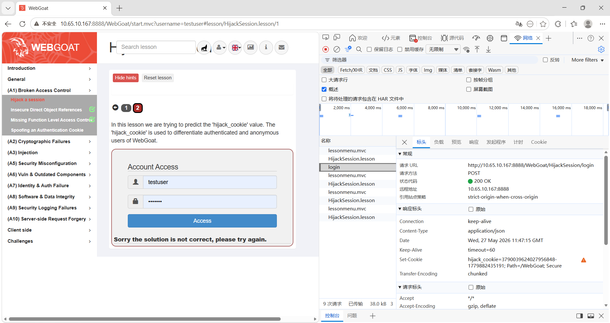

**发现**：`hijack_cookie` 组成结构为 **顺序号-时间戳**

```
756865111447224848-1780023431052
756865111447224849-1780023431807
756865111447224851-1780023432591
```

注意：顺序号从 `4848 → 4849 → 4851`，中间 **跳过了 4850*！

这暗示存在另一个登录用户占用了 `4850` 号。

### 4.2 Intruder 爆破 Session ID

**攻击策略：** 爆破时间戳值，获取被跳过顺序号的用户 Cookie。

**步骤一：发送到 Intruder**

拦截请求，将 Cookie 中的时间戳的后四位**1807**设为 Payload 位置：

```
hijack_cookie=756865111447224850-178002343$1807$
```

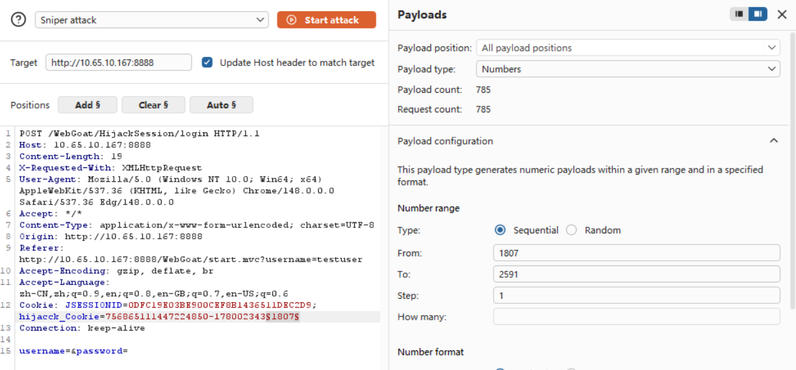

**步骤二：配置 Numbers Payload**

范围：`1807` 到 `2591`

**步骤三：分析爆破结果**

找到响应中显示 "Congratulations" 的请求：

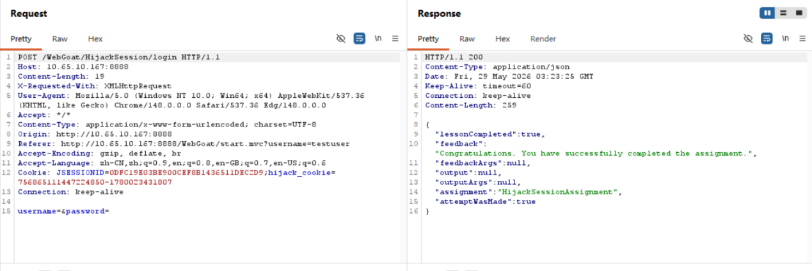

成功拿到已登录用户的身份凭证，完成会话劫持。

---

## 5. Cookie 伪造（Spoofing an Authentication Cookie）

> **核心漏洞**：认证 Cookie 的生成算法过于简单，可被逆向推导。

### 5.1 观察系统行为

- 有有效 Cookie → 自动登录
- 无 Cookie + 正确凭据 → 生成 Cookie 并登录
- 其他情况 → 拒绝登录

### 5.2 收集合法 Cookie

**用 webgoat/webgoat 登录,打开浏览器开发者工具（F12）→ Application/Storage → Cookies，记录 Cookie 名称和值。：**

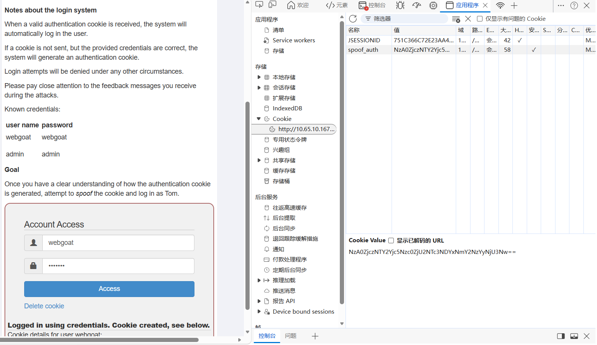

```
spoof_auth: NzA0ZjczNTY2Yjc5Nzc0ZjU2NTc3NDYxNmY2NzYyNjU3Nw==
```

**退出，用 admin/admin 登录：**

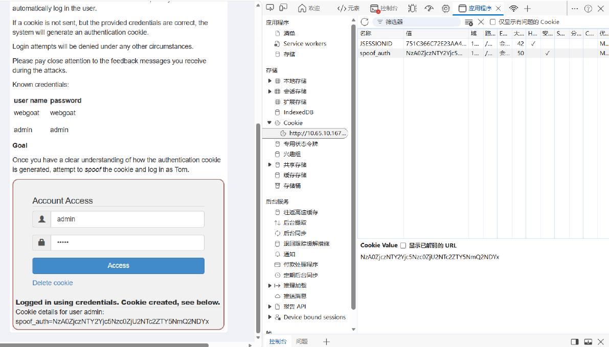

```
spoof_auth: NzA0ZjczNTY2Yjc5Nzc0ZjU2NTc2ZTY5NmQ2NDYx
```

### 5.3 解码分析（CyberChef / Burp Decoder）

**Base64 解码 webgoat 的 Cookie：**

```
NzA0ZjczNTY2Yjc5Nzc0ZjU2NTc3NDYxNmY2NzYyNjU3Nw==
→ 704f73566b79774f565774616f67626577
```

**Hex 解码：**

```
704f73566b79774f565774616f67626577
→ pOsVkywOVWtaogbew
```

**分析结构：**

```
pOsVkywOVW + taogbew
   ↑固定前缀   ↑"webgoat"的逆序
```

### 5.4 编码流程还原

| 步骤 | 操作 | 示例 |
|------|------|------|
| 1 | 用户名逆序 | `webgoat` → `taogbew` |
| 2 | 拼接固定前缀 | `pOsVkywOVW` + `taogbew` = `pOsVkywOVWtaogbew` |
| 3 | 转 Hex | `p` → `70`，`O` → `4f`... → `704f73566b79774f565774616f67626577` |
| 4 | Base64 编码 | → `NzA0ZjczNTY2Yjc5Nzc0ZjU2NTc3NDYxNmY2NzYyNjU3Nw==` |

### 5.5 伪造 Tom 的 Cookie

按同样算法生成 Tom 的 Cookie：

```
704f73566b79774f565774616f6d6f54
→ NzA0ZjczNTY2Yjc5Nzc0ZjU2NTc2ZDZmNTQ=
```

### 5.6 JavaScript 注入 Cookie

点击 **Delete cookie**，F12 → Console，执行：

```javascript
document.cookie = "spoof_auth=NzA0ZjczNTY2Yjc5Nzc0ZjU2NTc2ZDZmNTQ=; path=/";
location.reload();
```

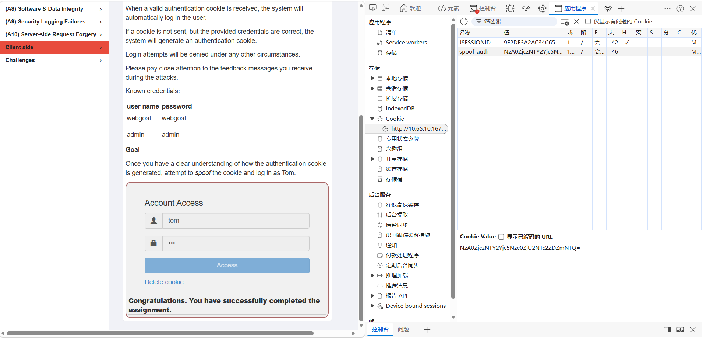

页面刷新后，服务器验证 Cookie 认为是合法用户 Tom，自动登录成功。

---

## 6. 核心知识点总结

### 6.1 越权类型对比

| 类型 | 英文 | 描述 | 示例 |
|------|------|------|------|
| **水平越权** | IDOR | 同级用户间越界访问 | 用户 A 访问用户 B 的资料 |
| **垂直越权** | Missing Function Level Access Control | 低权限用户访问高权限功能 | 普通用户访问管理员面板 |

### 6.2 本实验用到的 Burp 功能

| 功能 | 用途 |
|------|------|
| **Proxy** | 拦截/修改 HTTP 请求 |
| **Repeater** | 手动发送并反复修改请求 |
| **Intruder** | 自动化爆破（Numbers 模式） |
| **Decoder** | 解码 Cookie（Base64/Hex） |

### 6.3 Cookie 伪造流程

```
收集合法账号的 Cookie
    ↓
Base64 解码 → Hex 解码
    ↓
分析编码规律（固定前缀 + 用户名逆序）
    ↓
按规律生成目标用户的 Cookie
    ↓
用 JavaScript 注入 Cookie
    ↓
成功登录
```

### 6.4 关键防御要点

1. **永远不要相信前端**：前端隐藏不等于后端保护
2. **使用成熟 Session 管理**：不要自己实现 Session ID 生成
3. **所有端点都需要鉴权**：默认拒绝，按需开放
4. **敏感 API 使用间接引用**：避免暴露自增 ID
5. **统一编码规范**：避免 `Content-Type` 被滥用导致信息泄露