# 业务逻辑漏洞：支付逻辑与验证码绕过实验报告

> 本报告涵盖支付逻辑漏洞（价格篡改、数量篡改、优惠券复用）与验证码绕过（前端校验绕过、服务端校验绕过）两大业务逻辑漏洞类型，系统梳理漏洞原理、利用手法与防御措施。

---

## 目录

1. [支付逻辑漏洞](#1-支付逻辑漏洞)
   - 1.1 价格篡改
   - 1.2 数量篡改
   - 1.3 优惠券复用
   - 1.4 支付逻辑防御措施
2. [验证码绕过](#2-验证码绕过)
   - 2.1 验证码绕过（on client）——前端校验
   - 2.2 验证码绕过（on server）——服务端校验
   - 2.3 验证码防御措施

---

# 1. 支付逻辑漏洞

## 1.1 价格篡改

### 环境搭建：shop.php

```php
<?php
header("Content-type: text/html; charset=utf-8");
session_start();
if (!isset($_SESSION['user'])) $_SESSION['user'] = 'guest';

if (isset($_POST['action']) && $_POST['action'] == 'buy') {
    $price = $_POST['price'];
    echo "您购买了商品，需支付：{$price} 元。";
} else {
?>
<form method="post">
    商品：笔记本<br>
    价格：<input type="text" name="price" value="100"><br>
    <input type="hidden" name="action" value="buy">
    <input type="submit" value="购买">
</form>
<?php } ?>
```

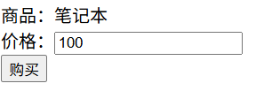

### 漏洞验证

#### 方式一：前端直接篡改

页面价格输入框无任何限制，直接将 `100` 改为 `1`。

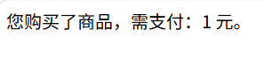

#### 方式二：Burp 抓包篡改

将价格改为 `-100`：

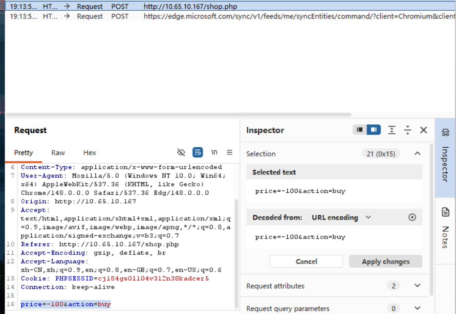

**结果：**


页面显示 "需支付：-100 元"。若后端直接用 `余额 - 价格` 计算，`余额 - (-100) = 余额 + 100`，用户余额反而增加，造成平台资金损失。

---

## 1.2 数量篡改

### 环境搭建：shop_quantity.php

```php
<?php
header("Content-type: text/html; charset=utf-8");
session_start();
if (!isset($_SESSION['user'])) $_SESSION['user'] = 'guest';

if (isset($_POST['action']) && $_POST['action'] == 'buy') {
    $price = $_POST['price'];
    $num = $_POST['quantity'];
    $total = $price * $num;
    echo "单价：{$price} 元，数量：{$num}，总计：{$total} 元。";
} else {
?>
<form method="post">
    商品：笔记本<br>
    价格：<input type="text" name="price" value="100"><br>
    数量：<input type="text" name="quantity" value="1"><br>
    <input type="hidden" name="action" value="buy">
    <input type="submit" value="购买">
</form>
<?php } ?>
```

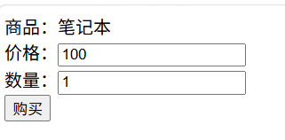

### 漏洞验证

Burp 抓包，将 `quantity` 改为 `-2`：

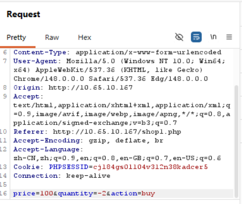

**结果：**


`quantity=-2` → 总价为负数，与负价格类似，会导致余额异常增加。

---

## 1.3 优惠券复用

### 环境搭建：shop_coupon.php

```php
<?php
session_start();
if (!isset($_SESSION['coupon_used'])) $_SESSION['coupon_used'] = false;

if ($_POST['action'] == 'buy') {
    $price = $_POST['price'];
    $coupon = $_POST['coupon'];
    if ($coupon == 'yes') {
        $price = $price - 50;  // 漏洞：只判断参数，不判断是否用过券
    }
    echo "实付：{$price} 元";
    $_SESSION['coupon_used'] = true;
} else {
?>
<form method="post">
    价格：<input type="text" name="price" value="100"><br>
    使用优惠券：<input type="hidden" name="coupon" value="yes">
    <input type="hidden" name="action" value="buy">
    <input type="submit" value="购买">
</form>
<?php } ?>
```

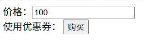

### 漏洞验证

Burp 抓包，反复提交 `coupon=yes`，每次都能减 50：

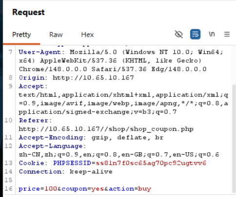

**漏洞原因**：服务端仅判断是否传了 `coupon=yes` 参数，未检查该优惠券是否已被当前用户使用过。

---

## 1.4 支付逻辑防御措施

### 价格/数量校验（修复示例）

```php
<?php
header("Content-type: text/html; charset=utf-8");
session_start();
if (!isset($_SESSION['user'])) $_SESSION['user'] = 'guest';

if (isset($_POST['action']) && $_POST['action'] === 'buy') {
    $price = $_POST['price'];
    $quantity = $_POST['quantity'];

    // ✅ 价格校验：数字、大于0
    if (!is_numeric($price) || $price <= 0) {
        echo "❌ 价格非法！请输入大于0的数字。";
        exit;
    }

    // ✅ 数量校验：整数、大于0、不超过合理范围
    if (!is_numeric($quantity) || $quantity <= 0 || !ctype_digit((string)$quantity) || $quantity > 10) {
        echo "❌ 数量非法！请输入1-10之间的整数。";
        exit;
    }

    $quantity = (int)$quantity;
    $total = $price * $quantity;
    echo "✅ 单价：{$price} 元，数量：{$quantity}，总计：{$total} 元。";
} else {
?>
<form method="post">
    商品：笔记本<br>
    价格：<input type="text" name="price" value="100"><br>
    数量：<input type="text" name="quantity" value="1"><br>
    <input type="hidden" name="action" value="buy">
    <input type="submit" value="购买">
</form>
<?php } ?>
```

### 优惠券防复用（修复示例）

```php
<?php
header("Content-type: text/html; charset=utf-8");
session_start();
if (!isset($_SESSION['user'])) $_SESSION['user'] = 'guest';
if (!isset($_SESSION['coupon_used'])) $_SESSION['coupon_used'] = false;

if (isset($_POST['action']) && $_POST['action'] === 'buy') {
    $price = $_POST['price'];
    $coupon = $_POST['coupon'] ?? '';

    if (!is_numeric($price) || $price <= 0) {
        echo "❌ 价格非法！";
        exit;
    }

    // ✅ 优惠券校验：券码正确 且 未使用过
    if ($coupon === 'yes' && $_SESSION['coupon_used'] === false) {
        $price = $price - 50;
        $_SESSION['coupon_used'] = true;
        echo "✅ 已使用优惠券，";
    } elseif ($coupon === 'yes' && $_SESSION['coupon_used'] === true) {
        echo "❌ 优惠券已使用过，无法重复使用！";
    }
    echo "实付：{$price} 元";
} else {
?>
<form method="post">
    价格：<input type="text" name="price" value="100"><br>
    使用优惠券：<input type="hidden" name="coupon" value="yes">
    <input type="hidden" name="action" value="buy">
    <input type="submit" value="购买">
</form>
<?php } ?>
```

---

# 2. 验证码绕过

## 2.1 验证码绕过（on client）——前端校验

### Pikachu 靶场搭建

1. 从 https://github.com/zhuifengshaonianhanlu/pikachu 下载源码
2. 放入 PHPStudy 的 WWW 目录
3. 配置 `pikachu/inc/config.inc.php` 中的数据库连接
4. 访问 `http://localhost/pikachu/install.php` 初始化数据库

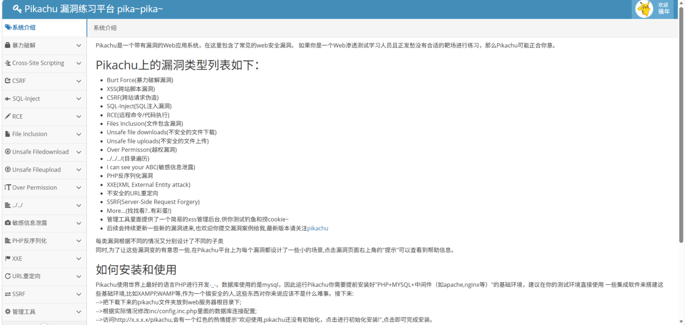

### 漏洞原理

验证码由**前端 JavaScript 生成和校验**，服务端根本不验证验证码。

### 实验步骤

**步骤一：进入 "验证码绕过(on client)" 页面**

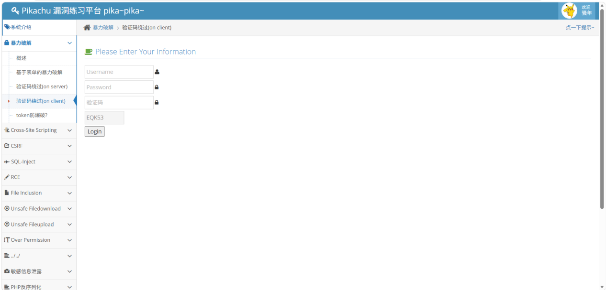

**步骤二：输入任意用户名密码，填写错误验证码**

点击登录，前端 JS 弹窗提示 "验证码错误"。

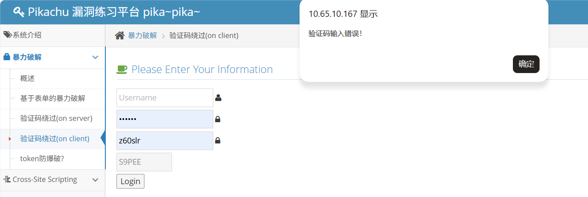

**步骤三：F12 → Network 观察正常请求**

先填正确验证码登录，抓取正常请求。

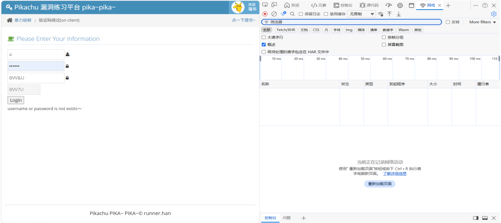

正常请求 URL 编码后的内容。

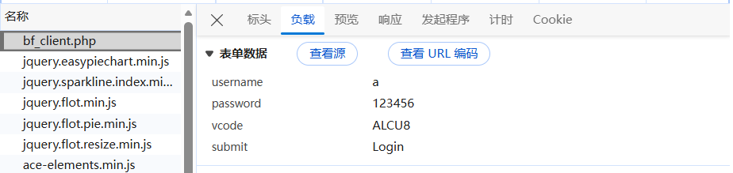

**步骤四：Console 直接发送请求（绕过前端校验）**

F12 → Console，粘贴以下代码并执行：

```javascript
fetch("http://10.65.10.167/pikachu/vul/burteforce/bf_client.php", {
  method: "POST",
  headers: {
    "Content-Type": "application/x-www-form-urlencoded",
  },
  body: "username=admin&password=123456&vcode=XXXX&submit=Login",
  credentials: "include"
})
.then(response => response.text())
.then(data => {
  console.log("返回结果：");
  console.log(data);
});
```

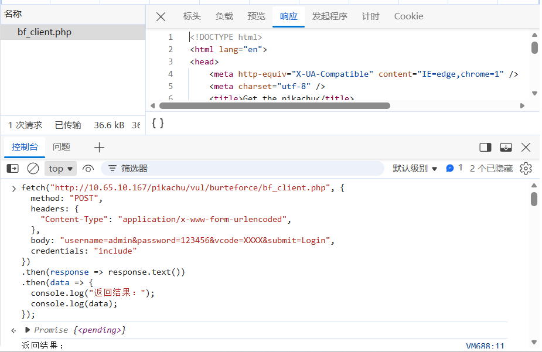

**结果**：`vcode=XXXX`（任意错误值）但请求仍然成功，说明服务端根本不校验验证码。

---

## 2.2 验证码绕过（on server）——服务端校验

### 漏洞原理

验证码由服务端生成，校验也在服务端完成。但**验证码使用后未及时销毁**，导致可重复使用。

### 实验步骤

**步骤一：获取一个有效验证码**

在 `bf_server.php` 页面填写正确验证码，Burp 拦截后 Forward 放行。

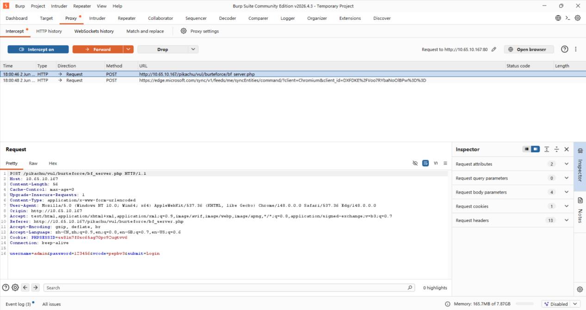

**步骤二：不刷新页面，重复使用同一验证码**

保持页面不刷新，验证码不变。再次提交，Burp 拦截后发送到 Repeater。

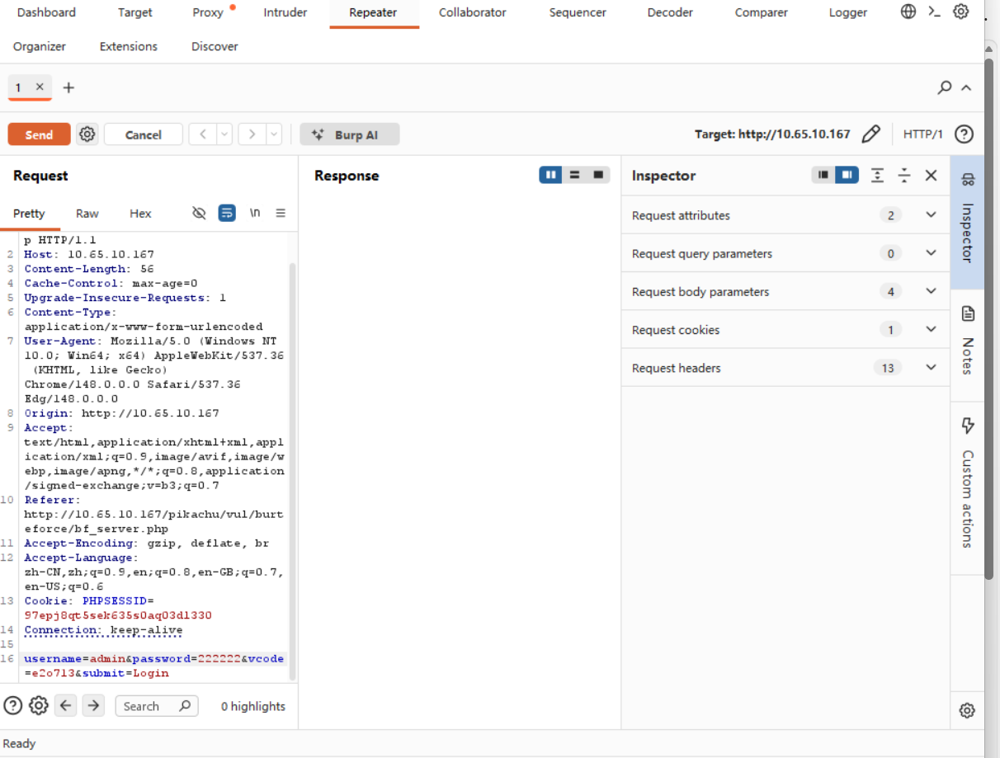

**步骤三：修改密码，固定验证码，多次发送**

在 Repeater 中修改 `password` 为不同值，`vcode` 保持不变，反复 Send。

**结果**：所有请求都返回 "username or password is not exists~"，说明验证码未失效，可重复使用。

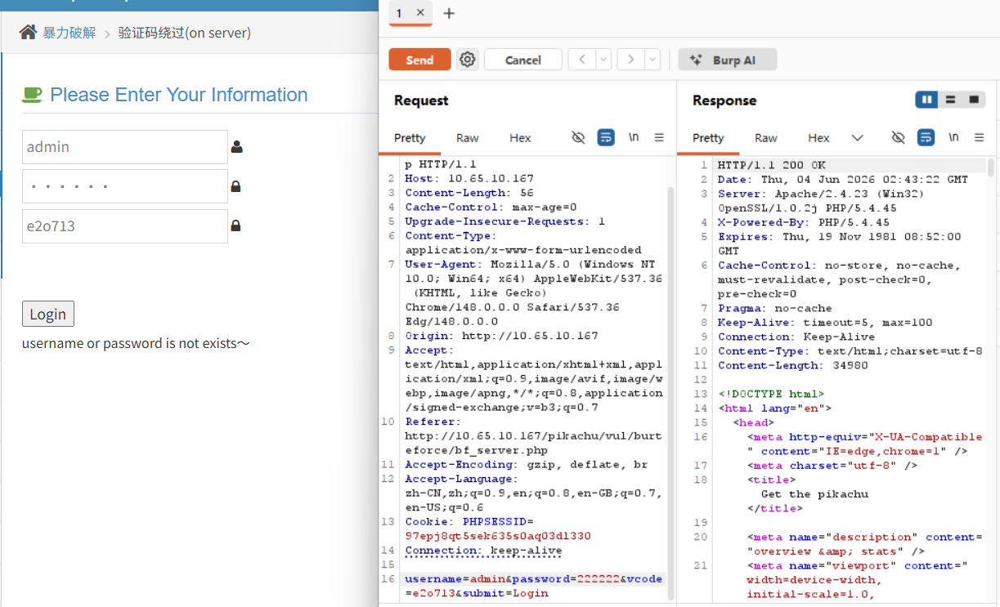

**步骤四：Intruder 自动化爆破**

- Positions：将 `password` 设为变量，`vcode` 固定
- Payloads：加载密码字典

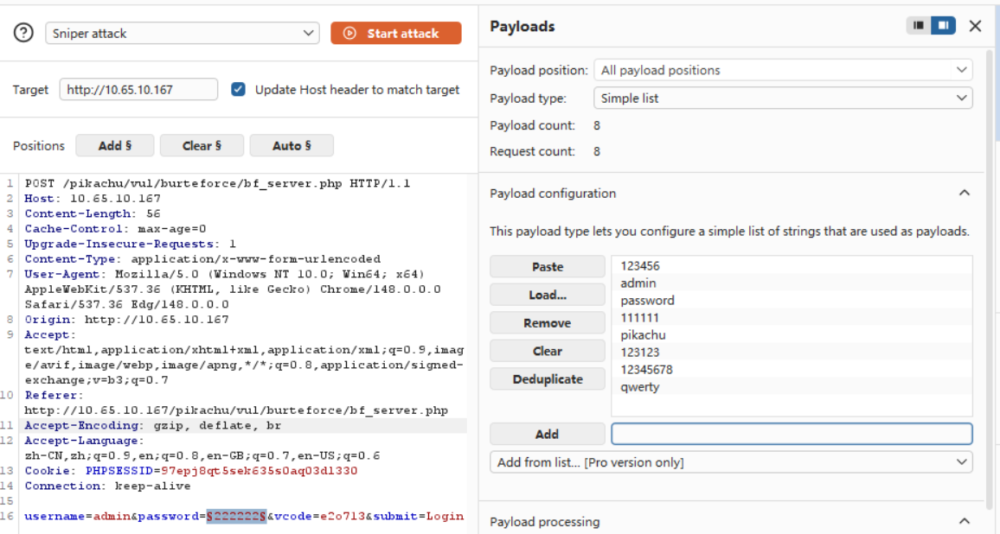

**步骤五：分析爆破结果**

观察 Length 列，返回长度不同的即可能为正确密码。

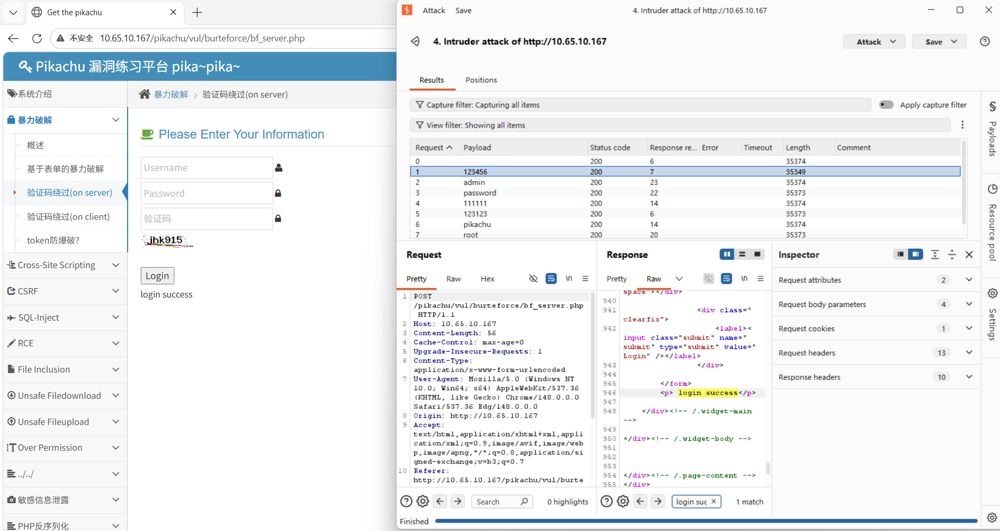

`password=123456` 时返回 `login success`，爆破成功。

---

## 2.3 验证码防御措施

| 序号 | 措施 | 说明 |
|------|------|------|
| 1 | **服务端生成与校验** | 永远不要在客户端生成/校验验证码 |
| 2 | **一次性使用** | 验证码使用后立即销毁，无论对错 |
| 3 | **设置有效期** | 验证码应在 60-120 秒后过期 |
| 4 | **复杂度足够** | 4-6 位随机数字/字母组合，避免简单规律 |
| 5 | **绑定会话** | 验证码与 Session ID 绑定，防止跨会话复用 |
| 6 | **限制尝试次数** | 同一 IP/用户连续失败 5 次后锁定或增加延迟 |

---

## 核心知识点总结

### 支付逻辑漏洞速查表

| 漏洞类型 | 核心问题 | 攻击手法 | 修复方法 |
|----------|---------|----------|----------|
| 价格篡改 | 信任前端传入的价格 | 改 `price` 为负数或 0 | 服务端从数据库读取价格 |
| 数量篡改 | 信任前端传入的数量 | 改 `quantity` 为负数 | 校验数量 > 0 且为整数 |
| 优惠券复用 | 未校验使用状态 | 反复提交 `coupon=yes` | 记录使用状态，单次有效 |

### 验证码漏洞速查表

| 漏洞类型 | 核心问题 | 攻击手法 | 修复方法 |
|----------|---------|----------|----------|
| 前端校验 | 验证码在客户端生成/校验 | 绕过 JS 直接发请求 | 服务端生成并校验 |
| 服务端未销毁 | 验证码使用后仍有效 | 重复使用同一验证码 | 使用后立即销毁 |

### 业务逻辑漏洞的共性原因

1. **信任用户输入**：价格、数量、优惠券等参数完全由用户提交
2. **缺乏状态校验**：未记录优惠券使用状态、验证码使用状态
3. **类型与范围无限制**：可传负数、字符串、0 等非法值
4. **前端校验 ≠ 安全**：所有前端校验均可绕过