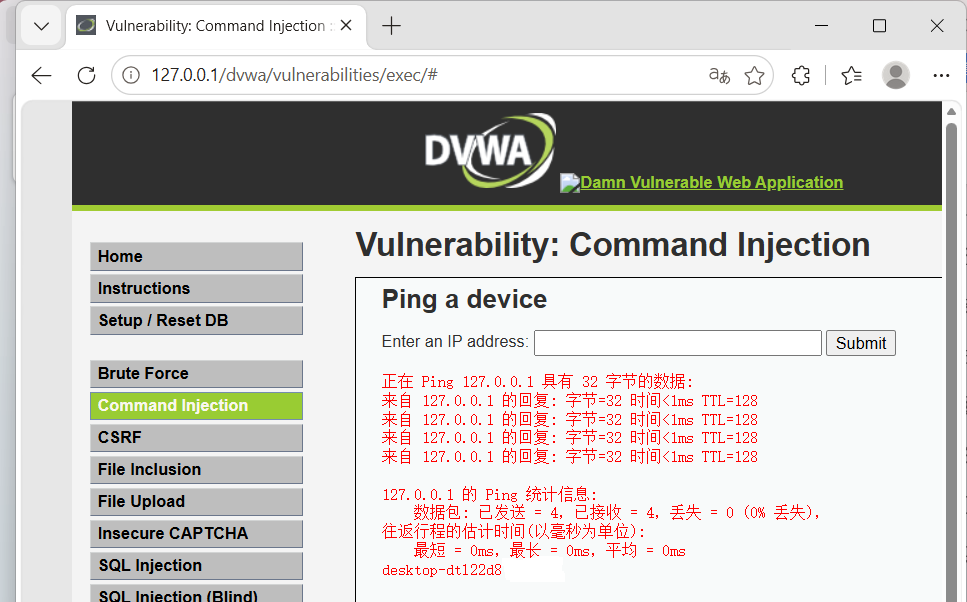
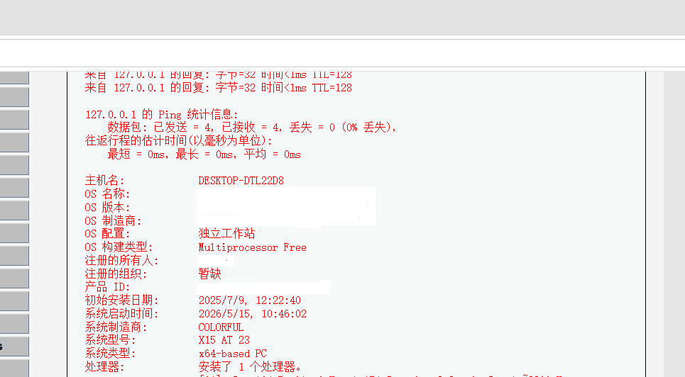
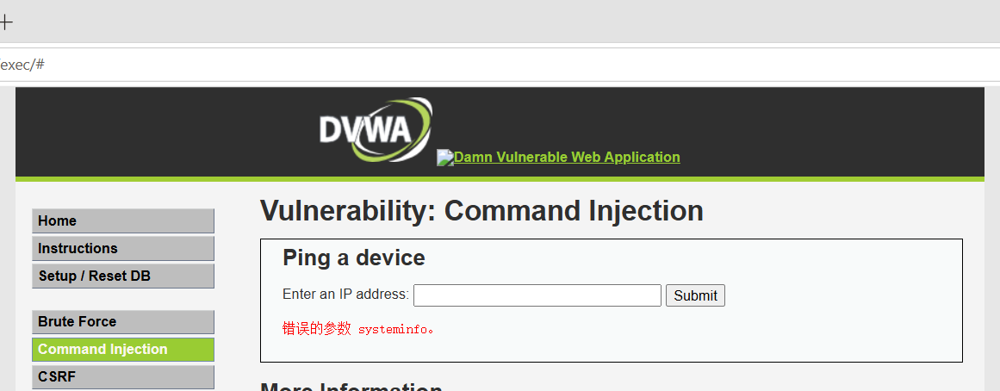
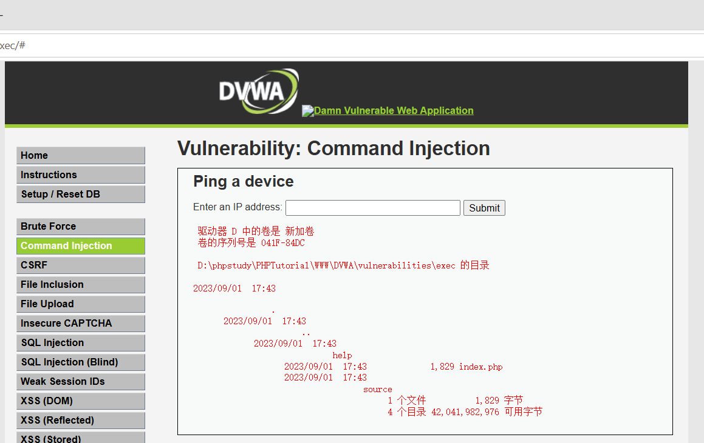
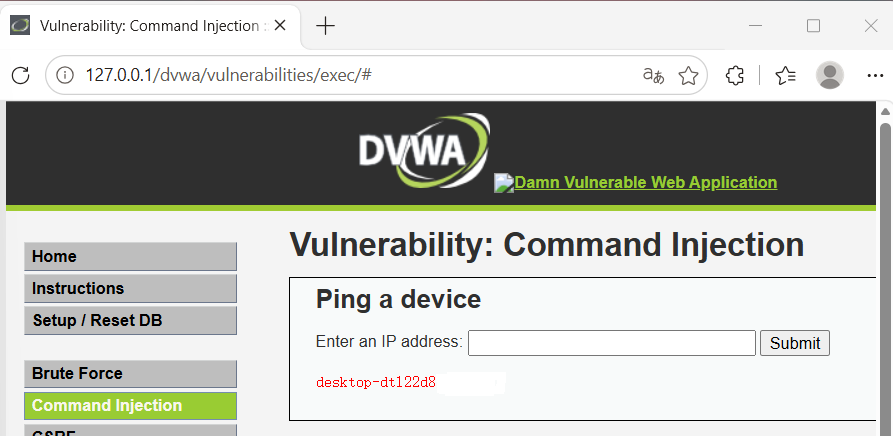

# 命令注入（Command Injection）实验报告

> 本报告涵盖 DVWA 靶场 Command Injection 模块 Low、Medium、High 三个安全级别的漏洞复现，系统梳理命令注入原理、连接符利用及绕过技巧。

---

## 目录

1. [命令注入概述](#1-命令注入概述)
2. [Low 难度：无过滤直接注入](#2-low-难度无过滤直接注入)
3. [Medium 难度：黑名单过滤部分连接符](#3-medium-难度黑名单过滤部分连接符)
4. [High 难度：str_replace 顺序绕过](#4-high-难度str_replace-顺序绕过)
5. [核心知识点总结](#5-核心知识点总结)

---

## 1. 命令注入概述

**命令注入（Command Injection）** 是指攻击者通过在输入字段中注入恶意系统命令，利用应用程序执行系统命令的功能，达到执行任意命令的目的。

### 常用命令连接符

| 连接符 | 含义 | 适用系统 |
|--------|------|----------|
| `;` | 顺序执行，A 执行完执行 B | Linux / Windows（PowerShell） |
| `&` | A 后台运行，A 和 B 同时执行 | Windows |
| `&&` | A 执行成功后执行 B | Windows / Linux |
| `\|` | A 的输出作为 B 的输入，A 不论成败都执行 B | Windows / Linux |
| `\|\|` | A 执行失败后执行 B | Windows / Linux |

### 常用系统命令

**Windows：**
- `net user` — 查看所有用户
- `systeminfo` — 查看系统信息
- `dir` — 查看当前目录
- `whoami` — 查看当前用户名

**Linux：**
- `cat /etc/passwd` — 查看用户文件
- `ls -la` — 查看目录文件
- `whoami` — 查看当前用户名

---

## 2. Low 难度：无过滤直接注入

> **漏洞点**：对用户输入的 IP 地址没有任何过滤，直接拼接到 `shell_exec()` 中执行。

```php
$cmd = shell_exec( 'ping ' . $target );
```

### 2.1 查看当前用户名

输入 `127.0.0.1 & whoami`：



### 2.2 查看系统信息

输入 `127.0.0.1 && systeminfo`：



---

## 3. Medium 难度：黑名单过滤部分连接符

> **防御机制**：使用黑名单过滤了 `&&` 和 `;` 两种连接符，但其他连接符未过滤。

### 3.1 测试被过滤的连接符

输入 `127.0.0.1 && systeminfo` 报错，说明 `&&` 被过滤。



### 3.2 使用未过滤的连接符绕过

输入 `127.0.0.1 | dir`，成功执行：



**可用的连接符**：`&`、`|`、`||`

---

## 4. High 难度：str_replace 顺序绕过

> **防御机制**：使用 `str_replace` 按数组顺序逐个过滤黑名单中的字符。

### 4.1 黑名单分析

High 级别的黑名单数组中包含：
```php
'| ' => '',   // 管道符+空格 → 替换成空
```

### 4.2 过滤逻辑的致命漏洞

PHP `str_replace` 有两个关键特性：
1. **顺序执行**：按数组顺序逐个规则处理
2. **全局替换**：每个规则替换字符串中所有匹配位置

### 4.3 绕过原理分析

以输入 `|| &whoami` 为例，假设黑名单顺序为：
```php
['&', '| ', '||']
```

**处理过程：**

| 步骤 | 规则 | 处理前 | 处理后 |
|------|------|--------|--------|
| 1 | `&` | `|| &whoami` | `|| whoami` |
| 2 | `\| ` | `\|\| whoami` | `\|whoami` |
| 3 | `\|\|` | `\|whoami` | 无匹配 → 不变 |

**最终结果**：`|whoami` ✅ 可执行

---

### 4.4 测试不同连接符

分别测试带空格和不带空格的情况：



**测试结果：**

| 输入 | 结果 |
|------|------|
| `127.0.0.1 && whoami`（带空格） | ❌ 被过滤 |
| `127.0.0.1 &&whoami`（不带空格） | ❌ 被过滤 |
| `127.0.0.1 & whoami`（带空格） | ❌ 被过滤 |
| `127.0.0.1 &whoami`（不带空格） | ❌ 被过滤 |
| `127.0.0.1 \| whoami`（带空格） | ❌ 被过滤 |
| `127.0.0.1 \|whoami`（不带空格） | ✅ **可执行** |
| `127.0.0.1 \|\| whoami`（带空格） | ✅ **可执行** |
| `127.0.0.1 \|\|whoami`（不带空格） | ❌ 被过滤 |

### 4.5 为什么 `||` 带空格也能执行？

黑名单中过滤的是 `| `（管道符+空格），而不是单独的 `|`。

`|| whoami` 中的 `||` 后跟空格，被识别为 `| ` 规则删除后，剩下的 `|whoami` 中不再包含 `||`，因此最终可执行。

**如果调整黑名单顺序为：**
```php
['||', '| ', '&']
```

处理 `|| &whoami`：

| 步骤 | 规则 | 结果 |
|------|------|------|
| 1 | `\|\|` | ` &whoami` |
| 2 | `\| ` | 无匹配 |
| 3 | `&` | ` whoami` |

最终结果：` whoami` ❌ 不可执行

**结论**：`str_replace` 的**执行顺序**直接影响过滤效果，不完整的黑名单 + 不严谨的顺序 = 可绕过。

---

## 5. 核心知识点总结

### 5.1 各难度防御与绕过速查表

| 安全级别 | 防御机制 | 绕过方法 |
|----------|---------|----------|
| Low | 无过滤 | 任意连接符 + 系统命令 |
| Medium | 黑名单过滤 `&&` 和 `;` | 使用 `&`、`\|`、`\|\|` |
| High | str_replace 黑名单（含 `\| `） | 利用替换顺序绕过（`\|\| whoami`） |
| Impossible | 白名单 IP 格式校验 | 无法绕过 |

### 5.2 安全开发的教训

> **"黑名单过滤不完整，等于没过滤"**

1. **黑名单总有遗漏**：攻防不对等，攻击者总能找到未过滤的组合。
2. **过滤逻辑的执行顺序至关重要**：`str_replace` 的数组顺序直接影响防御效果。
3. **推荐使用白名单**：只允许已知安全的输入格式。

### 5.3 Impossible 级别的正确做法

```php
if (filter_var($target, FILTER_VALIDATE_IP, FILTER_FLAG_IPV4)) {
    // 只接受合法的 IPv4 地址，其他全部拒绝
}
```

### 5.4 防御建议

1. **避免使用系统命令执行函数**：如 `shell_exec()`、`system()`、`exec()`。
2. **使用白名单校验**：限制输入格式（如 IP 地址格式）。
3. **输入转义**：使用 `escapeshellarg()` 或 `escapeshellcmd()` 处理用户输入。
4. **最小权限原则**：Web 服务使用低权限账户运行。
