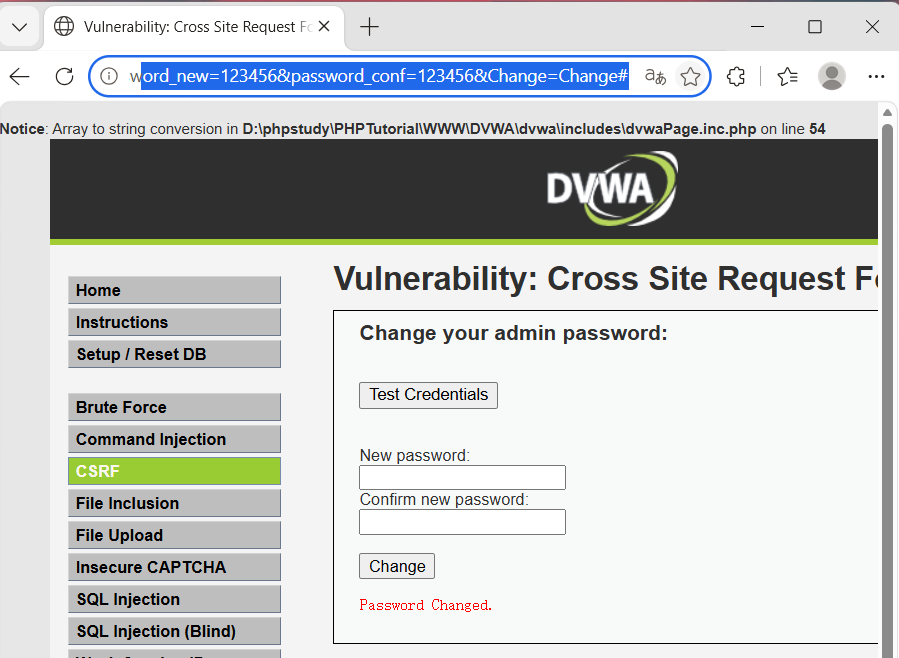
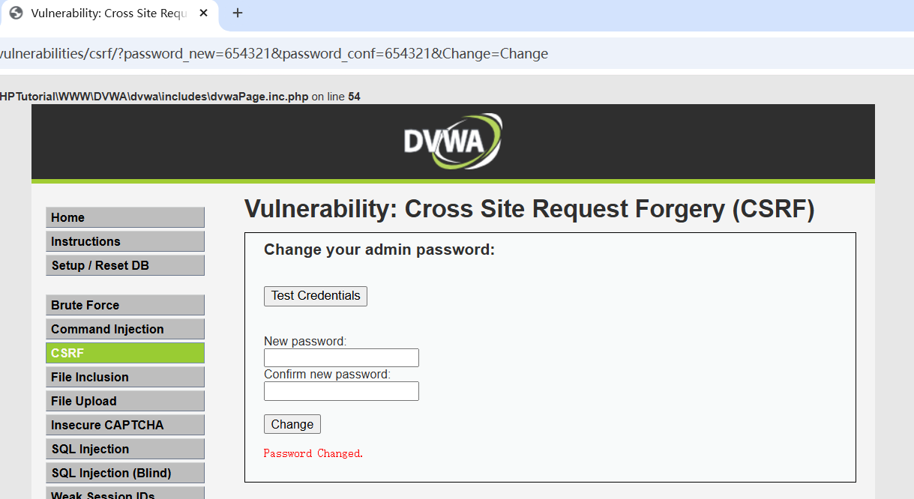
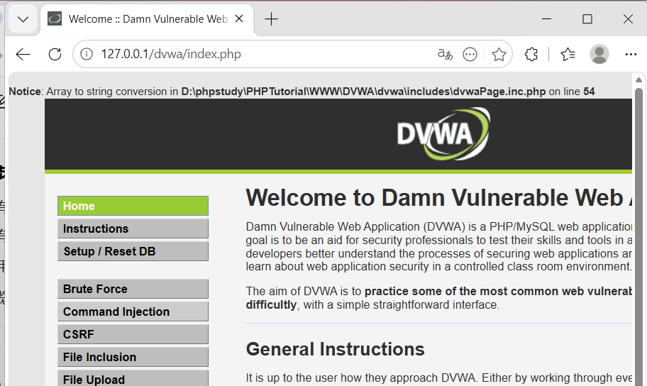
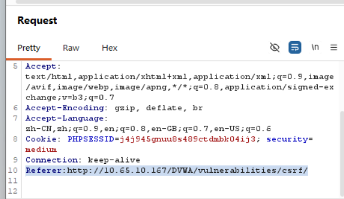
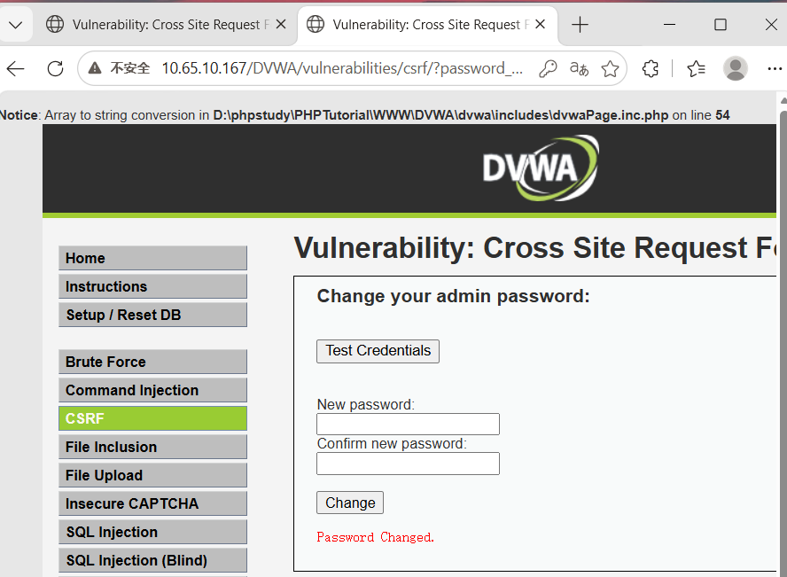
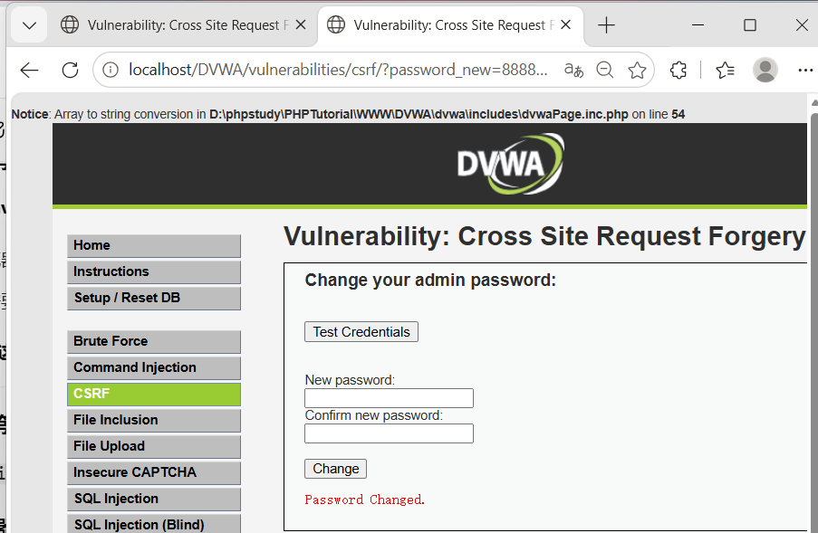

# CSRF 跨站请求伪造实验报告

> 本报告涵盖 DVWA 靶场 CSRF 模块 Low 和 Medium 两个安全级别的漏洞复现，系统梳理 CSRF 攻击原理、利用手法及防御绕过技巧。

---

## 目录

1. [CSRF 概述](#1-csrf-概述)
2. [Low 难度：无防护 GET 请求劫持](#2-low-难度无防护-get-请求劫持)
3. [Medium 难度：Referer 校验绕过](#3-medium-难度referer-校验绕过)
   - 3.1 抓包伪造 Referer
   - 3.2 data:URL 无 Referer 绕过
   - 3.3 恶意页面托管绕过
4. [核心知识点总结](#4-核心知识点总结)

---

## 1. CSRF 概述

**CSRF（Cross-Site Request Forgery，跨站请求伪造）** 的核心本质是：**盗用用户登录后的身份会话，伪造合法请求。**

**攻击条件：**
1. 用户已登录目标网站（持有有效 Cookie/Session）
2. 目标网站接口存在 CSRF 漏洞（无 Token、无 Referer 校验、无验证码）
3. 攻击者能诱导用户点击恶意链接或访问恶意页面

**危害：** 攻击者可利用受害者身份执行密码修改、资料篡改、资金转账等操作。

---

## 2. Low 难度：无防护 GET 请求劫持

> **校验方式**：无任何防护，仅依赖 Cookie 中的 `PHPSESSID` 识别用户身份。

### 2.1 漏洞分析

DVWA Low 难度下，修改密码接口存在以下问题：
- **请求方式**：GET 请求，参数直接拼在 URL 中
- **无 Token**：没有 CSRF Token 校验
- **无 Referer 校验**：不检查请求来源
- **无验证码**：无二次验证

修改密码的请求格式：
```
http://127.0.0.1/dvwa/vulnerabilities/csrf/?password_new=123456&password_conf=123456&Change=Change
```



### 2.2 攻击步骤

**步骤一：构造恶意 URL**

将密码修改为目标值 `654321`：
```
http://localhost/DVWA/vulnerabilities/csrf/?password_new=654321&password_conf=654321&Change=Change
```

**步骤二：诱导受害者点击**

受害者已登录 DVWA 后，在浏览器新标签页访问上述恶意 URL。



页面直接提示 "Password Changed"，密码已被篡改。

**步骤三：验证**

尝试用原密码登录失败，用新密码 `654321` 登录成功。



---

## 3. Medium 难度：Referer 校验绕过

> **校验方式**：服务器检查 HTTP 请求头中的 `Referer` 字段，必须包含当前网站域名才允许改密码。

### 3.1 Referer 校验原理

**Referer** 是 HTTP 请求头字段，告诉服务器当前请求是从哪个页面跳转过来的。

**Medium 防护逻辑：**
- 检查 Referer 中是否包含本站域名（如 `localhost` / `10.65.10.167`）
- 若包含 → 放行；若不包含或缺失 → 拦截

**漏洞点：** 仅简单判断 Referer 是否包含域名，而非严格匹配，存在多种绕过可能。

---

### 3.2 绕过方式一：Burp 抓包伪造 Referer

**原理：** 拦截请求，手动添加/修改 Referer 头，填入合法域名。

**步骤：**

1. 准备恶意 URL（指向目标服务器）：
   ```
   http://10.65.10.167/DVWA/vulnerabilities/csrf/?password_new=654321&password_conf=654321&Change=Change
   ```

2. 开启 Burp 拦截，访问该 URL，在请求中添加 Referer 头：
   ```
   Referer: http://10.65.10.167/DVWA/vulnerabilities/csrf/
   ```

   

3. 放行请求，密码修改成功。

   

---

### 3.3 绕过方式二：data:URL 无 Referer 绕过

> **核心原理：** 从 data:URL 页面发起的请求**没有 Referer 字段**。DVWA Medium 源码逻辑为：有 Referer 则检查是否包含本站；**无 Referer 则直接放行**。

#### data:URL 简介

**data:URL** 是一种特殊协议地址，无需联网、无需服务器，直接将网页内容写在 URL 本身中。

**格式：** `data:类型;编码,内容`

示例：
```
data:text/html,<script>alert(1)</script>
```

- `data:` → 表示这是 data 协议
- `text/html` → 内容类型为 HTML 网页
- `,` → 分隔符，后面是真正的网页代码

#### 构造恶意 data:URL

```
data:text/html,<script>location.href='http://localhost/DVWA/vulnerabilities/csrf/?password_new=888888&password_conf=888888&Change=Change';</script>
```

**代码解析：**
- `<script>`：浏览器自动执行其中的 JavaScript
- `location.href='...'`：自动跳转到修改密码的恶意链接

#### 攻击演示

1. 受害者登录 DVWA 后，在浏览器地址栏粘贴恶意 data:URL。
2. 页面自动执行脚本，跳转到改密码接口。
3. 由于请求无 Referer，服务器放行，密码被修改。



---

### 3.4 绕过方式三：恶意页面托管绕过

**原理：** 攻击者将恶意 HTML 页面托管在目标域名下（如通过文件上传、XSS 等方式），或使用包含目标域名的路径名。

**示例：** 创建 `10.65.10.167.html` 文件，内容为自动跳转到 CSRF 恶意 URL。

当受害者访问该页面时：
- Referer 为 `/xxx/xxx/10.65.10.167.html`
- 其中包含 `10.65.10.167`，满足服务器校验条件
- 密码被成功修改

---

## 4. 核心知识点总结

### 4.1 CSRF 攻击流程

```
用户登录目标网站（持有 Cookie）
        ↓
攻击者构造恶意请求（修改密码/转账等）
        ↓
诱导用户触发（点击链接/访问页面）
        ↓
浏览器携带 Cookie 自动发送请求
        ↓
服务器以为是用户本人操作 → 执行请求
```

### 4.2 各难度防御与绕过速查表

| 安全级别 | 防护机制 | 绕过方法 |
|----------|---------|----------|
| Low | 无防护 | 构造恶意 URL 诱导点击 |
| Medium | Referer 校验 | 抓包添加 Referer / data:URL 无 Referer / 恶意页面托管 |
| High | CSRF Token | （需分析 Token 生成逻辑） |
| Impossible | Token + 用户二次验证 | 无法绕过 |

### 4.3 不同绕过方式对比

| 绕过方式 | 适用场景 | Referer 处理 |
|----------|---------|--------------|
| 抓包伪造 Referer | 可拦截请求 | 手动添加合法 Referer |
| data:URL 无 Referer | 纯前端触发 | 无 Referer，服务器放行 |
| 恶意页面托管 | 目标域名存在可控路径 | Referer 包含目标域名 |

### 4.4 CSRF 防御建议

1. **使用 CSRF Token**：每个表单生成唯一 Token，服务器校验。
2. **验证 Referer/Origin**：严格校验请求来源，限制白名单域名。
3. **关键操作二次验证**：如修改密码需输入原密码，转账需短信验证。
4. **使用 SameSite Cookie**：设置 Cookie 的 `SameSite` 属性为 `Strict` 或 `Lax`。
5. **避免 GET 请求执行敏感操作**：改用 POST，但需结合 Token 防御。