# 文件上传漏洞（upload-labs）实验报告

> 本报告涵盖 upload-labs 靶场 Pass-01 至 Pass-06 的完整通关记录，包括：Burp 代理配置、证书安装、前端绕过、MIME 类型绕过、黑名单绕过（`.htaccess`、`.user.ini`、大小写、点空点绕过）等核心技巧。

---

## 目录

1. [环境准备：Burp 代理与证书配置](#1-环境准备burp-代理与证书配置)
2. [第一关：Pass-01 前端 JS 校验绕过](#2-第一关pass-01-前端-js-校验绕过)
3. [第二关：Pass-02 MIME 类型校验绕过](#3-第二关pass-02-mime-类型校验绕过)
4. [第三关：Pass-03 黑名单绕过（冷门后缀）](#4-第三关pass-03-黑名单绕过冷门后缀)
5. [第四关：Pass-04 .htaccess 配置文件绕过](#5-第四关pass-04-htaccess-配置文件绕过)
6. [第五关：Pass-05 点空点绕过与 .user.ini 尝试](#6-第五关pass-05-点空点绕过与-userini-尝试)
7. [第六关：Pass-06 大小写绕过](#7-第六关pass-06-大小写绕过)
8. [核心知识点总结](#8-核心知识点总结)

---

## 1. 环境准备：Burp 代理与证书配置

### 1.1 配置 Burp 代理监听

在 Burp Suite 中配置 Proxy Listener，让 Burp 作为代理服务器，在本地端口（如 `8081`）监听请求。

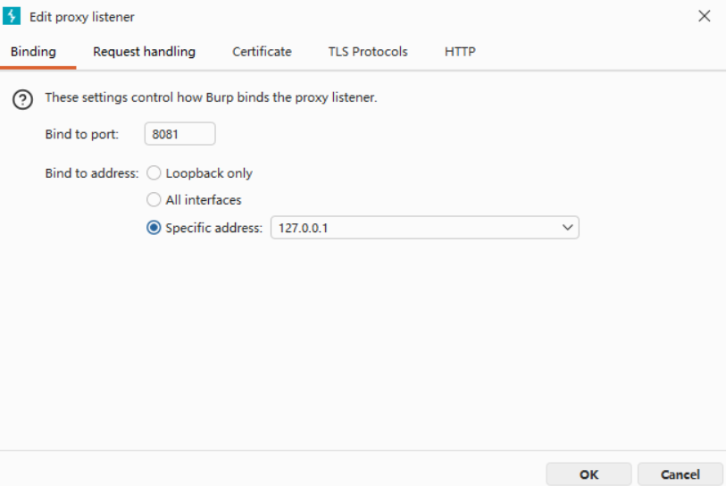

### 1.2 配置浏览器代理

使用 SwitchyOmega 等插件，将浏览器代理指向 Burp 监听的地址（`127.0.0.1:8081`）。

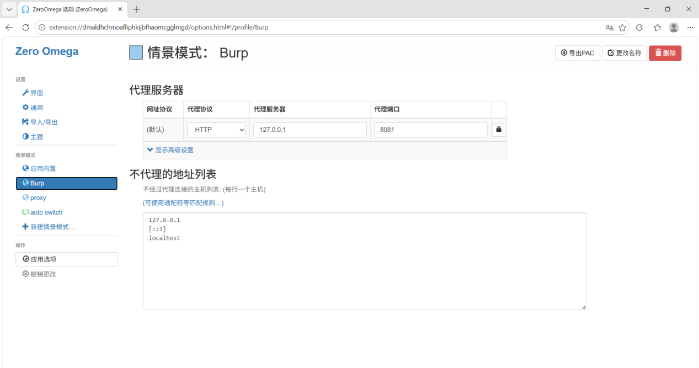

### 1.3 安装 Burp CA 证书

#### 为什么需要安装证书？

Burp 抓取 HTTPS 流量的原理是 **中间人代理**：

```
正常流程：浏览器 ↔ 真实服务器（加密直连）
开启 Burp：浏览器 ↔ Burp ↔ 真实服务器
```

Burp 会伪造一份证书给浏览器，浏览器不信任该证书时会断开连接。因此需要将 Burp 证书导入系统信任列表。

#### 导出 Burp 证书

Burp Suite → **Proxy** → **Options** → **Import/export CA certificate** → **Export** → **Certificate in DER format** → 保存为 `cacert.der`

#### 导入证书（Edge 浏览器）

Edge 浏览器 → **设置** → 搜索 **"证书"** → **管理证书** → 导入保存的 `cacert.der` 为受信任的证书。

#### 验证证书安装

Edge 访问 `http://burpsuite`，如果显示 "Burp Suite Community Edition" 页面，说明证书和代理都正常。

### 1.4 确认拦截状态

- **Proxy** → **Intercept** → 点击按钮切换到 **"Intercept is on"**，开启拦截。

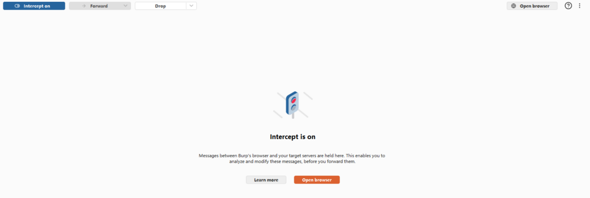

---

## 2. 第一关：Pass-01 前端 JS 校验绕过

> **校验方式**：前端 JavaScript 校验文件后缀（只允许 `.jpg`/`.png`/`.gif` 等图片格式）。

### 方法一：Burp 抓包改后缀

**步骤：**

1. 准备一个 `shell0.php`，内容为：
   ```php
   <?php phpinfo(); ?>
   ```
   先将后缀改为 `shell0.jpg`。

2. 访问 `http://127.0.0.1/upload-labs/`，选择 `shell0.jpg` 上传。

3. Burp 拦截请求，将 `filename="shell0.jpg"` 改为 `filename="shell0.php"`。

   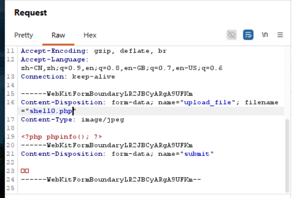

4. 点击 **Forward** 放行请求。

5. 检查服务器 `upload` 目录，发现 `shell0.php` 已成功上传。

   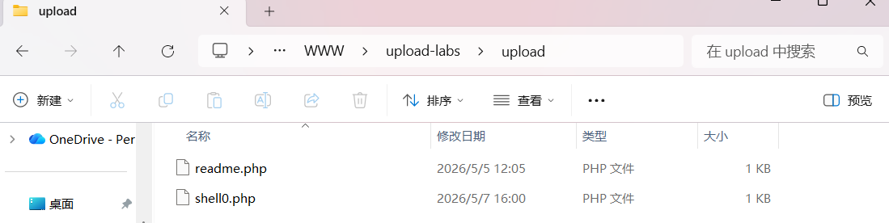

6. 浏览器访问 `http://127.0.0.1/upload-labs/upload/shell0.php`，执行成功。

   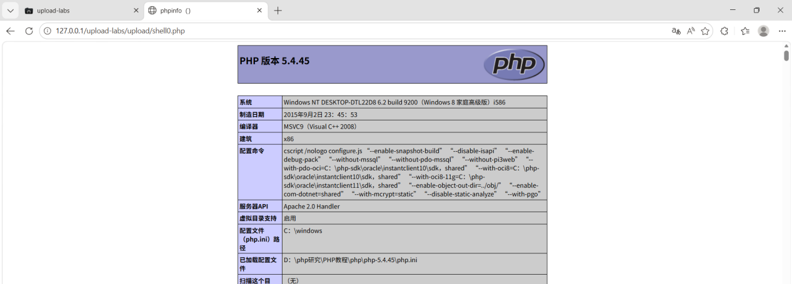

---

### 方法二：Repeater 手动发包

> 此方法无需开启代理拦截，直接从浏览器复制请求内容，在 Repeater 中构造发送。

**步骤：**

1. **F12** 打开开发者工具 → 切换到 **「网络」面板**。
2. 上传文件后，找到 `index.php`（POST 请求），复制请求标头（含原始请求行）。
3. 同时复制请求体（负载）内容。
4. 将二者拼接，得到完整的 HTTP 请求。

   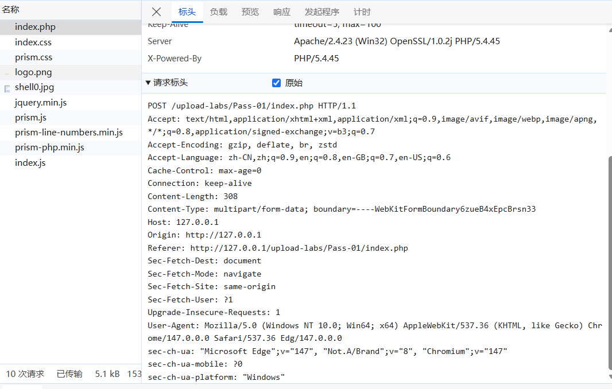

   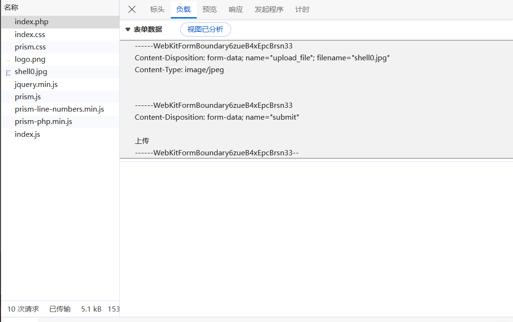

5. 打开 Burp → 切换到 **「Repeater」** 标签页 → 右键粘贴标准 HTTP 请求内容。

6. 修改 `filename="shell0.jpg"` 为 `filename="shell0.php"`。

> **⚠️ 关键注意事项：**
> - **格式要求**：请求行 → 所有请求头 → **必须空一行** → 请求体
> - **Content-Length 处理**：手动删掉该行。改文件名后字节数会变，Burp Repeater 会自动计算正确的 `Content-Length`，无需手动填写。
> - **请求体必须包含 PHP 代码**：否则服务器得到的是空文件，不会执行。

   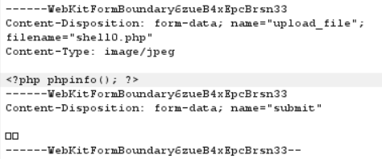

7. 点击 **Send**，配置 Host 为 `127.0.0.1`，Port 为 `80`。

   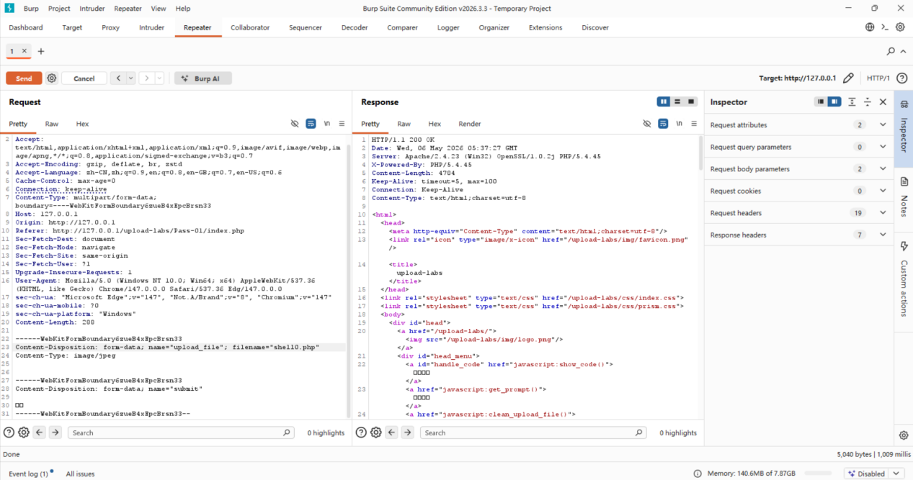

8. `upload` 目录下出现 `shell0.php`，访问成功。

   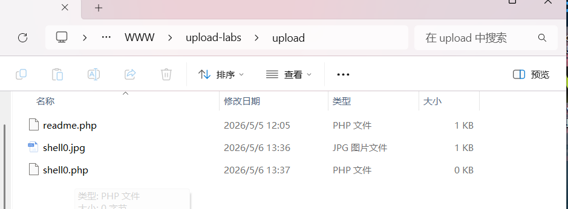

   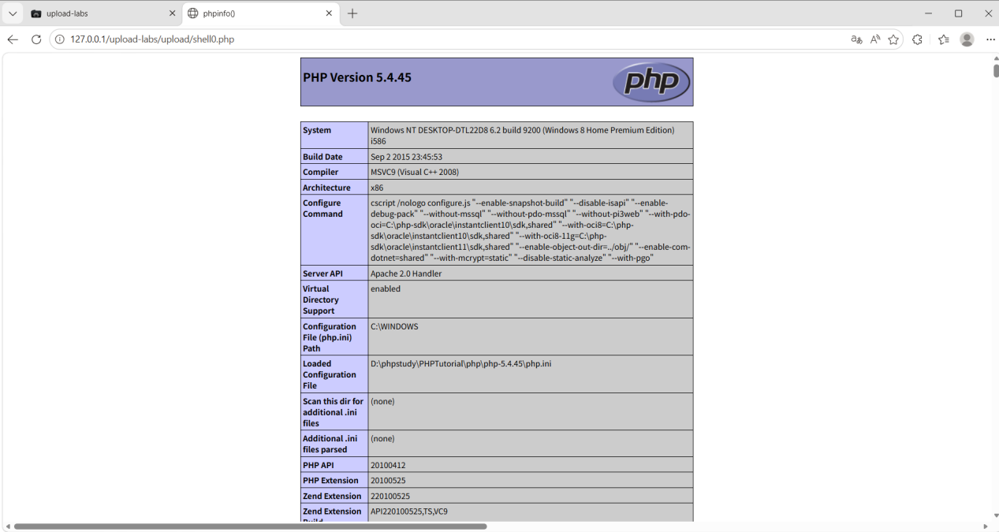

---

### 方法三：禁用浏览器 JavaScript

> 最简单粗暴的方式，无需 Burp。

1. 打开上传页面，按 **F12** 打开开发者工具。
2. 按 **Ctrl + Shift + P**，输入 `javascript`。
3. 选择 **禁用 JavaScript**。
4. 直接上传 `shell.php`，前端校验失效。

---

### 三种绕过方式对比

| 方法 | 原理 | 适用场景 |
|------|------|----------|
| Burp 抓包改后缀 | 前端 JS 通过后，在代理中修改请求 | 需要拦截分析其他请求时 |
| Repeater 手动发包 | 复制请求，手动构造并发送 | 本地靶场、反复改包测试 |
| 禁用 JS | 前端校验直接失效 | 快速测试，不依赖外部工具 |

---

## 3. 第二关：Pass-02 MIME 类型校验绕过

> **校验方式**：后端校验 `Content-Type` 头，只允许 `image/jpeg`、`image/png`、`image/gif`。

**步骤：**

1. 开启 Burp 拦截，直接上传 `shell.php`。

   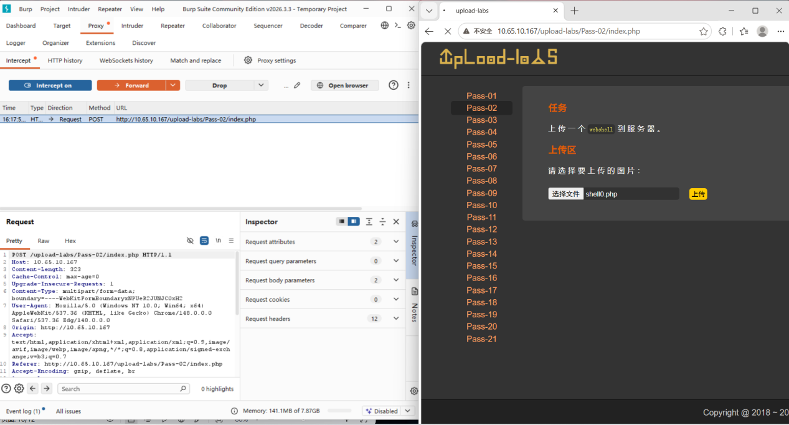

2. Burp 拦截请求，找到 `Content-Type: application/x-php`。

3. 修改为 `Content-Type: image/jpeg`，Forward 放行。

   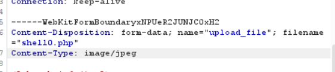

4. 上传成功。

   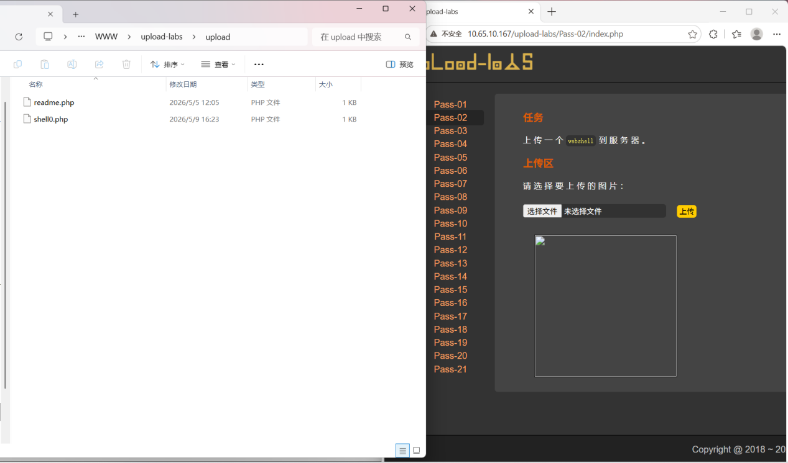

5. 浏览器访问 `http://127.0.0.1/upload-labs/upload/shell0.php`，执行成功。

   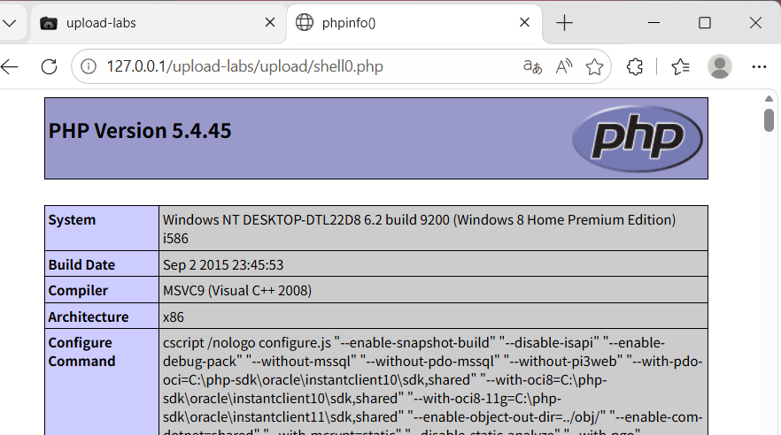

---

## 4. 第三关：Pass-03 黑名单绕过（冷门后缀）

> **校验方式**：后端黑名单过滤了 `.php`、`.php2`、`.php3`、`.php4`、`.php5`、`.phtml` 等常见 PHP 后缀。但未过滤 `.pht`、`.phar` 等冷门后缀。

**步骤：**

1. 准备一个 `shell0.pht`（内容为 `<?php phpinfo(); ?>`），直接上传。

   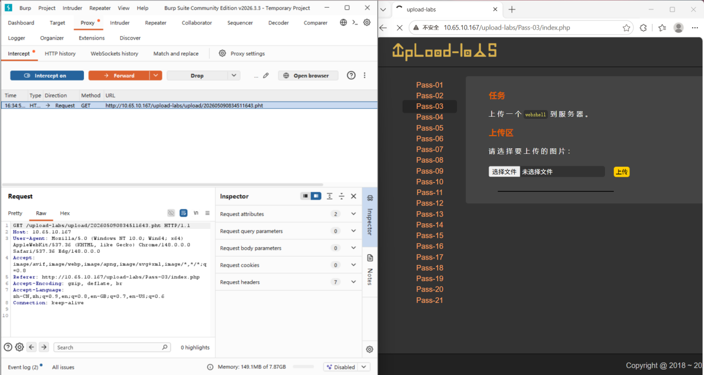

2. Burp 直接放行。

3. 查看响应，注意服务器返回的**随机时间戳文件名**（如 `202605090834511643.pht`）。

   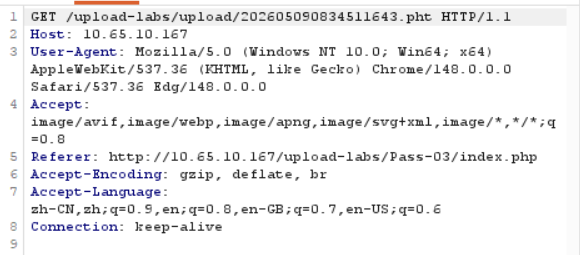

4. 浏览器访问该文件。

   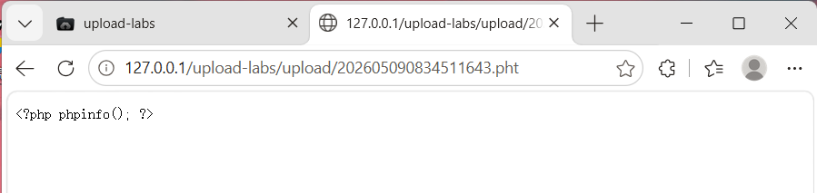

> **⚠️ 如果 .pht 没有被解析而是显示源码：**
>
> 检查 Apache 配置文件 `../Apache/conf/httpd.conf`，搜索 `AddType application/x-httpd-php`。
>
> ```apache
> AddType application/x-httpd-php .php .phtml
> ```
>
> 确认 `.phtml` 被包含。如果被注释，去掉 `#` 后重启 Apache 即可，重新上传shell0.phtml并访问该文件。

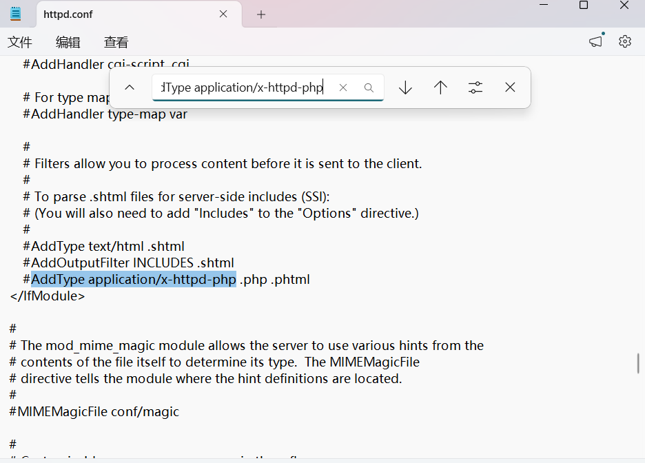
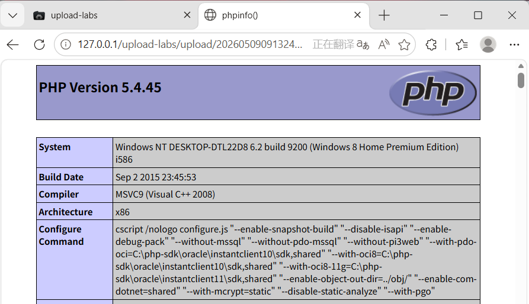

---

## 5. 第四关：Pass-04 .htaccess 配置文件绕过

> **校验方式**：黑名单过滤了所有常见 PHP 后缀（含 `.phtml`、`.pht`、`.phar` 等）。但**未过滤 `.htaccess`**。

### 5.1 原理说明

- **Apache**：支持 `.htaccess` 目录级配置文件。
- **`.htaccess`**：可单独给当前文件夹设置服务器规则，无需重启 Apache。

**Payload：**

`.htaccess` 文件内容：
```apache
SetHandler application/x-httpd-php
```

含义：当前文件夹下**所有文件**（无论什么后缀），全部交给 PHP 解析器执行。

### 5.2 操作步骤

1. 准备 `shell0.jpg`（伪装图片）和 `.htaccess` 配置文件。

2. **先上传 `.htaccess`**。注意：服务器默认会生成随机文件名，必须用 Burp 拦截，强制保存为 `.htaccess`。

   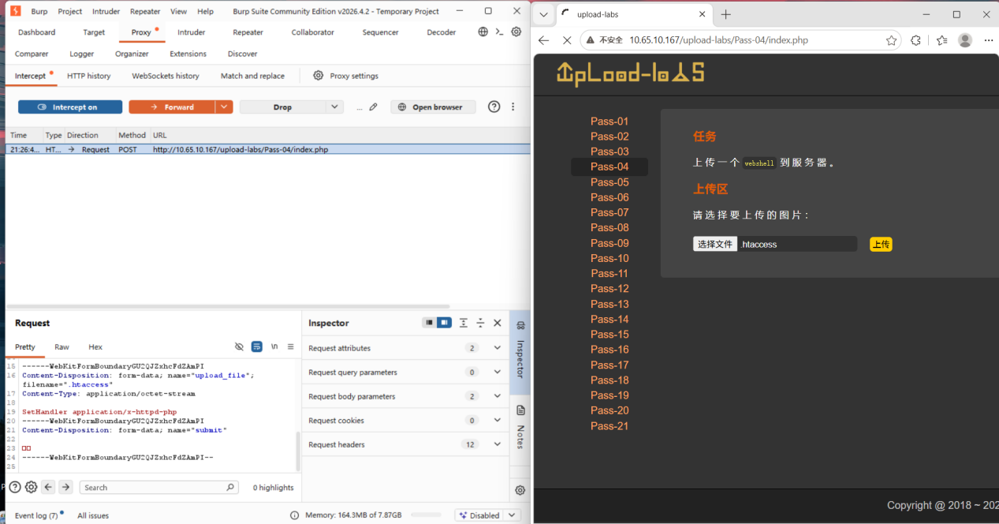

3. Burp 中修改 `filename=".htaccess"`，放行。

   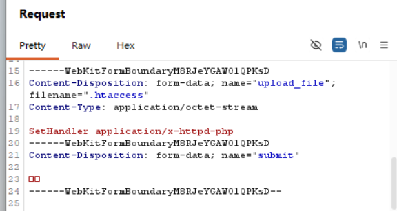

4. 再次上传 `shell0.jpg`。

   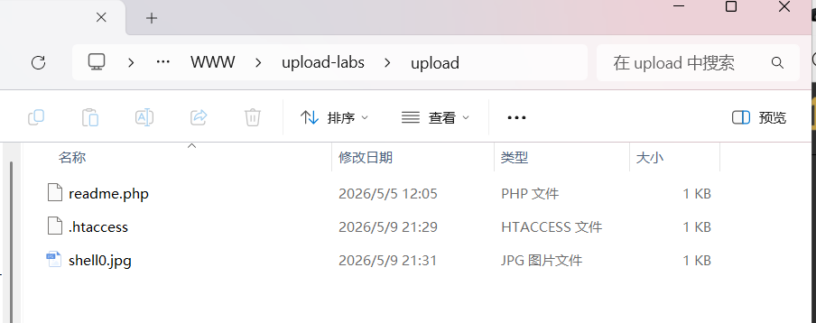

5. 浏览器访问 `shell0.jpg`，发现 PHP 代码被成功解析执行。

   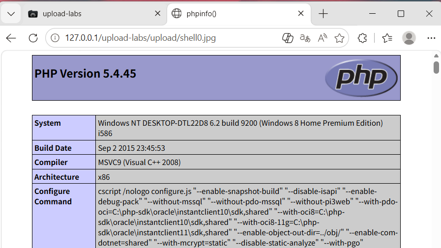

---

## 6. 第五关：Pass-05 点空点绕过与 .user.ini 尝试

> **校验方式**：黑名单极其全面（含 `.htaccess`），并做了**大小写转换**和**首尾去空**处理。

### 6.1 源码分析

```php
$file_name = trim($_FILES['upload_file']['name']);      // 1. 去首尾空格
$file_name = deldot($file_name);                        // 2. 删除末尾的点
$file_ext = strrchr($file_name, '.');                   // 3. 取后缀
$file_ext = strtolower($file_ext);                      // 4. 转小写
$file_ext = str_ireplace('::$DATA', '', $file_ext);    // 5. 去除 ::$DATA
$file_ext = trim($file_ext);                            // 6. 首尾去空
```

### 6.2 漏洞点：trim → deldot 的执行顺序

虽然源码看起来做了多重防护，但 `trim()` 和 `deldot()` 的执行顺序存在逻辑漏洞。

构造文件名：**`shell.php. .`**（点 + 空格 + 点）

| 步骤 | 函数 | 处理 | 结果 |
|------|------|------|------|
| 1 | `trim()` | 首尾去空格 | `shell.php. .`（中间空格保留） |
| 2 | `deldot()` | 从末尾删点，遇到空格停止 | `shell.php.`（**空格保留**） |
| 3 | `strrchr()` | 找最后一个点，取点后内容 | `. `（点+空格） |
| 4 | `strtolower()` | 转小写 | `. `（点+空格） |
| 5 | `str_ireplace()` | 无 `::$DATA` | `. `（点+空格） |
| 6 | `trim()` | **首尾去空格** | `.`（空格被 trim 掉！） |

最终 `$file_ext = "."`，不在黑名单中！

**保存时**：`move_uploaded_file()` 保存的文件名为 `shell.php. `（带空格+点），但 Windows 系统会自动去掉末尾空格和点，最终变成 `shell.php`。

### 6.3 操作步骤

1. Burp 拦截上传请求，修改 `filename="shell.php. ."`。

   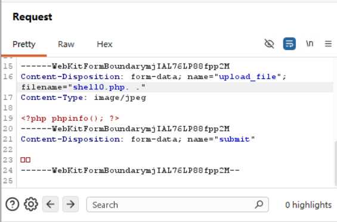

2. 放行，上传成功。

   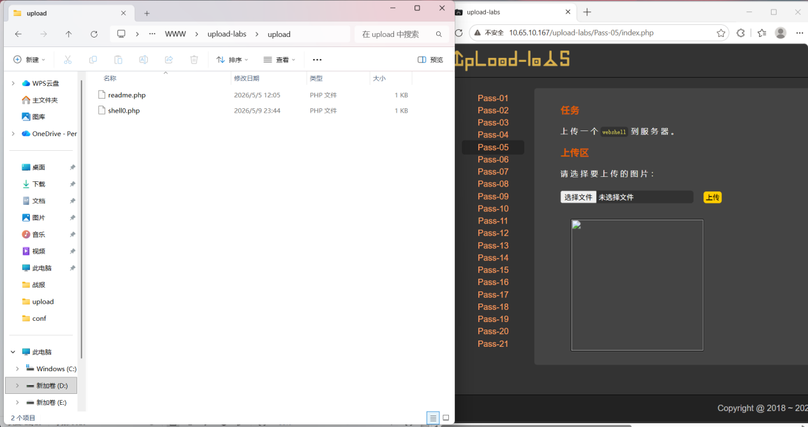

---

### 6.4 备选尝试：.user.ini（未成功）

> 观察源码发现黑名单中没有 `.ini`，尝试使用 `.user.ini` 绕过。

**`.user.ini`** 是 PHP 的目录级配置文件（仅限 CGI/FastCGI 模式），内容为：
```ini
auto_prepend_file=shell0.jpg
```
含义：执行当前目录下任意 PHP 文件前，自动包含 `shell0.jpg`。

**操作：** 先上传 `.user.ini`，再上传 `shell0.jpg`。

**结果：** 访问 `readme.php` 或 `test.php` 时，`shell0.jpg` 未被包含。

**原因：** 服务器以 **Apache 2.0 Handler（mod_php 模块模式）** 运行，而不是 CGI/FastCGI 模式。

> `.user.ini` 仅在 CGI/FastCGI 模式下有效（PHP-FPM 管理进程时会检查目录下的 `.user.ini`）；mod_php 模式下配置由 `httpd.conf` / `php.ini` 统一管理，不会扫描 `.user.ini`。

---

## 7. 第六关：Pass-06 大小写绕过

> **校验方式**：黑名单过滤了大部分后缀，但**源码中没有 `strtolower()`**，即未做大小写统一转换。

**漏洞点：** 黑名单虽包含部分大小写组合（如 `.pHp`），但仍有遗漏（如 `.PHP`、`.Php`、`.pHP` 等）。

### 操作步骤

1. 准备 `shell0.PHP`（注意大写），直接上传。查看响应，获取随机时间戳文件名（如 `202605100413265473.PHP`）。

   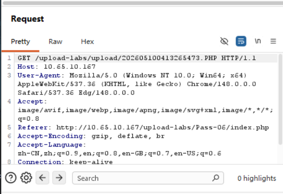

2. 浏览器访问该文件，执行成功。

   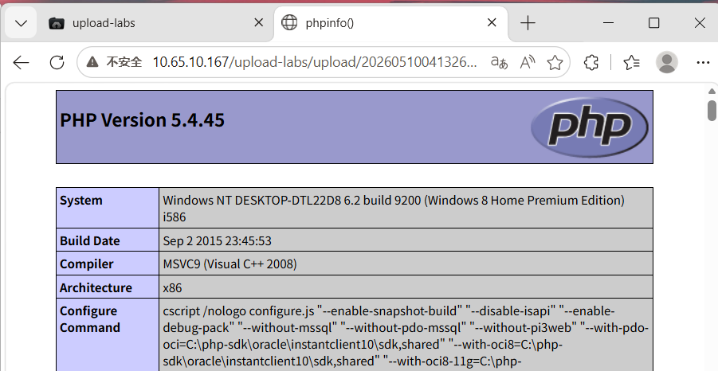

---

## 8. 核心知识点总结

### 8.1 各关校验方式与绕过技巧速查表

| 关卡 | 校验方式 | 绕过方法 | 关键点 |
|------|---------|----------|--------|
| Pass-01 | 前端 JS 校验 | 抓包改后缀 / 禁用 JS | 前端校验不靠谱 |
| Pass-02 | 后端 MIME 校验 | 修改 `Content-Type: image/jpeg` | 只校验头，不校验内容 |
| Pass-03 | 黑名单（常见 PHP 后缀） | 使用冷门后缀（`.pht`、`.phar`） | 黑名单不全面 |
| Pass-04 | 黑名单（含冷门后缀） | `.htaccess` 自定义解析规则 | Apache 特有 |
| Pass-05 | 黑名单 + 大小写转换 + 去空 | 点空点绕过（`shell.php. .`） | `trim` 与 `deldot` 顺序漏洞 |
| Pass-06 | 黑名单无大小写转换 | 大小写绕过（`.PHP`） | 未统一转小写 |

### 8.2 几种 PHP 文件执行方式对比

| 方法 | 原理 | 适用环境 |
|------|------|----------|
| `.htaccess` | `SetHandler application/x-httpd-php` | Apache（mod_php 模式） |
| `.user.ini` | `auto_prepend_file=shell.jpg` | CGI / FastCGI 模式 |
| 冷门后缀 | `.phtml`、`.pht`、`.phar` | 取决于 Apache 配置 |

### 8.3 防御建议

1. **综合校验**：前端 + 后端双重校验，后端为最终防线。
2. **内容检测**：不仅校验 MIME 头，还应检测文件内容（如 `getimagesize()`）。
3. **白名单策略**：只允许特定后缀（如 `.jpg`、`.png`），而非黑名单。
4. **重命名文件**：上传后强制重命名为随机字符串，不保留原始文件名。
5. **存储与执行分离**：上传目录禁止执行 PHP（如 `php_flag engine off`）。